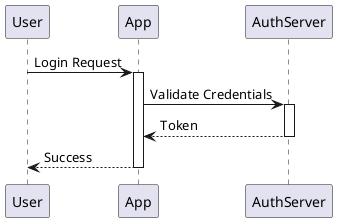
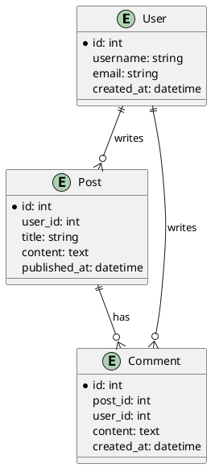
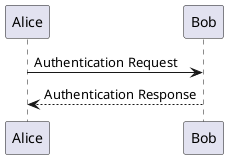
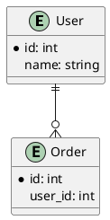

# PlantUML Claude Skill

A comprehensive Claude Code skill for generating PlantUML diagrams from text descriptions and converting them to images. This skill supports all 19 PlantUML diagram types and provides powerful tools to extract diagrams from markdown files.

## Features

- **Generate diagrams from natural language** - Describe what you want, get PlantUML syntax
- **Convert `.puml` files to images** - Generate PNG or SVG from standalone PlantUML files
- **Extract diagrams from markdown** - Find all `puml` code blocks, convert to images, and create updated markdown with image links
- **Comprehensive diagram support** - All UML (sequence, class, activity, state, etc.) and non-UML types (ER, Gantt, mindmap, etc.)
- **Modern styling** - CSS-like `<style>` syntax for professional diagram appearance

## Quick Start

### 1. Verify Setup

Check that Java, Graphviz, and plantuml.jar are installed:

```bash
python scripts/check_setup.py
```

### 2. Convert a PlantUML File

```bash
# Convert to PNG
python scripts/convert_puml.py my_diagram.puml

# Convert to SVG
python scripts/convert_puml.py my_diagram.puml --format svg --output-dir images/
```

### 3. Extract Diagrams from Markdown

```bash
# Process markdown file with ```puml code blocks
python scripts/extract_and_convert_puml.py article.md

# Use SVG format
python scripts/extract_and_convert_puml.py article.md --format svg
```

## Installation

### Requirements

1. **Java** (JRE 8 or higher)
   - Download from [Oracle](https://www.oracle.com/java/technologies/downloads/)
   - Verify: `java -version`

2. **plantuml.jar**
   - Download from [PlantUML](https://plantuml.com/download)
   - Place in one of these locations:
     - `~/plantuml.jar`
     - `/usr/local/bin/plantuml.jar`
     - Or set `PLANTUML_JAR` environment variable

3. **Graphviz** (recommended, required for most UML diagrams)
   - Download from [Graphviz](https://graphviz.org/download/)
   - Add `dot` executable to PATH

### Quick Setup

```bash
# macOS (with Homebrew)
brew install java graphviz
curl -o ~/plantuml.jar https://downloads.sourceforge.net/project/plantuml/plantuml.jar

# Ubuntu/Debian
sudo apt install default-jre graphviz
wget -O ~/plantuml.jar https://downloads.sourceforge.net/project/plantuml/plantuml.jar

# Verify installation
python scripts/check_setup.py
```

## Usage Examples

### Example 1: Create a Sequence Diagram

Create `auth_flow.puml`:



Convert to image:

```bash
python scripts/convert_puml.py auth_flow.puml --format svg
```

### Example 2: Create an ER Diagram

Create `blog_schema.puml`:



### Example 3: Process Markdown with Multiple Diagrams

Create `article.md`:

````markdown
# System Architecture

## Authentication Flow



## Database Schema


````

Process the file:

```bash
python scripts/extract_and_convert_puml.py article.md --format png
```

This creates:
- `article_with_images.md` - Updated markdown with image links
- `images/diagram_1_uml.png` - First diagram
- `images/diagram_2_uml.png` - Second diagram

Output `article_with_images.md`:

```markdown
# System Architecture

## Authentication Flow


## Database Schema


```

## Supported Diagram Types

### UML Diagrams

1. **Sequence** - Interactions between participants over time
2. **Use Case** - System features and actors
3. **Class** - Object-oriented structure
4. **Object** - Runtime instances
5. **Activity** - Workflows and processes
6. **Component** - System modules
7. **Deployment** - Physical architecture
8. **State** - State machines and transitions
9. **Timing** - State changes over time

### Non-UML Diagrams

10. **Entity-Relationship (ER)** - Database schemas
11. **Network** - Network topology
12. **Wireframes (Salt)** - UI mockups
13. **Ditaa** - ASCII art diagrams
14. **Work Breakdown Structure (WBS)** - Project tasks
15. **MindMap** - Hierarchical information
16. **Gantt** - Project timelines
17. **JSON/YAML** - Data visualization
18. **Archimate** - Enterprise architecture
19. **Timeline** - Chronological events

## Scripts Reference

### check_setup.py

Validates PlantUML environment setup.

```bash
python scripts/check_setup.py
```

Checks:
- Java installation and version
- Graphviz availability
- plantuml.jar location
- Runs test diagram conversion

### convert_puml.py

Converts standalone `.puml` files to images.

```bash
python scripts/convert_puml.py <file.puml> [options]

Options:
  --format png|svg       Output format (default: png)
  --output-dir <path>    Directory for output images (default: same as input)
```

### extract_and_convert_puml.py

Extracts PlantUML diagrams from markdown and converts to images.

```bash
python scripts/extract_and_convert_puml.py <file.md> [options]

Options:
  --format png|svg       Output format (default: png)
  --output-dir <path>    Directory for images (default: images/)
```

Workflow:
1. Scans markdown for all `puml` code blocks
2. Extracts each diagram to temporary `.puml` file
3. Converts to PNG/SVG using plantuml.jar
4. Replaces code blocks with `` links
5. Saves updated markdown as `*_with_images.md`

## Advanced Usage

### Direct PlantUML Commands

```bash
# Basic PNG conversion
java -jar ~/plantuml.jar diagram.puml

# SVG output
java -jar ~/plantuml.jar --svg diagram.puml

# Batch convert all .puml files
java -jar ~/plantuml.jar "**/*.puml" --svg --output-dir images/

# Check syntax without converting
java -jar ~/plantuml.jar --check-syntax diagram.puml

# Pipe input
echo "@startuml Alice->Bob @enduml" | java -jar ~/plantuml.jar -pipe --svg > output.svg
```

### Modern Styling

```puml
@startuml
<style>
classDiagram {
  class {
    BackgroundColor LightBlue
    BorderColor Navy
    FontColor DarkBlue
    FontSize 14
  }
  arrow {
    LineColor SeaGreen
    LineThickness 2
  }
}
</style>

class Animal {
  -name: String
  +move()
}
class Dog extends Animal {
  +bark()
}
Animal <|-- Dog
@enduml
```

Use CSS-like `<style>` syntax for professional appearance:



### Themes

Quick styling with built-in themes:

```puml
@startuml
!theme cerulean

' Your diagram content
@enduml
```

Available themes: `cerulean`, `bluegray`, `plain`, `sketchy`, `amiga`

## Documentation

The `references/` directory contains comprehensive guides:

- **[toc.md](references/toc.md)** - Navigation hub for all diagram types
- **[plantuml_reference.md](references/plantuml_reference.md)** - Installation, CLI, troubleshooting
- **[common_format.md](references/common_format.md)** - Universal syntax elements
- **[styling_guide.md](references/styling_guide.md)** - Modern `<style>` syntax guide
- **[sequence_diagrams.md](references/sequence_diagrams.md)**, **[class_diagrams.md](references/class_diagrams.md)**, etc. - Detailed guides for each diagram type

## Troubleshooting

### "plantuml.jar not found"

- Download from https://plantuml.com/download
- Place in `~/plantuml.jar` or set `PLANTUML_JAR` environment variable
- Verify: `python scripts/check_setup.py`

### "Graphviz not found"

- Install from https://graphviz.org/download/
- Add `dot` executable to PATH
- Some diagrams (JSON, YAML, Gantt, MindMap) don't require Graphviz

### "Syntax Error?"

- Verify `@start`/`@end` delimiters match
- Check diagram-specific syntax in `references/[diagram_type].md`
- Use `java -jar plantuml.jar --check-syntax file.puml`

### "Java not found"

- Install Java JRE/JDK 8+
- Add to PATH
- Verify: `java -version`

## Tips and Best Practices

1. **Use descriptive filenames** - `user_auth_sequence.puml` instead of `diagram1.puml`
2. **Add comments** - Use `'` for single-line comments to document complex logic
3. **Choose SVG for documentation** - Scalable, better quality, supports hyperlinks
4. **Use PNG for web** - Smaller file sizes, fixed resolution
5. **Start simple** - Test basic diagrams before adding complexity
6. **Version control** - Commit `.puml` source files to Git
7. **Prefer modern styling** - Use `<style>` tags instead of legacy `skinparam`

## Use with Claude Code

This is a Claude Code skill. When loaded, Claude can:

- Generate PlantUML syntax from natural language descriptions
- Select the appropriate diagram type for your use case
- Create properly formatted `.puml` files
- Convert diagrams to images
- Extract and process diagrams from markdown files
- Apply modern styling for professional appearance

Simply describe what you want: *"Create a sequence diagram for user authentication"* or *"Extract all diagrams from my article.md and convert to SVG"*.

## License

This skill is provided as-is for use with Claude Code.

## Resources

- [PlantUML Official Site](https://plantuml.com/)
- [PlantUML Language Reference Guide (PDF)](https://pdf.plantuml.net/PlantUML_Language_Reference_Guide_en.pdf)
- [PlantUML GitHub](https://github.com/plantuml/plantuml)
- [Graphviz Downloads](https://graphviz.org/download/)
