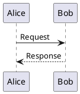

# PlantUML Diagram Generation and Conversion

## Table of Contents

- [Purpose](#purpose)
- [When to Use This Skill](#when-to-use-this-skill)
- [Prerequisites](#prerequisites)
- [Creating Diagrams](#creating-diagrams)
  - [Diagram Type Identification](#diagram-type-identification)
  - [Resilient Workflow](#resilient-workflow-primary---recommended)
- [Converting Source Code to Diagrams](#converting-source-code-to-diagrams)
- [Converting Diagrams to Images](#converting-diagrams-to-images)
  - [Standalone .puml Files](#convert-standalone-puml-files)
  - [Markdown Processing](#extract-and-convert-from-markdown)
  - [Direct Command-Line Usage](#direct-command-line-usage)
- [Best Practices](#best-practices)
- [Troubleshooting](#troubleshooting)
- [References](#references)

## Purpose

This skill enables comprehensive PlantUML diagram creation and conversion workflows. PlantUML is a text-based diagramming tool that generates professional diagrams from simple, intuitive syntax.

**Core capabilities:**

1. Create diagrams from natural language descriptions
2. Convert source code to architecture diagrams (Spring Boot, FastAPI, Python ETL, Node.js, React)
3. Convert standalone `.puml` files to PNG or SVG images
4. Extract `puml` code blocks from markdown and convert to images
5. Process linked `.puml` files in markdown (``)
6. Validate PlantUML syntax without conversion
7. Replace markdown diagrams with image links for publication (Confluence, Notion)

## When to Use This Skill

**Activate for:**

- Diagram creation requests (e.g., "Create a sequence diagram showing authentication flow")
- Code architecture visualization (e.g., "Create deployment diagram for my Spring Boot app")
- `.puml` file to image conversion
- Markdown files containing ```puml code blocks or linked .puml files
- Confluence or Notion markdown preparation (documents with PlantUML diagrams require conversion first)
- Specific diagram types: UML (sequence, class, activity, state, component, deployment, use case, object, timing) or non-UML (ER, Gantt, mindmap, WBS, JSON/YAML, network, Archimate, wireframes)
- PlantUML syntax validation

**Confluence/Notion uploads:** If markdown contains PlantUML diagrams, run conversion FIRST before upload.

## Prerequisites

Before creating diagrams, verify the PlantUML setup:

```bash
python scripts/check_setup.py
```

**Required components:**

| Component | Purpose | Installation |
|-----------|---------|--------------|
| Java JRE/JDK 8+ | Runtime | https://www.oracle.com/java/technologies/downloads/ |
| plantuml.jar | Diagram generator | https://plantuml.com/download (place in `~/plantuml.jar` or set `PLANTUML_JAR`) |
| Graphviz (optional) | Complex layouts | https://graphviz.org/download/ |

## Creating Diagrams

### Diagram Type Identification

Identify the appropriate diagram type based on user intent:

| User Intent | Diagram Type | Reference |
|-------------|--------------|-----------|
| Interactions over time | Sequence | `references/sequence_diagrams.md` |
| System structure with classes | Class | `references/class_diagrams.md` |
| Workflows, decision flows | Activity | `references/activity_diagrams.md` |
| Object states and transitions | State | `references/state_diagrams.md` |
| Database schemas | ER (Entity Relationship) | `references/er_diagrams.md` |
| Project timelines | Gantt | `references/gantt_diagrams.md` |
| Idea organization | MindMap | `references/mindmap_diagrams.md` |
| System architecture | Component | `references/component_diagrams.md` |
| Actors and features | Use Case | `references/use_case_diagrams.md` |
| All 19 types | See navigation hub | `references/toc.md` |

**Syntax resources:**

- `references/toc.md`: Navigation hub linking to all diagram types
- `references/common_format.md`: Universal elements (delimiters, metadata, comments, notes)
- `references/styling_guide.md`: Modern `<style>` syntax for visual customization

### Resilient Workflow (Primary - Recommended)

For reliable diagram generation with error recovery, follow the 4-step resilient workflow:

**Step 1: Identify Diagram Type & Load Reference**
- Identify diagram type from user intent
- Load `references/[diagram_type]_diagrams.md` for syntax guide
- Consult `references/toc.md` if ambiguous

**Step 2: Create File with Structured Naming**
```
./diagrams/<markdown_name>_<num>_<type>_<title>.puml
```

Example: `./diagrams/architecture_001_sequence_user_auth.puml`

**Step 3: Convert with Error Handling (max 3 retries)**

If conversion fails:
1. Check `references/troubleshooting/toc.md` for error classification
2. Load specific guide from `references/troubleshooting/[category]_guide.md`
3. Check `references/common_syntax_errors.md` for diagram type

**Step 4: Validate & Integrate**
1. Verify image file exists
2. Add image link: ``
3. Keep .puml source file for future edits

**Full documentation:** `references/workflows/resilient-execution-guide.md`

### Quick Syntax Reference

**Common elements:**

- Delimiters: `@startuml` / `@enduml` (required)
- Comments: `' Single line` or `/' Multi-line '/`
- Relationships: `->` (solid), `-->` (dashed), `..>` (dotted)
- Labels: `A -> B : Label text`

**Minimal examples** (see `references/[type]_diagrams.md` for comprehensive syntax):



```puml
' Class: references/class_diagrams.md
@startuml
class Animal { +move() }
class Dog extends Animal { +bark() }
@enduml
```

```puml
' ER: references/er_diagrams.md
@startuml
entity User { *id: int }
entity Post { *id: int }
User ||--o{ Post
@enduml
```

## Converting Source Code to Diagrams

The `examples/` directory contains language-specific templates for converting common application architectures:

| Application Type | Directory | Key Diagrams |
|------------------|-----------|--------------|
| Spring Boot | `examples/spring-boot/` | Deployment, Component, Sequence |
| FastAPI | `examples/fastapi/` | Deployment, Component (async routers) |
| Python ETL | `examples/python-etl/` | Architecture with Airflow |
| Node.js | `examples/nodejs-web/` | Express/Nest.js components |
| React | `examples/react-frontend/` | SPA deployment, component architecture |

**Workflow:**
1. Identify application type
2. Review example in `examples/[app-type]/`
3. Map code structure to diagram patterns
4. Copy and adapt the example `.puml` file
5. Use Unicode symbols from `references/unicode_symbols.md` for semantic clarity

## Converting Diagrams to Images

### Convert Standalone .puml Files

```bash
# Convert to PNG (default)
python scripts/convert_puml.py diagram.puml

# Convert to SVG
python scripts/convert_puml.py diagram.puml --format svg

# Specify output directory
python scripts/convert_puml.py diagram.puml --format svg --output-dir images/
```

### Extract and Convert from Markdown

**CRITICAL for Confluence/Notion:** Run this FIRST before upload if markdown contains PlantUML diagrams.

```bash
# Process embedded ```puml blocks AND linked  files
python scripts/process_markdown_puml.py article.md

# Convert to SVG format
python scripts/process_markdown_puml.py article.md --format svg

# Validate syntax only (for CI/CD)
python scripts/process_markdown_puml.py article.md --validate
```

**Outputs:**
- `article_with_images.md`: Markdown with image links
- `images/`: Directory with generated images

**IDE-Friendly Workflow:** Keep diagrams as `.puml` files during development for IDE preview, then convert for publication.

### Direct Command-Line Usage

```bash
# Basic conversion
java -jar ~/plantuml.jar diagram.puml

# SVG with custom output
java -jar ~/plantuml.jar --svg --output-dir out/ diagram.puml

# Batch conversion
java -jar ~/plantuml.jar "**/*.puml" --svg
```

See `references/plantuml_reference.md` for comprehensive command-line options.

## Best Practices

**Diagram Quality:**
- Use descriptive filenames from diagram content
- Add comments with `'` for clarity
- Follow standard UML notation
- Test incrementally before adding complexity

**Format Selection:**
- **PNG**: Web publishing, smaller files, fixed resolution
- **SVG**: Documentation, scalable, supports hyperlinks

**Styling:** Apply modern `<style>` syntax from `references/styling_guide.md`:

```puml
@startuml
<style>
classDiagram {
  class { BackgroundColor LightBlue }
}
</style>
' diagram content
@enduml
```

**Themes:** `!theme cerulean` (also: `bluegray`, `plain`, `sketchy`, `amiga`)

**Unicode symbols:** Add semantic meaning with symbols from `references/unicode_symbols.md`:

```puml
node "☁️ AWS Cloud" as aws
database "💾 PostgreSQL" as db
```

## Troubleshooting

**Quick diagnosis:**
1. Check syntax: `java -jar plantuml.jar --check-syntax file.puml`
2. Identify error type
3. Load troubleshooting guide: `references/troubleshooting/toc.md`

**Common issues:**

| Issue | Solution |
|-------|----------|
| "plantuml.jar not found" | Download from https://plantuml.com/download, set `PLANTUML_JAR` |
| "Graphviz not found" | Install from https://graphviz.org/download/ |
| "Syntax Error" | Check delimiters match, consult `references/common_format.md` |
| "Java not found" | Install Java JRE/JDK 8+, verify with `java -version` |

**Comprehensive guides** (215+ errors documented):
- `references/troubleshooting/toc.md` - Navigation hub with error decision tree
- `references/troubleshooting/[category]_guide.md` - 12 focused guides by error type

## References

### Core Syntax References

| Resource | Purpose |
|----------|---------|
| `references/toc.md` | Navigation hub for all 19 diagram types |
| `references/common_format.md` | Universal elements (delimiters, metadata, comments) |
| `references/styling_guide.md` | Modern `<style>` syntax with CSS-like rules |
| `references/plantuml_reference.md` | Installation, CLI, and troubleshooting |

### Troubleshooting Guides

| Resource | Coverage |
|----------|----------|
| `references/troubleshooting/toc.md` | Navigation hub with error decision tree |
| `references/troubleshooting/installation_setup_guide.md` | Setup problems |
| `references/troubleshooting/general_syntax_guide.md` | Syntax errors |
| `references/troubleshooting/[diagram_type]_guide.md` | Diagram-specific errors |

### Enrichment Resources

| Resource | Purpose |
|----------|---------|
| `references/unicode_symbols.md` | Unicode symbols for semantic enrichment |
| `examples/[framework]/` | Code-to-diagram patterns |

## Summary

1. **Verify setup**: `python scripts/check_setup.py`
2. **Navigate types**: Start with `references/toc.md`
3. **Learn syntax**: Open `references/[diagram_type]_diagrams.md`
4. **Apply styling**: Use `references/styling_guide.md`
5. **Add symbols**: Use `references/unicode_symbols.md`
6. **Convert files**: `scripts/convert_puml.py`
7. **Process markdown**: `scripts/process_markdown_puml.py`
8. **Troubleshoot**: `references/troubleshooting/toc.md`

**Supported diagrams:**
- UML: sequence, class, activity, state, component, deployment, use case, object, timing
- Non-UML: ER, Gantt, mindmap, WBS, JSON/YAML, network, Archimate, wireframes
