# PlantUML Diagram Generation and Conversion

## Purpose

This skill enables comprehensive PlantUML diagram creation and conversion workflows. PlantUML is a text-based diagramming tool that generates professional diagrams from simple, intuitive syntax. Use this skill to:

1. **Create diagrams from natural language descriptions**
2. **Convert source code to architecture diagrams** (Spring Boot, FastAPI, Python ETL, Node.js, React, etc.)
3. **Convert standalone `.puml` files to PNG or SVG images**
4. **Extract `puml` code blocks from markdown** and convert to images
5. **Process linked `.puml` files in markdown** (``)
6. **Enrich diagrams with Unicode symbols** for semantic clarity
7. **Validate PlantUML syntax** without conversion
8. **Replace markdown diagrams with image links** for publication (Confluence, etc.)

## When to Use This Skill

Use this skill when:
- User requests diagram creation (e.g., "Create a sequence diagram showing authentication flow")
- **User wants to visualize code architecture** (e.g., "Create deployment diagram for my Spring Boot app")
- User needs to convert `.puml` files to images
- User wants to process markdown files containing ```puml code blocks **or linked .puml files**
- **User asks to convert markdown for Confluence or other doc systems** that don't support PlantUML
- **⚠️ IMPORTANT: User is uploading markdown to Confluence or Notion** - If the markdown contains PlantUML diagrams (```puml blocks or .puml file links), use this skill FIRST to convert diagrams to images before upload
- User asks for specific diagram types: UML (sequence, class, activity, state, component, deployment, use case, object, timing) or non-UML (ER, Gantt, mindmap, WBS, JSON/YAML, network, Archimate, wireframes)
- **User wants to add semantic meaning with Unicode symbols** (e.g., 🔒 for security, 💾 for database)
- **User needs to validate PlantUML syntax** before committing
- User mentions PlantUML explicitly

## Setup Verification

Before creating diagrams, verify the PlantUML setup is complete. Run the setup checker:

```bash
python scripts/check_setup.py
```

This verifies:
- Java installation (required)
- Graphviz installation (recommended for complex layouts)
- plantuml.jar availability

### Quick Setup Guide

If components are missing:

1. **Java**: Download from https://www.oracle.com/java/technologies/downloads/
2. **plantuml.jar**: Download from https://plantuml.com/download
   - Place in: `~/plantuml.jar` or set `PLANTUML_JAR` environment variable
3. **Graphviz** (optional): Download from https://graphviz.org/download/
   - Required for most UML diagrams and complex layouts

## Creating Diagrams

### Process for Diagram Requests

When a user requests a diagram:

1. **Identify the diagram type** based on user intent:
   - **Sequence**: Interactions between objects/actors over time
   - **Class**: System structure with classes and relationships
   - **Activity**: Workflows, processes, decision flows
   - **State**: Object states and transitions
   - **ER (Entity Relationship)**: Database schemas with entities and relationships
   - **Gantt**: Project timelines and task scheduling
   - **MindMap**: Idea organization and brainstorming
   - **Component**: System architecture and modules
   - **Use Case**: Actors and system features
   - **Others**: See `references/toc.md` for all 19 diagram types

2. **Consult references** for syntax:
   - `references/toc.md`: Navigation hub linking to all diagram types
   - `references/[diagram_type].md`: Detailed syntax for specific diagram (e.g., `sequence_diagrams.md`, `class_diagrams.md`)
   - `references/common_format.md`: Universal elements shared across diagrams
   - `references/styling_guide.md`: Modern `<style>` syntax for visual customization
   - `references/plantuml_reference.md`: Comprehensive command-line and troubleshooting guide

3. **Generate the PlantUML source code** following syntax rules:
   - All diagrams start with `@start<type>` (e.g., `@startuml`)
   - All diagrams end with `@end<type>` (e.g., `@enduml`)
   - Use appropriate keywords for the diagram type
   - Add comments with `'` for clarity

4. **Save to `.puml` file** or present to user for review

5. **Convert to image** using the conversion script (see below)

### Resilient Workflow (Primary - Recommended)

For reliable diagram generation with error recovery, use the 4-step resilient workflow:

#### Step 1: Identify Diagram Type & Load Reference
- Identify diagram type from user intent (sequence, class, ER, etc.)
- Load `references/[diagram_type]_diagrams.md` for syntax guide
- If ambiguous, consult `references/toc.md`

#### Step 2: Create File with Structured Naming
Save diagrams using the naming convention:
```
./diagrams/<markdown_name>_<num>_<type>_<title>.puml
```

**Examples:**
```
./diagrams/architecture_001_sequence_user_authe.puml
./diagrams/api_design_002_class_order_servi.puml
```

**Automated:**
```bash
python scripts/resilient_processor.py article.md --format png
```

#### Step 3: Convert with Error Handling (max 3 retries)
If conversion fails:
1. Check `references/troubleshooting/toc.md` for error classification
2. Load specific guide from `references/troubleshooting/[category]_guide.md`
3. Check `references/common_syntax_errors.md` for diagram type
4. **External search fallback** (in order):
   - Perplexity (`mcp__perplexity-ask__perplexity_ask`)
   - Brave Search (`mcp__brave-search__brave_web_search`)
   - Gemini skill
   - WebSearch tool

#### Step 4: Validate & Integrate into Markdown
**Only after successful generation:**
1. Verify image file exists at expected path
2. Add image link: ``
3. Keep .puml source file for future edits

**Full documentation:** `references/workflows/resilient-execution-guide.md`

### Syntax Reference Quick Guide

**Common Elements:**
- Comments: `' Single line` or `/' Multi-line '/`
- Relationships: `->` (solid), `-->` (dashed), `..>` (dotted)
- Labels: `A -> B : Label text`
- Styling: Use `skinparam` or `!theme <name>`

**Key Diagram Types:**

**Sequence Diagram:**


**Class Diagram:**


**ER Diagram:**


Consult `references/toc.md` to navigate to specific diagram type guides with comprehensive examples.

## Converting Source Code to Diagrams

This skill includes comprehensive examples of converting common application architectures into PlantUML diagrams. The `examples/` directory contains language-specific templates and patterns.

### Available Code-to-Diagram Examples

#### Spring Boot Applications (`examples/spring-boot/`)
- **Deployment Diagram**: AWS ECS deployment with RDS, ElastiCache, S3
- **Component Diagram**: Controller → Service → Repository architecture
- **Sequence Diagram**: Complete REST API request flow with JWT authentication
- **Symbols**: 🌱 Spring, 🎯 Controllers, 💼 Services, 📦 Repositories, 🔒 Security

**Example mapping**: When analyzing Spring Boot code, identify:
- `@RestController` → API endpoints 🎯
- `@Service` → Business logic 💼
- `@Repository` → Data access 📦
- `@Configuration` → System config ⚙️
- Security filters → 🔒 JWT validation

#### FastAPI Applications (`examples/fastapi/`)
- **Deployment Diagram**: Kubernetes (GKE) with Cloud SQL, Memorystore Redis, Pub/Sub
- **Component Diagram**: Async routers, dependencies, Pydantic models
- **Symbols**: ⚡ FastAPI/Async, 🚀 Uvicorn, 🐍 Python, 📝 Pydantic, 🔒 OAuth2

**Example mapping**: When analyzing FastAPI code:
- `APIRouter` → API routers 🎯
- `Depends()` → Dependency injection
- `Pydantic BaseModel` → Data validation 📝
- `async def` → Async processing ⚡
- Background tasks → ⏱️ Async jobs

#### Python ETL Pipelines (`examples/python-etl/`)
- **Architecture Diagram**: Complete ETL pipeline with Airflow orchestration
- **Symbols**: 🐍 Python, ⚗️ Transform, 📊 Analytics, 🐘 PostgreSQL, ☁️ Cloud storage

**Example mapping**: When analyzing ETL code:
- Data sources → 📊 Sources (databases, APIs, files)
- Extraction logic → 📥 Extract modules
- Transformation → ⚗️ Transform (pandas, Pydantic)
- Data quality → ✅ Validation (Great Expectations)
- Loading → 📤 Load to warehouse/lake
- Scheduling → 🎯 Airflow DAGs

#### Node.js Web Applications (`examples/nodejs-web/`)
- Component diagrams for Express.js/Nest.js architectures
- Symbols: 🟢 Node.js, ⚡ Express, 🎯 Routes, 💼 Services

#### React Frontend (`examples/react-frontend/`)
- Deployment diagrams for SPA hosting (S3 + CloudFront)
- Component architecture diagrams
- Symbols: ⚛️ React, 🎨 Components, 🗂️ State management

### How to Use Code-to-Diagram Examples

1. **Identify the application type** (Spring Boot, FastAPI, ETL, etc.)
2. **Examine the example** in `examples/[app-type]/`
3. **Map your code structure** to the diagram patterns
4. **Copy and adapt** the example `.puml` file
5. **Use consistent Unicode symbols** from the examples
6. **Add domain-specific details** relevant to your application

**Example workflow:**
```bash
# User has a Spring Boot microservice
# 1. Review example
cat examples/spring-boot/deployment-diagram.puml

# 2. Copy and customize
cp examples/spring-boot/deployment-diagram.puml my-service-deployment.puml
# Edit my-service-deployment.puml with your service details

# 3. Convert to image
python scripts/convert_puml.py my-service-deployment.puml --format svg
```

## Unicode Symbols for Semantic Enrichment

PlantUML diagrams can be enhanced with Unicode symbols to add visual meaning without cluttering with text. The comprehensive symbol guide is available at `references/unicode_symbols.md`.

### Quick Symbol Reference

**Common Symbols by Category:**

- **Web/Network**: 🌐 Web, 📡 Communication, 🔗 Links, ⚡ Fast/Async
- **Data/Storage**: 💾 Database, 🗄️ Warehouse, 📊 Analytics, 📁 Files
- **Security**: 🔒 Secure, 🔑 Key/Token, 🛡️ Firewall, 👤 User
- **System**: ⚙️ Config, 🔧 Tools, 🎯 Target/Endpoint, 💼 Business logic
- **Messaging**: 📬 Queue, 📨 Message, 🔔 Notification, 📢 Broadcast
- **Languages**: 🐍 Python, ☕ Java, 🟢 Node.js, 🌱 Spring Boot, ⚛️ React
- **Cloud**: ☁️ Cloud, 🅰️ AWS, 🔵 Azure, 🟢 GCP, ☸️ Kubernetes
- **Processing**: 🔄 Loop/Retry, ⚗️ Transform, ✅ Valid, ❌ Error
- **Monitoring**: 📊 Metrics, 📈 Increasing, 📉 Decreasing, 🚦 Health status

### Using Unicode Symbols

Always enclose labels with symbols in double quotes:

```puml
@startuml
node "☁️ AWS Cloud" as aws
component "🔒 Security Service\nJWT Validation" as security
database "💾 PostgreSQL" as db
queue "📬 RabbitMQ" as mq

security --> db : "🔑 Encrypted queries"
security --> mq : "📨 Events"
@enduml
```



**Best practices:**
- Use consistently throughout a diagram
- Don't overuse - 1-2 symbols per node maximum
- Choose context-appropriate symbols
- Combine with descriptive text
- See `references/unicode_symbols.md` for comprehensive guide

## Converting Diagrams

### Convert Standalone .puml Files

Use the `convert_puml.py` script to convert `.puml` files to images:

```bash
# Convert to PNG (default)
python scripts/convert_puml.py diagram.puml

# Convert to SVG
python scripts/convert_puml.py diagram.puml --format svg

# Specify output directory
python scripts/convert_puml.py diagram.puml --format svg --output-dir images/
```

**When to use:**
- User has existing `.puml` files
- User requests image export of created diagrams
- Batch conversion of multiple `.puml` files needed

### Extract and Convert from Markdown (Enhanced)

**⚠️ CRITICAL for Confluence/Notion Uploads**: If you are uploading a markdown document to Confluence or Notion that contains PlantUML diagrams, you MUST use this workflow FIRST to convert diagrams to images. Confluence and Notion do not natively render PlantUML code blocks.

Use the **new** `process_markdown_puml.py` script to process markdown files. This enhanced script supports **both embedded code blocks AND linked .puml files**.

```bash
# Process both embedded ```puml blocks AND linked  files
python scripts/process_markdown_puml.py article.md

# Convert to SVG format
python scripts/process_markdown_puml.py article.md --format svg

# Custom output directory
python scripts/process_markdown_puml.py article.md --output-dir diagrams/

# Validate syntax without converting (useful for CI/CD)
python scripts/process_markdown_puml.py article.md --validate
```

**What this script does:**

1. **Scans for embedded code blocks**: Finds all `puml` code blocks
2. **Scans for linked .puml files**: Finds `` links
3. **Validates syntax**: Checks PlantUML syntax for all diagrams
4. **Converts to images**: Generates PNG or SVG using plantuml.jar
5. **Replaces in markdown**: Both embedded blocks and links become ``
6. **Saves updated markdown**: Creates `*_with_images.md` for publication

**When to use:**

- **REQUIRED: Before uploading markdown to Confluence or Notion** if document contains PlantUML diagrams
- User has markdown with embedded PlantUML diagrams (```puml blocks)
- User has markdown linking to external `.puml` files (IDE-friendly workflow)
- User wants to convert documentation for Confluence or other systems without PlantUML support
- User needs to validate PlantUML syntax in CI/CD pipeline
- User wants to generate article versions with images instead of code blocks

**Confluence/Notion Workflow:**
1. Detect PlantUML diagrams in markdown (```puml blocks or  links)
2. Run: `python scripts/process_markdown_puml.py document.md --format png`
3. Result: `document_with_images.md` with  references
4. Upload both the transformed markdown AND the images/ directory to Confluence/Notion

**IDE-Friendly Workflow:**

Many IDEs (IntelliJ, VS Code with extensions) can render `.puml` files directly. This workflow allows developers to keep diagrams as separate files during development, then convert for publication:

```markdown
# Development version (article.md)
## Architecture

See the deployment diagram:


See the component diagram:


```

When processed:
```bash
python scripts/process_markdown_puml.py article.md --format svg
```

Generates `article_with_images.md`:
```markdown
# Development version
## Architecture

See the deployment diagram:


See the component diagram:


```

**Benefits of linked .puml files:**
- ✅ IDEs with PlantUML support render diagrams in preview
- ✅ Diagrams are versioned separately from documentation
- ✅ Easier to maintain and update diagrams
- ✅ Reuse diagrams across multiple markdown files
- ✅ Better for code reviews (diff .puml files directly)
- ✅ Same processing script handles both embedded and linked diagrams

**Example markdown input:**
````markdown
# My Article

Here's a sequence diagram:


````

**Output after processing:**
```markdown
# My Article

Here's a sequence diagram:


```

## Direct Command-Line Usage

For advanced users or custom workflows, PlantUML can be invoked directly:

```bash
# Basic PNG conversion
java -jar ~/plantuml.jar diagram.puml

# SVG with custom output
java -jar ~/plantuml.jar --svg --output-dir out/ diagram.puml

# Batch conversion
java -jar ~/plantuml.jar "**/*.puml" --svg

# Pipe input
echo "@startuml Alice->Bob @enduml" | java -jar ~/plantuml.jar -pipe --svg > output.svg
```

See `references/plantuml_reference.md` for comprehensive command-line options.

## Best Practices

### Diagram Quality

- **Use descriptive names**: Generate meaningful filenames from diagram content
- **Add comments**: Use `'` for single-line comments to explain complex logic
- **Follow conventions**: Use standard UML notation for consistency
- **Test incrementally**: Verify simple diagrams before adding complexity

### Format Selection

- **PNG**: Best for web publishing, smaller file sizes, fixed resolution
- **SVG**: Best for documentation, scalable, supports hyperlinks and tooltips
- **Use SVG when**: Diagrams need to be printed or scaled to different sizes

### Styling and Themes

**Modern `<style>` syntax (recommended)**:
```puml
@startuml
<style>
classDiagram {
  class {
    BackgroundColor LightBlue
    BorderColor Navy
    FontColor DarkBlue
  }
  arrow {
    LineColor SeaGreen
  }
}
</style>

' Your diagram content
@enduml
```

See `references/styling_guide.md` for comprehensive modern styling with CSS-like syntax, stereotypes, and advanced techniques.

**Themes** for quick styling:
```puml
@startuml
!theme cerulean
' Your diagram content
@enduml
```

Available themes: `cerulean`, `bluegray`, `plain`, `sketchy`, `amiga`

**Note**: Modern `<style>` syntax is preferred over legacy `skinparam` for better organization and maintainability.

### Error Handling

**IMPORTANT**: PlantUML syntax is tricky and errors are common. We provide comprehensive troubleshooting resources.

#### Quick Diagnosis Process

If diagram generation fails:
1. **Check syntax**: `java -jar plantuml.jar --check-syntax file.puml`
2. **Identify error type**: Missing delimiters, arrow syntax, special characters, etc.
3. **Load troubleshooting guide**: `references/common_syntax_errors.md`
4. **Navigate to your issue**:
   - General syntax errors (delimiters, arrows, quotes)
   - Diagram-specific errors (by diagram type)
   - Setup issues (Java, Graphviz, plantuml.jar)

#### When to Load Troubleshooting Resources

**NEW: Comprehensive Troubleshooting Guides** (215+ common errors documented):

**Start here**: Load `references/troubleshooting/toc.md` - Navigation hub with error decision tree

**For specific issues**:
- **Setup problems**: `references/troubleshooting/installation_setup_guide.md` (15 errors)
- **Syntax errors**: `references/troubleshooting/general_syntax_guide.md` (20 errors)
- **Arrow/relationship issues**: `references/troubleshooting/arrows_relationships_guide.md` (20 errors)
- **Text/label problems**: `references/troubleshooting/text_labels_guide.md` (20 errors)
- **Styling issues**: `references/troubleshooting/styling_themes_guide.md` (20 errors)
- **Include/preprocessor**: `references/troubleshooting/preprocessor_includes_guide.md` (20 errors)
- **Sequence diagrams**: `references/troubleshooting/sequence_diagrams_guide.md` (20 errors)
- **Class diagrams**: `references/troubleshooting/class_diagrams_guide.md` (20 errors)
- **ER diagrams**: `references/troubleshooting/er_diagrams_guide.md` (20 errors)
- **Activity diagrams**: `references/troubleshooting/activity_diagrams_guide.md` (20 errors)
- **Image generation**: `references/troubleshooting/image_generation_guide.md` (20 errors)
- **Performance issues**: `references/troubleshooting/performance_guide.md` (20 errors)

**Legacy resources** (also available):
- `references/common_syntax_errors.md` - Original comprehensive guide
- `references/plantuml_reference.md` - Installation and CLI reference

#### Common Error Categories

The troubleshooting guide covers:
- **Delimiter errors**: Missing/mismatched `@startuml`/`@enduml`
- **Arrow syntax errors**: Incorrect relationship symbols
- **Quote handling**: Curly quotes, escape sequences
- **Special characters**: Unicode, whitespace (NBSP/tabs)
- **Preprocessor issues**: `!define`, `!include`, environment variables
- **Styling conflicts**: Mixing `skinparam` with `<style>`
- **Version-specific issues**: PlantUML v1.2025+ changes
- **Diagram-specific errors**: 5+ common errors for each of 19 diagram types

## Workflow Examples

### Example 1: Create and Convert ER Diagram

User request: *"Create an ER diagram for a blog database with Users and Posts"*

1. Generate PlantUML source:


2. Save to `blog_er.puml`

3. Convert to SVG:
```bash
python scripts/convert_puml.py blog_er.puml --format svg
```

### Example 2: Process Markdown with Multiple Diagrams

User request: *"Convert all PlantUML diagrams in my_article.md to images"*

1. Run extraction script:
```bash
python scripts/extract_and_convert_puml.py my_article.md --format png
```

2. Review `my_article_with_images.md`

3. Images saved to `images/` directory

### Example 3: Create Gantt Chart

User request: *"Create a Gantt chart for a 3-phase project"*

1. Generate PlantUML:


2. Save to `project_timeline.puml`

3. Convert to PNG:
```bash
python scripts/convert_puml.py project_timeline.puml --format png
```

## Troubleshooting

### Common Issues

**"plantuml.jar not found"**
- Download from https://plantuml.com/download
- Place in `~/plantuml.jar` or set `PLANTUML_JAR` environment variable
- Verify with: `python scripts/check_setup.py`

**"Graphviz not found"**
- Install from https://graphviz.org/download/
- Add `dot` executable to PATH
- Some diagrams (JSON, YAML, Gantt, MindMap) don't require Graphviz

**"Syntax Error?"**
- Check `@start`/`@end` delimiters match (see `references/common_format.md`)
- Verify diagram-specific keywords
- Consult specific diagram guide from `references/toc.md` for correct syntax

**"Java not found"**
- Install Java JRE/JDK 8+
- Add to PATH
- Verify: `java -version`

## References

Load these files for detailed information:

### Core Syntax References
- **`references/toc.md`**: Navigation hub linking to all 19 diagram types
- **`references/sequence_diagrams.md`**, **`class_diagrams.md`**, **`er_diagrams.md`**, etc.: Comprehensive guides for specific diagram types
- **`references/common_format.md`**: Universal elements shared across all diagram types (delimiters, metadata, comments, notes)
- **`references/styling_guide.md`**: Modern `<style>` syntax with CSS-like rules, stereotypes, and advanced styling
- **`references/plantuml_reference.md`**: Installation, command-line operations, and troubleshooting

### New Resources

**Troubleshooting Guides** (⚠️ START HERE FOR ERRORS):
- **`references/troubleshooting/toc.md`**: **Navigation hub** with error decision tree and quick reference
- **`references/troubleshooting/*.md`**: **12 focused guides** covering 215+ common errors
  - Installation & setup, general syntax, arrows, text/labels, styling
  - Sequence, class, ER, activity diagram-specific errors
  - Preprocessor, image generation, performance issues

**Other Resources**:
- **`references/common_syntax_errors.md`**: Original comprehensive guide (1,755 lines, all 19 diagram types)
- **`references/unicode_symbols.md`**: Unicode symbol guide for semantic enrichment (🔒 🌐 💾 ⚙️ etc.)
- **`examples/spring-boot/`**: Spring Boot to PlantUML diagram examples (deployment, component, sequence)
- **`examples/fastapi/`**: FastAPI/Python async to PlantUML diagram examples
- **`examples/python-etl/`**: Python ETL pipeline architecture diagrams
- **`examples/nodejs-web/`**: Node.js/Express application diagrams
- **`examples/react-frontend/`**: React frontend deployment and component diagrams

## Summary

To use this skill effectively:

1. **Verify setup**: Run `python scripts/check_setup.py`
2. **Navigate diagram types**: Start with `references/toc.md` to find the right diagram type
3. **Learn syntax**: Open specific diagram guides (e.g., `references/sequence_diagrams.md`) for detailed examples
4. **Use modern styling**: Apply `<style>` syntax from `references/styling_guide.md` for professional appearance
5. **Enrich with symbols**: Use Unicode symbols from `references/unicode_symbols.md` for visual clarity (🔒 💾 ⚙️)
6. **Map code to diagrams**: Review `examples/[framework]/` for code-to-diagram patterns (Spring Boot, FastAPI, ETL, etc.)
7. **Convert standalone files**: Use `scripts/convert_puml.py` for `.puml` to image conversion
8. **Process markdown (enhanced)**: Use `scripts/process_markdown_puml.py` for both embedded ```puml blocks AND linked .puml files
9. **Validate syntax**: Use `--validate` flag for CI/CD pipeline checks
10. **IDE-friendly workflow**: Link to `.puml` files in markdown for IDE preview, convert for publication
11. **Troubleshoot**: Consult `references/plantuml_reference.md` for installation and CLI help

This skill supports all PlantUML capabilities including:
- **UML diagrams**: sequence, class, activity, state, component, deployment, use case, object, timing
- **Non-UML diagrams**: ER, Gantt, mindmap, WBS, JSON/YAML, network, Archimate, wireframes
- **Modern styling**: `<style>` syntax with CSS-like rules
- **Unicode symbols**: Semantic enrichment with 🌐 🔒 💾 ⚙️ 📊 and 100+ other symbols
- **Code-to-diagram**: Examples for Spring Boot, FastAPI, Python ETL, Node.js, React
- **Advanced features**: Themes, hyperlinks, icons, validation
- **Markdown integration**: Embedded code blocks AND linked .puml files
