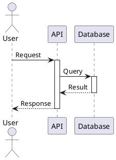

# Test Document: Linked PlantUML Files

This markdown file demonstrates the new capability to link to external `.puml` files.

## Embedded Diagram (Traditional)

Here's a traditional embedded PlantUML diagram:



## Linked Diagram (NEW)

Here's a linked PlantUML diagram that references an external file:


IDEs with PlantUML support (IntelliJ IDEA, VS Code with PlantUML extension) will render this diagram directly in the markdown preview!

## Another Linked Diagram


## Benefits of Linked Diagrams

1. **IDE Preview** - View diagrams while editing in supported IDEs
2. **Version Control** - Track diagram changes separately
3. **Reusability** - Same diagram in multiple documents
4. **Maintainability** - Update once, reflects everywhere
5. **Code Reviews** - Reviewers can diff .puml files directly

## Processing This File

To convert this file to Confluence-ready markdown with images:

```bash
# Process both embedded and linked diagrams
python scripts/process_markdown_puml.py examples/test_linked_puml.md --format svg

# This will create:
# - examples/test_linked_puml_with_images.md (all diagrams as image links)
# - examples/images/*.svg (generated images)
```

## Validation

Validate all diagrams (embedded and linked) without converting:

```bash
python scripts/process_markdown_puml.py examples/test_linked_puml.md --validate
```

This will:
- ✅ Check syntax of embedded code blocks
- ✅ Check syntax of linked .puml files
- ✅ Report any errors with line numbers
- ✅ Return exit code 0 if all valid, non-zero if errors
