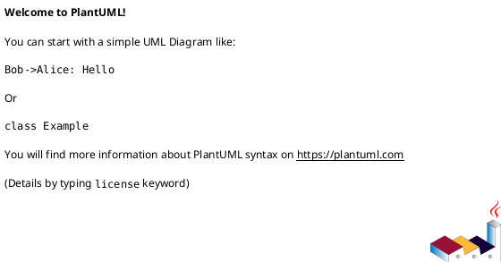

 ---
name: plantuml
description: Generate PlantUML diagrams from text descriptions and convert them to PNG/SVG images. Use when asked to create a diagram, generate PlantUML, convert .puml to image, extract diagrams from markdown, or prepare markdown for Confluence/Notion. Supports all 19 PlantUML diagram types including UML (sequence, class, activity, state, component, deployment, use case, object, timing) and non-UML (ER, Gantt, JSON/YAML, mindmap, WBS, network, wireframes, Archimate).
---

# PlantUML Diagram Generation and Conversion

This skill turns natural language descriptions and source code into professional PlantUML diagrams. It prioritizes correct syntax on first attempt, uses structured file naming for traceability, and converts diagrams to publication-ready images.

When errors occur, it consults targeted troubleshooting guides and retries up to 3 times before surfacing the issue to the user.

## Setup Verification

Before creating any diagram, confirm the environment is ready:

```bash
python scripts/check_setup.py
```

This checks Java (JRE 8+), Graphviz, and plantuml.jar. If any component is missing, load `references/plantuml_reference.md` for installation steps.

## Routing: Match the User's Intent to a Workflow

Read the user's request and match it to **one** of these workflows:

### 1. Create a New Diagram

**Trigger:** User says "create", "generate", "draw", "make", or "diagram for..."

**Steps:**
1. Identify the diagram type using the keyword table below
2. Load the matching syntax reference: `references/[type]_diagrams.md`
3. Create the `.puml` file with structured naming (see naming convention below)
4. Convert with `python scripts/convert_puml.py file.puml --format png`
5. On conversion failure, consult `references/troubleshooting/toc.md`, identify the error category, then load the specific guide from `references/troubleshooting/[category]_guide.md`. Retry up to 3 times.
6. Verify the output image exists and is non-empty
7. Present the image link to the user

### 2. Convert an Existing .puml File

**Trigger:** User provides a `.puml` file or says "convert"

```bash
python scripts/convert_puml.py diagram.puml --format png
python scripts/convert_puml.py diagram.puml --format svg --output-dir images/
```

### 3. Process Markdown Containing PlantUML

**Trigger:** User mentions "markdown", "extract diagrams", "Confluence", or "Notion" — or uploads a `.md` file containing ` ```puml ` blocks or `` links

**Important:** Confluence and Notion cannot render PlantUML natively. Always convert diagrams to images before upload.

```bash
python scripts/process_markdown_puml.py article.md --format png
python scripts/process_markdown_puml.py article.md --validate  # syntax check only, for CI/CD
```

Output: `article_with_images.md` + `images/` directory with generated PNGs or SVGs.

### 4. Convert Source Code to Architecture Diagrams

**Trigger:** User says "from code", "analyze my app", or names a framework (Spring Boot, FastAPI, ETL, Node.js, React)

1. Identify the framework
2. Review the matching example in `examples/[framework]/` — each contains deployment, component, and sequence diagram templates
3. Map the user's code structure to the example patterns
4. Adapt the template `.puml` to match their actual architecture
5. Enrich with Unicode symbols from `references/unicode_symbols.md`

### 5. Fix a Broken Diagram

**Trigger:** User says "error", "fix", "not working", "syntax error", or provides a `.puml` that fails to convert

1. Load `references/troubleshooting/toc.md` — this contains an error decision tree
2. Match the error message to a category
3. Load the specific guide: `references/troubleshooting/[category]_guide.md`
4. Apply the documented fix, re-convert, and verify

### 6. Style or Theme an Existing Diagram

**Trigger:** User mentions "style", "theme", "colors", "appearance", or "make it look better"

Load `references/styling_guide.md` for modern `<style>` CSS-like syntax. For quick theming: `!theme cerulean` (also: `bluegray`, `plain`, `sketchy`, `amiga`).

---

## Diagram Type Identification

Match the user's language to a diagram type. When multiple types could fit, prefer the first match in this table:

| User's Language | Diagram Type | Syntax Reference |
|---|---|---|
| "sequence", "API call", "request/response", "message flow", "interaction" | Sequence | `references/sequence_diagrams.md` |
| "class", "inheritance", "OOP", "extends", "implements" | Class | `references/class_diagrams.md` |
| "database", "entity", "table", "schema", "ER", "relationship" | ER | `references/er_diagrams.md` |
| "workflow", "process", "flowchart", "decision tree", "activity" | Activity | `references/activity_diagrams.md` |
| "state", "transition", "state machine" | State | `references/state_diagrams.md` |
| "component", "module", "architecture" | Component | `references/component_diagrams.md` |
| "deployment", "server", "infrastructure", "cloud", "docker" | Deployment | `references/deployment_diagrams.md` |
| "gantt", "timeline", "schedule", "project plan" | Gantt | `references/gantt_diagrams.md` |
| "use case", "actor", "feature" | Use Case | `references/use_case_diagrams.md` |
| "mindmap", "brainstorm", "ideas" | MindMap | `references/mindmap_diagrams.md` |
| "network", "topology" | Network | `references/network_diagrams.md` |
| "wireframe", "UI mockup" | Salt | `references/wireframes_salt.md` |
| "json", "yaml", "data structure" | JSON/YAML | `references/json_yaml_diagrams.md` |
| "gantt", "WBS", "work breakdown" | WBS | `references/wbs_diagrams.md` |

If the request is ambiguous, default to **sequence** — it's the most general-purpose type. Confirm with the user before converting. For the full list of all 19 types, load `references/toc.md`.

---

## File Naming Convention

All `.puml` files go in a `./diagrams/` directory with structured names:

```
./diagrams/<markdown_name>_<NNN>_<type>_<short_title>.puml
```

Examples:
- `./diagrams/architecture_001_sequence_jwt_auth.puml`
- `./diagrams/readme_002_er_user_schema.puml`
- `./diagrams/standalone_001_class_payment.puml` (when no markdown source)

---

## Core Syntax Quick Reference

Every PlantUML diagram uses this structure:



Common relationship arrows: `->` solid, `-->` dashed, `..>` dotted. Labels: `A -> B : Label text`.

For diagram-specific syntax beyond this, load the matching `references/[type]_diagrams.md`.

---

## Examples: What Good Execution Looks Like

### Example 1: Simple diagram from a description

**User request:** "Create a sequence diagram for user login with JWT"

**Agent execution:**
1. Matched keywords "sequence" + "login" + "JWT" → type: sequence
2. Loaded `references/sequence_diagrams.md` for participant, activation, and arrow syntax
3. Created `./diagrams/standalone_001_sequence_jwt_login.puml` using reference syntax patterns
4. Ran: `python scripts/convert_puml.py ./diagrams/standalone_001_sequence_jwt_login.puml --format png`
5. Verified `./diagrams/standalone_001_sequence_jwt_login.png` exists (non-empty)
6. Presented image link to user

### Example 2: Markdown processing for Confluence

**User request:** "I need to upload this doc to Confluence" (uploads `architecture.md` containing PlantUML blocks)

**Agent execution:**
1. Detected `.md` file with PlantUML content + "Confluence" → Workflow 3
2. Ran: `python scripts/process_markdown_puml.py architecture.md --format png`
3. Output: `architecture_with_images.md` + `images/` directory
4. Told user: "Converted 4 diagrams to images. Upload `architecture_with_images.md` — all PlantUML blocks have been replaced with image links."

### Example 3: Handling a conversion error

**User request:** "Fix my diagram, it's giving a syntax error" (provides broken `.puml`)

**Agent execution:**
1. Attempted conversion — failed with "No @startuml found"
2. Loaded `references/troubleshooting/toc.md` → matched error to "General Syntax" category
3. Loaded `references/troubleshooting/general_syntax_guide.md` → Error #1: missing delimiters
4. Found the file was missing `@enduml` (misleading error message — the guide documents this)
5. Added the missing delimiter, re-converted successfully
6. Presented fixed diagram and explained the issue

---

## Resource Loading Strategy

Load reference files one at a time, only when the current step requires them.

**For diagram creation:** Load `references/[type]_diagrams.md` after identifying the type.

**For styling:** Load `references/styling_guide.md` when the user requests visual customization, or after the diagram is structurally complete and ready for polish.

**For errors:** Start with `references/troubleshooting/toc.md` (the decision tree), then load the single specific guide it points to.

**For code-to-diagram:** Load the framework example from `examples/[framework]/` after identifying which framework the user's code uses.

**For Unicode enrichment:** Load `references/unicode_symbols.md` when building deployment or component diagrams from code, or when the user asks for icons/symbols.

**For all 19 diagram types:** Load `references/toc.md` only when the type table above doesn't match the user's request.

---

## Available Resources

### Syntax References (one per diagram type)

| File | Content |
|---|---|
| `references/toc.md` | Navigation hub — all 19 diagram types with descriptions |
| `references/common_format.md` | Universal elements: delimiters, metadata, comments, notes |
| `references/sequence_diagrams.md` | Participants, arrows, activation, fragments, groups |
| `references/class_diagrams.md` | Classes, relationships, visibility, generics, packages |
| `references/er_diagrams.md` | Entities, attributes, cardinality, keys |
| `references/activity_diagrams.md` | Actions, decisions, forks, partitions, swimlanes |
| `references/state_diagrams.md` | States, transitions, nested states, history |
| `references/component_diagrams.md` | Components, interfaces, packages, ports |
| `references/deployment_diagrams.md` | Nodes, artifacts, cloud/database/storage shapes |
| `references/gantt_diagrams.md` | Tasks, durations, dependencies, milestones |
| `references/use_case_diagrams.md` | Actors, use cases, relationships |
| `references/mindmap_diagrams.md` | Hierarchy, branches, styles |
| `references/network_diagrams.md` | Network topology, nwdiag syntax |
| `references/wbs_diagrams.md` | Work breakdown structure |
| `references/json_yaml_diagrams.md` | Data structure visualization |
| `references/wireframes_salt.md` | UI mockup syntax |
| `references/styling_guide.md` | Modern `<style>` CSS-like syntax, skinparam, themes |
| `references/unicode_symbols.md` | 100+ symbols organized by category (web, security, data, cloud) |
| `references/plantuml_reference.md` | Installation, CLI options, direct Java commands |

### Troubleshooting Guides (215+ documented errors)

| File | Coverage |
|---|---|
| `references/troubleshooting/toc.md` | **Start here** — error decision tree and category navigation |
| `references/troubleshooting/installation_setup_guide.md` | Java, Graphviz, plantuml.jar (15 errors) |
| `references/troubleshooting/general_syntax_guide.md` | Delimiters, comments, structure (20 errors) |
| `references/troubleshooting/arrows_relationships_guide.md` | Arrow syntax across diagram types (20 errors) |
| `references/troubleshooting/text_labels_guide.md` | Quotes, special characters, encoding (20 errors) |
| `references/troubleshooting/styling_themes_guide.md` | skinparam vs style, colors, fonts (20 errors) |
| `references/troubleshooting/preprocessor_includes_guide.md` | !include, !define, !procedure (20 errors) |
| `references/troubleshooting/sequence_diagrams_guide.md` | Participants, activations, fragments (20 errors) |
| `references/troubleshooting/class_diagrams_guide.md` | Relationships, visibility, generics (20 errors) |
| `references/troubleshooting/er_diagrams_guide.md` | Entities, cardinality, keys (20 errors) |
| `references/troubleshooting/activity_diagrams_guide.md` | Flow control, forks, partitions (20 errors) |
| `references/troubleshooting/image_generation_guide.md` | Rendering, output formats (20 errors) |
| `references/troubleshooting/performance_guide.md` | Timeouts, memory, large diagrams (20 errors) |

### Code-to-Diagram Examples

| Directory | Framework | Diagrams Included |
|---|---|---|
| `examples/spring-boot/` | Spring Boot | AWS ECS deployment, MVC components, REST API sequence |
| `examples/fastapi/` | FastAPI | Kubernetes deployment, async architecture |
| `examples/python-etl/` | Python ETL | Airflow pipeline, data quality, monitoring |
| `examples/nodejs-web/` | Node.js | Express/Nest.js components |
| `examples/react-frontend/` | React | SPA deployment (S3 + CloudFront) |

### Scripts

| Script | Purpose |
|---|---|
| `scripts/check_setup.py` | Verify Java, Graphviz, plantuml.jar |
| `scripts/convert_puml.py` | Convert `.puml` → PNG/SVG |
| `scripts/process_markdown_puml.py` | Process markdown with embedded or linked PlantUML |
| `scripts/resilient_processor.py` | 4-step workflow with structured naming and retry logic |

---

## Edge Cases and Fallbacks

**Ambiguous diagram type:** Default to sequence. Confirm with the user before converting.

**Missing reference file:** Proceed using the syntax quick reference above and the common patterns in `references/common_format.md`. Note which specific guide was unavailable.

**Conversion fails after 3 retries:** Present the error message and the troubleshooting guide's suggested fix to the user. Include the `.puml` source so they can iterate.

**User uploads markdown for Confluence/Notion without mentioning conversion:** Check whether the markdown contains PlantUML blocks (` ```puml ` or `.puml` links). If it does, convert diagrams to images first and explain why — these platforms cannot render PlantUML natively.

**User asks for a diagram type not in the keyword table:** Load `references/toc.md` for the full list of 19 types. Present the options and let the user choose.

**User wants both PNG and SVG:** Run conversion twice with `--format png` and `--format svg`.

---

## Best Practices

**Format selection:** Use SVG for documentation (scalable, supports hyperlinks). Use PNG for web embedding (smaller files, fixed resolution).

**Styling:** Apply modern `<style>` blocks rather than legacy `skinparam` where possible. Example:

```puml
@startuml
<style>
classDiagram {
  class { BackgroundColor LightBlue }
}
</style>
class Animal { +move() }
class Dog extends Animal { +bark() }
@enduml
```

**File management:** Keep `.puml` source files alongside generated images. The source is the single source of truth — images are derived artifacts.

**Incremental complexity:** Start with the structural content (participants, entities, classes). Convert and verify. Then add styling, notes, and visual enrichment in a second pass.
