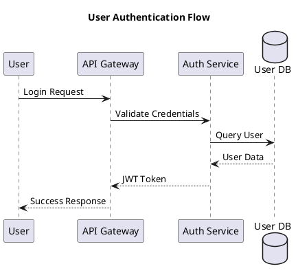
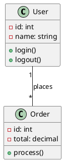

# Test Resilient Workflow

This document tests the resilient workflow processor.

## Authentication Flow

```puml
@startuml
title User Authentication Flow

participant "User" as user
participant "API Gateway" as api
participant "Auth Service" as auth
database "User DB" as db

user -> api: Login Request
api -> auth: Validate Credentials
auth -> db: Query User
db --> auth: User Data
auth --> api: JWT Token
api --> user: Success Response

@enduml
```

## Simple Class Diagram

```puml
@startuml
class User {
  -id: int
  -name: string
  +login()
  +logout()
}

class Order {
  -id: int
  -total: decimal
  +process()
}

User "1" -- "*" Order: places
@enduml
```
