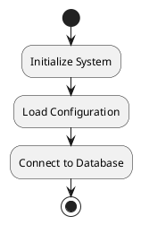
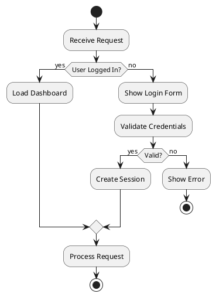
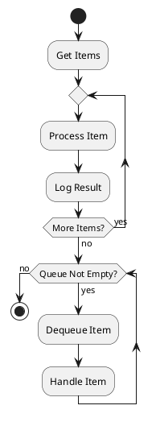
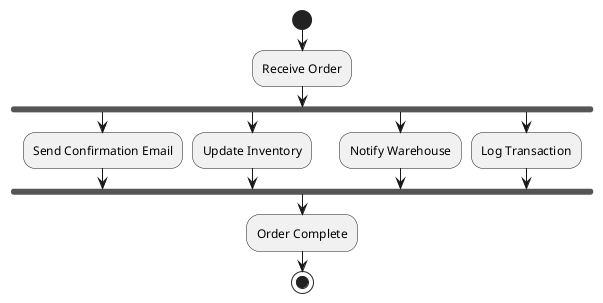
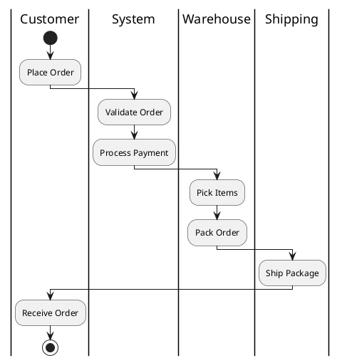
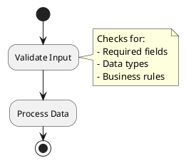

# Activity Diagrams

Activity diagrams model workflows, business processes, and algorithms, showing sequential and parallel activities, decision points, and control flow.

## Basic Structure



## Decision Points



## Loops



## Parallel Processing (Fork/Join)



## Swim Lanes



## Notes and Documentation



## Conversion

```bash
java -jar plantuml.jar -tsvg activity.puml
```

See [toc.md](toc.md) for all diagram types.
