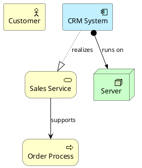

# Archimate Diagrams

Archimate diagrams model enterprise architecture.

## Basic Structure

```puml
@startuml
!include <archimate/Archimate>

Business_Actor(customer, "Customer")
Business_Process(order, "Order Process")
Business_Service(sales, "Sales Service")
Application_Component(crm, "CRM System")
Technology_Node(server, "Server")

Rel_Serving(sales, order, "supports")
Rel_Realization(crm, sales, "realizes")
Rel_Assignment(crm, server, "runs on")
@enduml
```

See [toc.md](toc.md) for all diagram types.
