# Class Diagrams

Class diagrams show the static structure of a system, depicting classes, their attributes, methods, relationships, and how they relate to one another. They are foundational for object-oriented design documentation.

## Basic Class Definition

Define classes using the `class` keyword with attributes and methods specified inside curly braces:

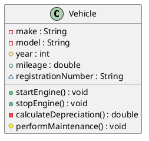

## Visibility Modifiers

PlantUML uses standard UML visibility symbols:

- `+` **Public** - Accessible everywhere
- `-` **Private** - Accessible only within the class
- `#` **Protected** - Accessible in this class and subclasses
- `~` **Package/Internal** - Accessible within the package

**Example:**

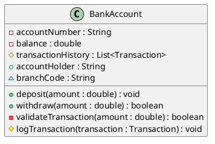

### Alternative Icon Visibility

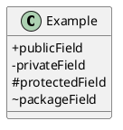

## Class Relationships

### Inheritance/Generalization (`<|--`)

Inheritance represents an "is-a" relationship:

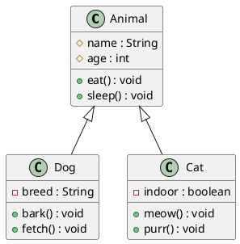

### Composition (`*--`)

Composition represents strong ownership - if the container is destroyed, so are the components:

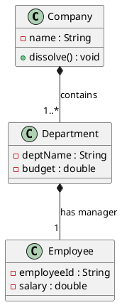

**Key Point:** In composition, the lifecycle of the part is tied to the whole. When Company is destroyed, Departments cease to exist.

### Aggregation (`o--`)

Aggregation represents weak ownership - parts can exist independently:

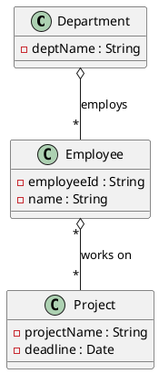

**Key Point:** Employees can exist without a Department, and can work on multiple Projects.

### Association (`--`)

Association shows a general relationship:

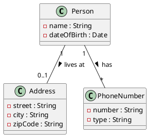

### Dependency (`..>`)

Dependency shows that one class uses another:

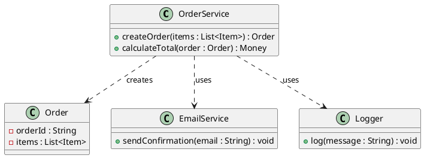

**Key Point:** Dependency means changes to the target class may require changes to the source class.

## Multiplicity

Express the number of instances in relationships:

- `1` - Exactly one
- `0..1` - Zero or one
- `*` or `0..*` - Zero or more
- `1..*` - One or more
- `m..n` - Between m and n (e.g., `3..7`)

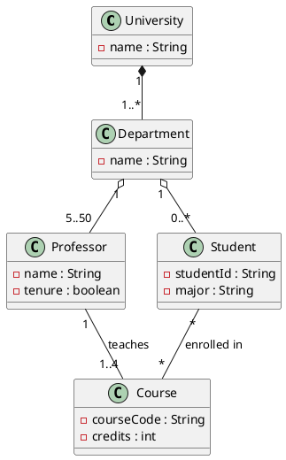

## Abstract Classes and Interfaces

### Abstract Classes

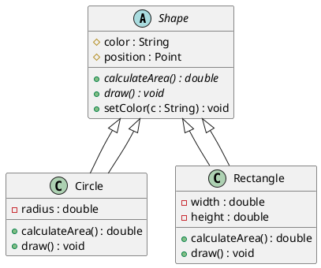

### Interfaces

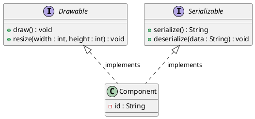

**Dashed line (`<|..`)** is used for interface implementation.

## Enumerations

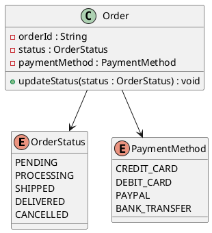

## Stereotypes and Annotations

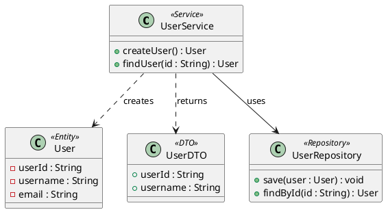

## Packages and Namespaces

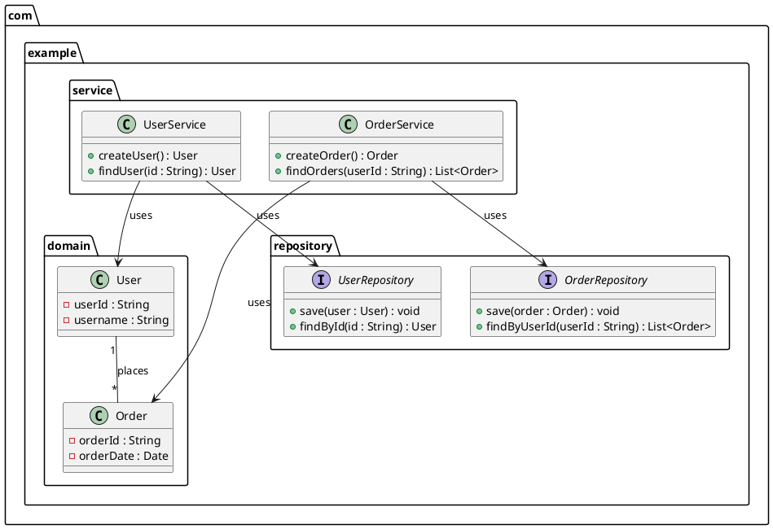

## Generics

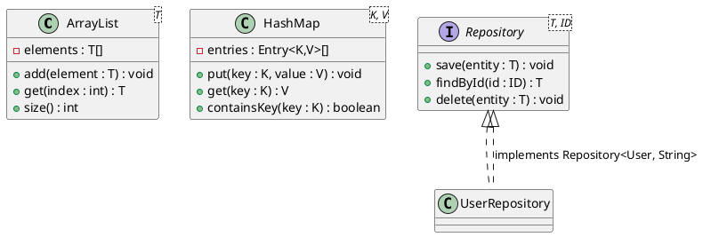

## Notes and Documentation

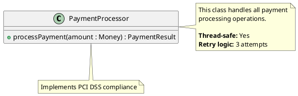

## Real-World Example: E-Commerce Domain Model

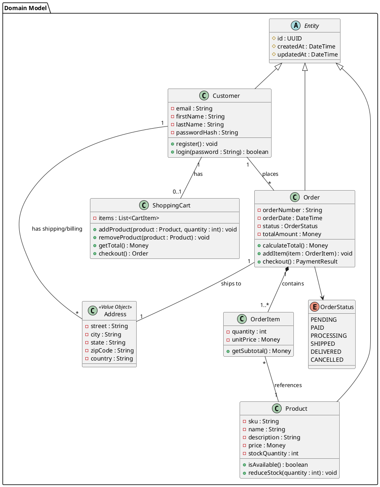

## Tips and Best Practices

1. **Keep it focused** - One diagram per concern (don't mix persistence, service, and domain layers)
2. **Use packages** - Group related classes
3. **Show key relationships only** - Don't include every field/method
4. **Use stereotypes** - `<<Entity>>`, `<<Service>>`, `<<Repository>>`
5. **Leverage abstract classes** - Show common behavior at the right level
6. **Be consistent with naming** - Follow your project's conventions
7. **Add notes sparingly** - Document non-obvious design decisions
8. **Use multiplicity** - Make cardinality explicit

## Common Patterns

### Repository Pattern

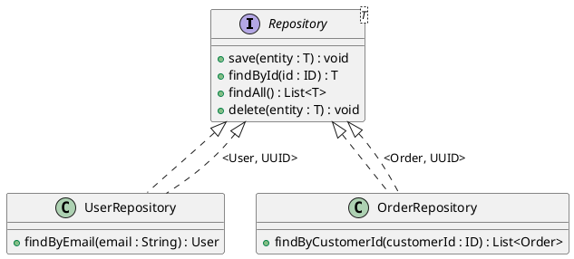

### Factory Pattern

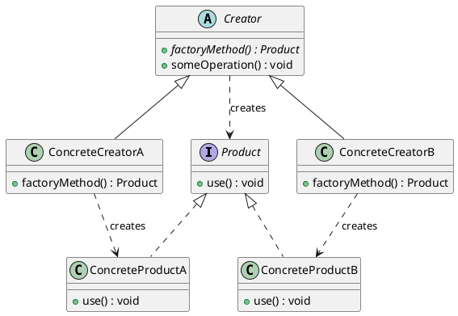

## Conversion to Images

```bash
# PNG
java -jar plantuml.jar class_diagram.puml

# SVG (recommended)
java -jar plantuml.jar -tsvg class_diagram.puml
```

See [plantuml_reference.md](plantuml_reference.md) for comprehensive CLI documentation.
