# Common Format Elements

This guide covers the universal elements and syntax shared across most PlantUML diagram types.

## Table of Contents

1. [Universal Delimiters](#universal-delimiters)
2. [Metadata Commands](#metadata-commands)
3. [Comments](#comments)
4. [Notes and Annotations](#notes-and-annotations)
5. [Text Formatting](#text-formatting)
6. [Basic Colors](#basic-colors)
7. [Diagrams with Different Delimiters](#diagrams-with-different-delimiters)

---

## Universal Delimiters

### Standard Format

Most PlantUML diagrams use the same start and end tags:

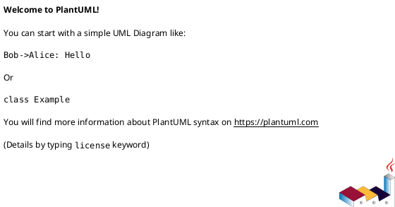

### Optional Diagram Name

You can name your diagram for better organization:


The name becomes part of the generated filename: `my_diagram.png`

### Multiple Diagrams in One File

```puml
@startuml diagram1
class User
@enduml

@startuml diagram2
class Order
@enduml
```

This generates `diagram1.png` and `diagram2.png`.

---

## Metadata Commands

### Title

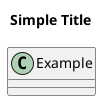

### Multi-line Title

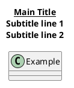

### Header and Footer

```puml
@startuml
header
  <font color=red>Warning:</font>
  Draft Version
endheader

footer
  Page %page% of %lastpage%
  Generated on %date%
endfooter

class Example
@enduml
```

**Available Variables**:
- `%page%` - Current page number
- `%lastpage%` - Total pages
- `%date%` - Current date
- `%time%` - Current time

### Caption

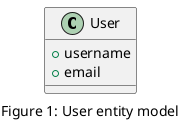

### Legend

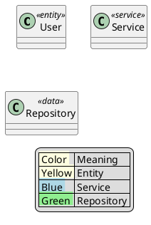

### Legend Positioning

```puml
legend left
legend right
legend top
legend bottom
legend center
```

### Complete Metadata Example

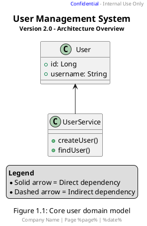

---

## Comments

### Single-line Comments

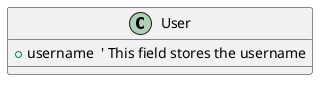

### Multi-line Comments

```puml
@startuml
/'
  This is a multi-line comment
  spanning several lines
  useful for documentation
'/

class User {
  +username
  +email
}
@enduml
```

### Comments for Documentation

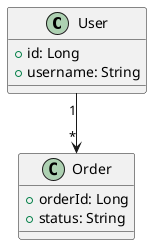

---

## Notes and Annotations

### Note Positioning

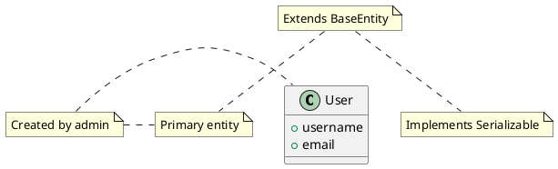

### Multi-line Notes

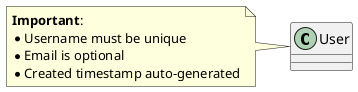

### Notes on Links

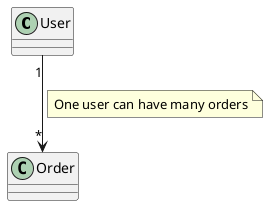

### Floating Notes

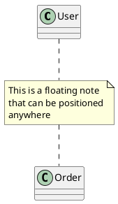

### Colored Notes

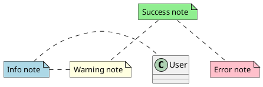

### Notes with Creole Formatting

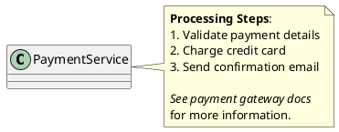

---

## Text Formatting

PlantUML supports **Creole** wiki-style formatting across all text elements (titles, notes, labels, etc.).

### Basic Creole Syntax

| Syntax | Result | Usage |
|--------|--------|-------|
| `**text**` | **Bold** | `**Important**` |
| `//text//` | *Italic* | `//Optional//` |
| `--text--` | ~~Strikethrough~~ | `--Deprecated--` |
| `__text__` | Underline | `__Required__` |
| `""text""` | Monospace | `""code()""` |

### Lists

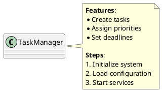

### Hyperlinks

```puml
@startuml
class Documentation

note bottom
  See [[https://plantuml.com PlantUML Docs]]
  API: [[https://api.example.com/docs]]
end note
@enduml
```

### Text Size and Color

```puml
@startuml
title
  <size:20>Large Title</size>
  <size:12>Normal subtitle</size>
  <size:8>Small footnote</size>
end title

class Example

note right
  <color:red>Error messages</color>
  <color:blue>Info messages</color>
  <color:green>Success messages</color>
  <color:#FF5722>Custom hex color</color>
end note
@enduml
```

### Combining Formats

```puml
@startuml
class AdvancedExample

note left
  <size:14>**<color:blue>Status Report</color>**</size>

  <color:green>//System operational//</color>
  ""last_check: 2025-11-08""

  **Tasks**:
  * <color:green>Completed: 45</color>
  * <color:orange>In Progress: 12</color>
  * <color:red>--Failed: 3--</color>
end note
@enduml
```

**For comprehensive text formatting details**, see [styling_guide.md](styling_guide.md#creole-text-formatting).

---

## Basic Colors

### Named Colors

PlantUML supports standard color names:

**Basic**: Red, Blue, Green, Yellow, Orange, Purple, Pink, Gray, Black, White

**Variants**:
- Light* (LightBlue, LightGreen, LightGray, etc.)
- Dark* (DarkBlue, DarkGreen, DarkGray, etc.)
- Pale* (PaleGreen, PaleGoldenRod, etc.)

**Additional**: Navy, Teal, Olive, Maroon, Fuchsia, Lime, Aqua, Silver

### Hex Colors

```puml
@startuml
class Example #FF5722
class Another #4CAF50

note right #E3F2FD
  Custom background color
end note
@enduml
```

### Color Application

#### Element Background

```puml
@startuml
class User #LightBlue {
  +username
}

class Admin #LightGreen {
  +permissions
}
@enduml
```

#### Line Colors

```puml
@startuml
class User
class Order

User -[#Red]-> Order : error case
User -[#Green]-> Order : success case
@enduml
```

### Color Gradients

```puml
@startuml
class Example #LightBlue/Blue {
  gradient effect
}
@enduml
```

**For advanced styling and color techniques**, see [styling_guide.md](styling_guide.md).

---

## Diagrams with Different Delimiters

While most diagrams use `@startuml`/`@enduml`, some specialized diagram types have their own delimiters.

### Alternative Start/End Tags

| Diagram Type | Start Tag | End Tag | Notes |
|--------------|-----------|---------|-------|
| **JSON** | `@startjson` | `@endjson` | Visualize JSON data |
| **YAML** | `@startyaml` | `@endyaml` | Visualize YAML data |
| **Gantt** | `@startgantt` | `@endgantt` | Project timelines |
| **MindMap** | `@startmindmap` | `@endmindmap` | Hierarchical organization |
| **WBS** | `@startwbs` | `@endwbs` | Work breakdown structure |
| **Salt (Wireframes)** | `@startsalt` | `@endsalt` | UI mockups |
| **Ditaa** | `@startditaa` | `@endditaa` | ASCII diagrams |
| **Chen ER** | `@startchen` | `@endchen` | Chen notation ER diagrams |

### Examples of Alternative Delimiters

#### JSON Diagram

```puml
@startjson
{
  "name": "John Doe",
  "age": 30,
  "email": "john@example.com"
}
@endjson
```

#### Gantt Chart

```puml
@startgantt
Project starts 2025-01-15
[Task 1] lasts 10 days
[Task 2] lasts 15 days
[Task 2] starts at [Task 1]'s end
@endgantt
```

#### MindMap

```puml
@startmindmap
* Root Concept
** Branch 1
*** Leaf 1.1
*** Leaf 1.2
** Branch 2
*** Leaf 2.1
@endmindmap
```

#### Salt Wireframe

```puml
@startsalt
{
  Login
  Username | "user@example.com"
  Password | "****"
  [Cancel] | [OK]
}
@endsalt
```

### Why Different Delimiters?

These specialized diagrams have:
- **Different syntax rules** from standard UML
- **Unique rendering engines** optimized for their specific purpose
- **Domain-specific features** (e.g., date calculations in Gantt, tree structures in MindMap)

### Standard vs. Specialized Delimiters

✅ **Use `@startuml`/`@enduml` for**:
- Sequence diagrams
- Class diagrams
- Use case diagrams
- Activity diagrams
- State diagrams
- Component diagrams
- Deployment diagrams
- Object diagrams
- Timing diagrams
- Entity-Relationship diagrams
- Network diagrams (nwdiag)

⚠️ **Use specialized delimiters for**:
- JSON/YAML visualization
- Gantt charts
- MindMaps
- Work Breakdown Structure (WBS)
- Wireframes (Salt)
- ASCII diagrams (Ditaa)
- Chen ER notation

---

## Common Elements Summary

### Elements Found in Most Diagrams

| Element | Syntax | Description |
|---------|--------|-------------|
| **Delimiters** | `@startuml`...`@enduml` | Required start/end |
| **Title** | `title My Title` | Diagram title |
| **Header** | `header...endheader` | Top page decoration |
| **Footer** | `footer...endfooter` | Bottom page decoration |
| **Caption** | `caption My Caption` | Figure caption |
| **Legend** | `legend...endlegend` | Color/symbol key |
| **Comments** | `'` or `/' ... '/` | Documentation |
| **Notes** | `note left/right/top/bottom` | Annotations |
| **Colors** | Named or `#RRGGBB` | Visual styling |
| **Creole** | `**bold**`, `//italic//`, etc. | Text formatting |

### Universal Best Practices

1. ✅ **Always include delimiters** (`@startuml`/`@enduml`)
2. ✅ **Add titles** for context and documentation
3. ✅ **Use comments** to explain complex parts
4. ✅ **Add legends** when using multiple colors/symbols
5. ✅ **Use Creole formatting** for emphasis in notes
6. ✅ **Name your diagrams** for better file organization
7. ✅ **Include metadata** (header/footer) for professional output

---

## Quick Reference Template

```puml
@startuml diagram_name
title
  <size:16><b>Main Title</b></size>
  <size:12>Subtitle or Description</size>
end title

header
  Document Header Information
endheader

footer
  Page %page% | %date%
endfooter

' ====================
' Your diagram content
' ====================

class Example {
  +field: Type
  +method(): ReturnType
}

note right
  **Documentation**:
  * Important point 1
  * Important point 2

  See [[https://docs.example.com documentation]]
end note

caption Figure 1: Diagram description

legend right
  **Legend**
  | Symbol | Meaning |
  | Line | Description |
endlegend
@enduml
```

---

See [toc.md](toc.md) for all diagram types and [styling_guide.md](styling_guide.md) for advanced styling with modern `<style>` syntax.
