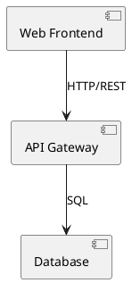
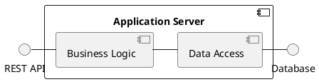
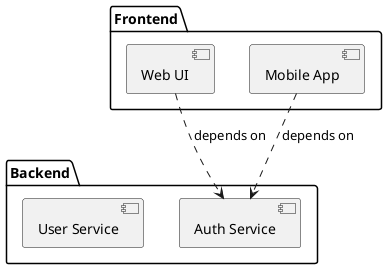

# Component Diagrams

Component diagrams show how a system is decomposed into components and how these components depend on each other through interfaces and ports.

## Basic Structure

## Interfaces and Ports

## Dependencies

See [toc.md](toc.md) for all diagram types.
