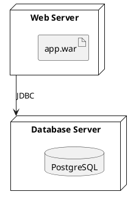
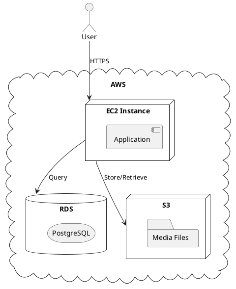

# Deployment Diagrams

Deployment diagrams show the execution architecture—how software artifacts are deployed onto nodes (hardware devices or execution environments).

## Basic Structure

## Cloud Infrastructure

See [toc.md](toc.md) for all diagram types.
