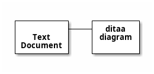

# Ditaa Diagrams (ASCII Art)

Ditaa converts ASCII art to diagrams.

## Basic Structure

## With Colors

## Special Tags
- `{d}` Document
- `{s}` Storage
- `{io}` Input/Output
- `{c}` Choice

See [toc.md](toc.md) for all diagram types.
