# Entity-Relationship (ER) Diagrams

ER diagrams model database structure, showing entities, attributes, and relationships between entities. They are essential for database design and documentation.

## Basic Entity Definition

Define entities and their attributes:

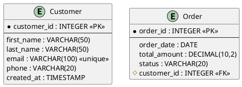

## Attribute Notation

- `*` - **Primary Key** (PK)
- `#` - **Foreign Key** (FK)
- `--` - **Separator** between identifier and descriptive attributes

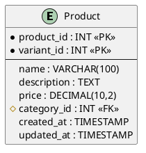

## Relationship Cardinality

PlantUML uses special notation for cardinality:

- `||` - **Exactly one**
- `|o` or `o|` - **Zero or one**
- `|{` or `}|` - **One or more**
- `o{` or `}o` - **Zero or more**

### One-to-Many Relationship

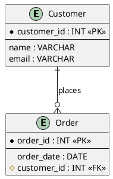

**Reading:** One Customer places zero or more Orders.

### One-to-One Relationship

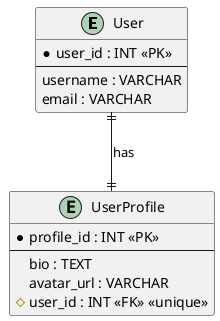

**Reading:** One User has exactly one UserProfile.

### Many-to-Many Relationship

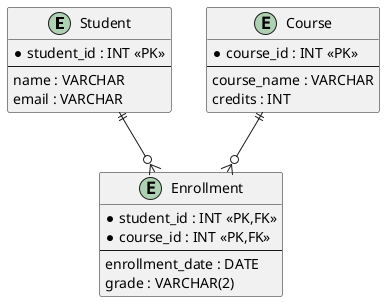

**Reading:** Students and Courses have a many-to-many relationship through Enrollment.

## Cardinality Examples

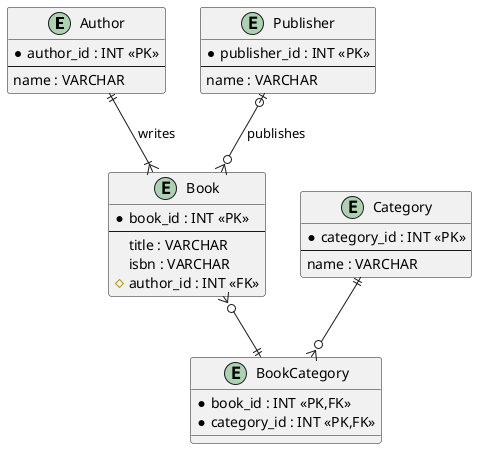

## Real-World Example: E-Commerce Database

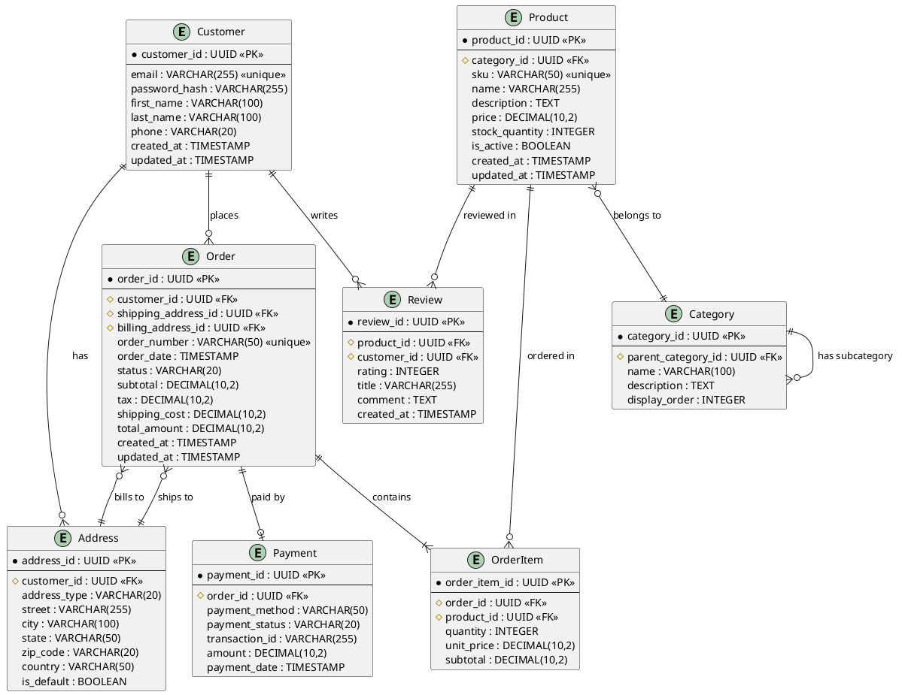

## Composite Primary Keys

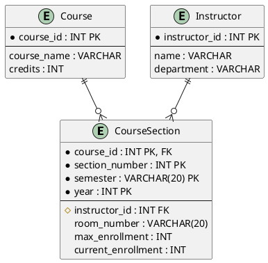

## Self-Referencing Relationships

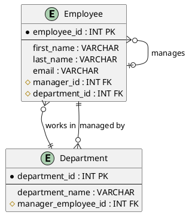

## Weak Entities

Weak entities depend on a strong entity for their existence:

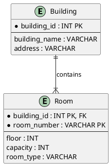

## Advanced Example: Multi-Tenant SaaS Database

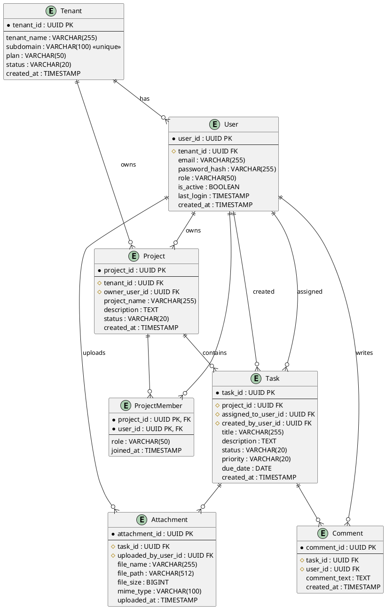

## Tips and Best Practices

1. **Use UUIDs for distributed systems** - Better for microservices and sharding
2. **Add indexes as notes** - Document performance-critical indexes
3. **Show data types** - Helps with implementation
4. **Mark unique constraints** - Use `<<unique>>` stereotype
5. **Document cascading deletes** - Add notes for ON DELETE CASCADE
6. **Separate concerns** - Create multiple diagrams for complex schemas
7. **Use meaningful names** - Follow database naming conventions
8. **Add timestamps** - created_at, updated_at for audit trails

## Common Patterns

### Audit Log Pattern

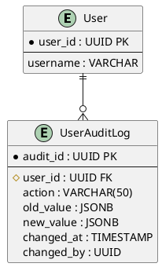

### Soft Delete Pattern

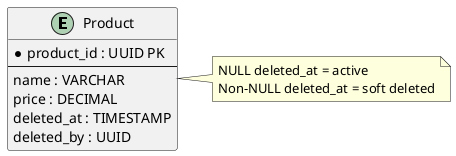

## Conversion to Images

```bash
# PNG
java -jar plantuml.jar er_diagram.puml

# SVG (recommended)
java -jar plantuml.jar -tsvg er_diagram.puml
```

See [plantuml_reference.md](plantuml_reference.md) for comprehensive CLI documentation.
