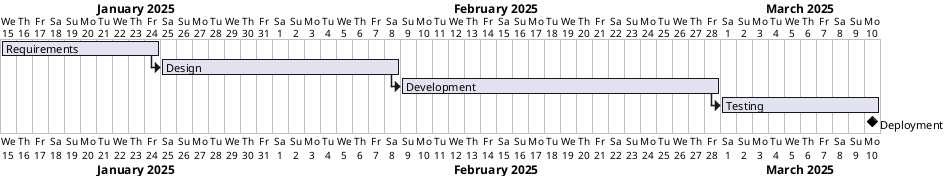
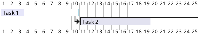

# Gantt Charts

Gantt charts show project timelines and dependencies.

## Basic Structure

```puml
@startgantt
Project starts 2025-01-15

[Requirements] lasts 10 days
[Design] lasts 15 days
[Design] starts at [Requirements]'s end

[Development] lasts 20 days
[Development] starts at [Design]'s end

[Testing] lasts 10 days
[Testing] starts at [Development]'s end

[Deployment] happens at [Testing]'s end
@endgantt
```

## With Progress

```puml
@startgantt
[Task 1] lasts 10 days
[Task 1] is 30% completed
[Task 1] is colored in Lavender/LightBlue

[Task 2] lasts 15 days
[Task 2] starts at [Task 1]'s end
[Task 2] is 60% completed
@endgantt
```

See [toc.md](toc.md) for all diagram types.
