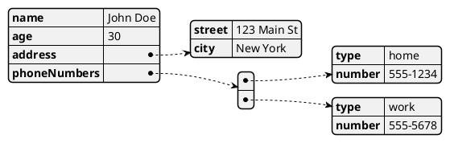
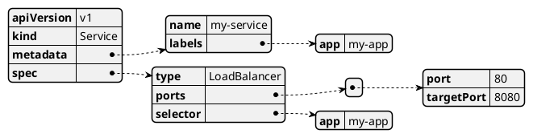

# JSON and YAML Visualization

PlantUML can visualize JSON and YAML data structures.

## JSON Example

```puml
@startjson
{
  "name": "John Doe",
  "age": 30,
  "address": {
    "street": "123 Main St",
    "city": "New York"
  },
  "phoneNumbers": [
    {"type": "home", "number": "555-1234"},
    {"type": "work", "number": "555-5678"}
  ]
}
@endjson
```

## YAML Example

```puml
@startyaml
apiVersion: v1
kind: Service
metadata:
  name: my-service
  labels:
    app: my-app
spec:
  type: LoadBalancer
  ports:
    - port: 80
      targetPort: 8080
  selector:
    app: my-app
@endyaml
```

See [toc.md](toc.md) for all diagram types.
