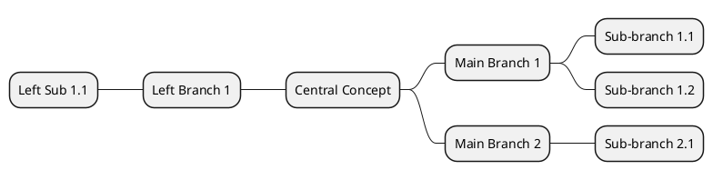
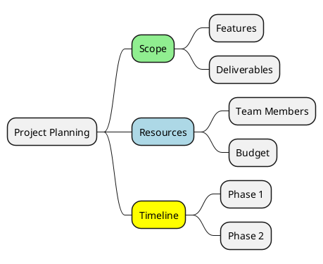

# MindMap Diagrams

MindMap diagrams organize hierarchical information.

## Basic Structure

```puml
@startmindmap
* Central Concept
** Main Branch 1
*** Sub-branch 1.1
*** Sub-branch 1.2
** Main Branch 2
*** Sub-branch 2.1

left side

** Left Branch 1
*** Left Sub 1.1
@endmindmap
```

## With Colors

```puml
@startmindmap
* Project Planning
**[#lightgreen] Scope
*** Features
*** Deliverables
**[#lightblue] Resources
*** Team Members
*** Budget
**[#yellow] Timeline
*** Phase 1
*** Phase 2
@endmindmap
```

See [toc.md](toc.md) for all diagram types.
