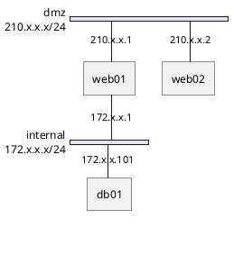
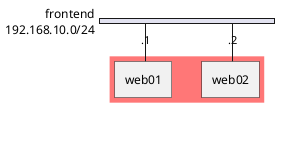

# Network Diagrams (nwdiag)

Network diagrams visualize network topology.

## Basic Structure

```puml
@startuml
nwdiag {
  network dmz {
    address = "210.x.x.x/24"
    web01 [address = "210.x.x.1"];
    web02 [address = "210.x.x.2"];
  }

  network internal {
    address = "172.x.x.x/24"
    web01 [address = "172.x.x.1"];
    db01 [address = "172.x.x.101"];
  }
}
@enduml
```

## With Groups

```puml
@startuml
nwdiag {
  network frontend {
    address = "192.168.10.0/24"

    group webservers {
      color = "#FF7777"
      web01 [address = ".1"];
      web02 [address = ".2"];
    }
  }
}
@enduml
```

See [toc.md](toc.md) for all diagram types.
