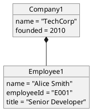
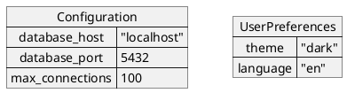

# Object Diagrams

Object diagrams show specific instances of classes at a particular moment in time.

## Basic Structure

```puml
@startuml
object Company1 {
  name = "TechCorp"
  founded = 2010
}

object Employee1 {
  name = "Alice Smith"
  employeeId = "E001"
  title = "Senior Developer"
}

Company1 *-- Employee1
@enduml
```

## Maps and Collections

```puml
@startuml
map Configuration {
  database_host => "localhost"
  database_port => 5432
  max_connections => 100
}

map UserPreferences {
  theme => "dark"
  language => "en"
}
@enduml
```

See [toc.md](toc.md) for all diagram types.
