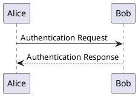

# PlantUML Installation, CLI, and Troubleshooting Guide

This comprehensive guide covers PlantUML installation, environment configuration, command-line operations, and troubleshooting for converting diagrams to PNG and SVG formats.

## Part 1: Installation and Configuration

Before generating diagrams, establish a robust local environment with three key components: PlantUML, Java runtime, and Graphviz.

### Acquiring PlantUML

PlantUML is a standalone Java Archive (.jar) file, not a traditional installation:

**Download Sources:**
- Official Website: https://plantuml.com/download
- GitHub Releases (recommended for latest): https://github.com/plantuml/plantuml/releases
- SourceForge Mirror: https://sourceforge.net/projects/plantuml/

**Best Practice:** Download the latest `plantuml.jar` and place it in a dedicated directory:
- Windows: `C:\tools\plantuml\plantuml.jar`
- macOS/Linux: `~/plantuml.jar` or `~/tools/plantuml.jar`

### Java Runtime (Required)

PlantUML requires Java Runtime Environment (JRE) or Development Kit (JDK) version 8 or higher.

**Verify Existing Installation:**
```bash
java -version
```

If Java is installed, this displays the version (e.g., "17.0.3"). If not, install and configure using environment variables.

#### Windows 11 Setup

1. **Download JDK:**
   - Oracle: https://www.oracle.com/java/technologies/downloads/
   - OpenJDK (Temurin): https://adoptium.net/

2. **Install JDK:** Run the installer (.exe or .msi)

3. **Set Environment Variables:**
   - Open **Advanced system settings** → **Environment Variables**
   - Create `JAVA_HOME`:
     - Variable: `JAVA_HOME`
     - Value: `C:\Program Files\Java\jdk-17.0.3` (your JDK path)
   - Update `Path`:
     - Find **Path** under System variables → **Edit**
     - Add new entry: `%JAVA_HOME%\bin`

4. **Verify:** Open new terminal and run `java -version`

#### macOS (Sonoma) Setup

1. **Install via Homebrew:**
```bash
brew install --cask temurin
```

2. **Set Environment Variables:**

Edit `~/.zshrc` (Zsh is default shell on macOS):

```bash
export JAVA_HOME=$(/usr/libexec/java_home)
export PATH=$JAVA_HOME/bin:$PATH
```

3. **Apply Changes:**
```bash
source ~/.zshrc
```

4. **Verify:**
```bash
java -version
```

#### Ubuntu 24.04 Setup

1. **Install JDK:**
```bash
sudo apt update
sudo apt install default-jdk
```

2. **Set Environment Variables:**

Find Java path:
```bash
sudo update-alternatives --config java
# Note the path, e.g., /usr/lib/jvm/java-21-openjdk-amd64
```

Edit system environment:
```bash
sudo nano /etc/environment
```

Add line:
```
JAVA_HOME="/usr/lib/jvm/java-21-openjdk-amd64"
```

3. **Apply Changes:**
```bash
source /etc/environment
```

4. **Verify:**
```bash
java -version
```

### Graphviz (Recommended)

Graphviz is required for most UML diagrams (class, component, state, etc.). Sequence diagrams and some non-UML diagrams don't require it.

#### Why Full Installation is Required

PlantUML bundles a minimal Graphviz for Windows, but it's unreliable. A full manual installation ensures the `dot` executable is available system-wide.

#### Configuration Methods

Set both for maximum compatibility:
1. **Add to PATH:** Makes `dot` available as a general command
2. **Set GRAPHVIZ_DOT:** Explicit path to the executable file

#### Windows 11 Setup

1. **Install:**
```bash
winget install graphviz
```
Or download installer from https://graphviz.org/download/

2. **Set GRAPHVIZ_DOT:**
   - Open **Advanced system settings** → **Environment Variables**
   - Create new variable:
     - Variable: `GRAPHVIZ_DOT`
     - Value: `C:\Program Files\Graphviz\bin\dot.exe`

3. **Update PATH:**
   - Find **Path** → **Edit**
   - Add: `C:\Program Files\Graphviz\bin`

4. **Verify:**
```bash
dot -V
```

#### macOS (Sonoma) Setup

1. **Install via Homebrew:**
```bash
brew install graphviz
```

2. **Set Environment Variable:**

Edit `~/.zshrc`:
```bash
export GRAPHVIZ_DOT=$(which dot)
```

The executable will be at `/opt/homebrew/bin/dot` (Apple Silicon) or `/usr/local/bin/dot` (Intel).

3. **Apply Changes:**
```bash
source ~/.zshrc
```

4. **Verify:**
```bash
dot -V
```

#### Ubuntu 24.04 Setup

1. **Install:**
```bash
sudo apt update
sudo apt install graphviz
```

2. **Set Environment Variable:**

Edit `/etc/environment`:
```bash
sudo nano /etc/environment
```

Add line:
```
GRAPHVIZ_DOT="/usr/bin/dot"
```

3. **Apply:**
```bash
source /etc/environment
```

4. **Verify:**
```bash
dot -V
```

### Installation Verification

Perform layered diagnostic check:

**Step 1: Verify Java**
```bash
java -version
```
Confirms Java runtime is in PATH.

**Step 2: Verify Graphviz**
```bash
dot -V
```
Confirms Graphviz is installed and in PATH.

**Step 3: Verify PlantUML <> Graphviz Link**
```bash
java -jar <path-to-plantuml.jar> -testdot
```

Successful output shows dot version and confirms complete installation.

**Common Failure:** "Dot executable does not exist" indicates missing or incorrect `GRAPHVIZ_DOT` environment variable.

## Part 2: Command-Line Conversion

### Basic Conversion Commands

Create a source file `my-diagram.puml`:



**Convert to PNG (default):**
```bash
java -jar <path-to-plantuml.jar> my-diagram.puml
```
Creates `my-diagram.png` in the same directory.

**Convert to SVG:**
```bash
java -jar <path-to-plantuml.jar> -tsvg my-diagram.puml
```
Creates `my-diagram.svg` (scalable vector format, recommended).

**Why SVG?** Vector format scales infinitely without pixelation, supports hyperlinks, and can embed source code as metadata.

### Output Directory Management

By default, PlantUML creates images alongside source files. Separate source from build artifacts:

**Specify Output Directory:**
```bash
java -jar <path-to-plantuml.jar> -tsvg -o "build/images" my-diagram.puml
```

Creates `build/images/` directory if needed and saves output there.

**Path Behavior:**
- **Absolute path** (`-o /abs/path/out`): Flattens output - all images in one directory
- **Relative path** (`-o ../out`): Preserves source directory structure

### Batch Processing

**Process Directory:**
```bash
java -jar <path-to-plantuml.jar> -tsvg -o "build/images" "docs/src-directory/"
```

**Recursive Wildcard Matching (Recommended):**
```bash
java -jar <path-to-plantuml.jar> -tsvg -o "build/images" "**/*.puml"
```

**Critical:** Always quote wildcard patterns (`"**/*.puml"`). Without quotes, the shell expands the pattern before passing to Java, which fails or creates unwieldy commands. Quotes ensure PlantUML's internal wildcard engine performs the recursive search.

**Wildcard Patterns:**
- `*` - Matches any characters (not directory separators)
- `?` - Matches exactly one character
- `**` - Matches any characters including directory separators (recursive)

### Pipe Mode

For automation and scripting, PlantUML can operate as part of a pipeline:

```bash
cat my-diagram.puml | java -jar <path-to-plantuml.jar> -tsvg -pipe > output.svg
```

Enables dynamic diagram generation without temporary files.

### Alternative Output Formats

**PDF** (requires external dependencies):
```bash
java -jar <path-to-plantuml.jar> -tpdf diagram.puml
```
Requires Apache FOP and Batik .jar files in the same folder as plantuml.jar.

**LaTeX/Tikz:**
```bash
java -jar <path-to-plantuml.jar> -tlatex diagram.puml
```
For academic/scientific publications.

**ASCII Art:**
```bash
java -jar <path-to-plantuml.jar> -tutxt diagram.puml
```
Unicode box-drawing characters for text-only environments.

## Part 3: Comprehensive CLI Flags

### Preprocessing and Customization

**Set Preprocessor Variables:**
```bash
java -jar <path-to-plantuml.jar> -DAUTHOR="John" -DVERSION="1.0" diagram.puml
```
Equivalent to `!define VAR value` in the file.

**Override Skin Parameters:**
```bash
java -jar <path-to-plantuml.jar> -SbackgroundColor=LightYellow diagram.puml
```

**Set Pragmas:**
```bash
java -jar <path-to-plantuml.jar> -Pteoz=true diagram.puml
```
Controls engine behavior (e.g., switch to teoz sequence engine).

### Workflow and Diagnostic Flags

**Syntax Checking (CI/CD):**
```bash
java -jar <path-to-plantuml.jar> --check-syntax src/
```
Validates files without generating images - essential for build pipelines.

**Metadata Management:**
- `-metadata`: Extract source from image
- `-nometadata`: Strip embedded source (smaller file size)

```bash
java -jar <path-to-plantuml.jar> -metadata image.png > recovered.puml
```

**Verbose Logging:**
```bash
java -jar <path-to-plantuml.jar> -v diagram.puml
```

**Multi-threading:**
```bash
java -jar <path-to-plantuml.jar> --threads auto "**/*.puml"
```

### Complete Flag Reference

| Flag (New/Beta) | Flag (Legacy) | Purpose |
|-----------------|---------------|---------|
| `--check-syntax` | `-checkonly` | Validate syntax without generating images |
| `--output-dir "dir"` | `-o "dir"` | Specify output directory |
| `--svg` | `-tsvg` | Generate SVG format |
| `--png` | `-tpng` | Generate PNG format (default) |
| N/A | `-pipe` or `-p` | Read from stdin, write to stdout |
| N/A | `-charset <xxx>` | Specify input charset (e.g., UTF-8) |
| N/A | `-D<VAR=value>` | Define preprocessor variable |
| N/A | `-S<param=value>` | Set skin parameter |
| N/A | `-P<pragma=value>` | Set pragma |
| `--disable-metadata` | `-nometadata` | Don't embed source in images |
| `--extract-metadata` | `-metadata` | Extract source from image |
| N/A | `-verbose` or `-v` | Verbose logging |
| N/A | `-version` | Display version info |
| N/A | `-testdot` | Test Graphviz installation |
| N/A | `-nbthread <N>` | Use N threads (`auto` for automatic) |
| N/A | `-timeout <N>` | Set timeout in seconds (default 900) |
| N/A | `-recurse` or `-r` | Recursively process subdirectories |

## Part 4: Batch Automation Scripts

### macOS/Linux Bash Script (Simple)

```bash
#!/bin/bash
# Simple batch conversion using PlantUML's wildcard

PLANTUML_JAR="~/tools/plantuml.jar"
SRC_DIR="docs/src"
OUT_DIR="docs/build"

mkdir -p "$OUT_DIR"

echo "Processing diagrams from $SRC_DIR..."

# Quotes around wildcard are CRITICAL
java -jar "$PLANTUML_JAR" -tsvg -o "$OUT_DIR" "$SRC_DIR/**/*.puml"

echo "Complete. Output in $OUT_DIR."
```

### macOS/Linux Bash Script (Robust)

```bash
#!/bin/bash
# Robust script using find for manual control

PLANTUML_JAR="~/tools/plantuml.jar"
SRC_DIR=$(pwd)/"docs/src"
OUT_DIR=$(pwd)/"docs/build"

echo "Scanning $SRC_DIR..."

find "$SRC_DIR" -type f -name "*.puml" | while read -r file; do
    rel_path="${file#$SRC_DIR/}"
    rel_dir=$(dirname "$rel_path")
    final_out_dir="$OUT_DIR/$rel_dir"

    mkdir -p "$final_out_dir"

    java -jar "$PLANTUML_JAR" -tsvg -o "$final_out_dir" "$file"

    echo "Processed: $rel_path"
done

echo "Complete."
```

### Windows Batch Script (Simple)

```batch
@echo off
set "PLANTUML_JAR=C:\tools\plantuml.jar"
set "SRC_DIR=docs\src"
set "OUT_DIR=docs\build"

if not exist "%OUT_DIR%" mkdir "%OUT_DIR%"

echo Processing diagrams from %SRC_DIR%...

java -jar "%PLANTUML_JAR%" -tsvg -o "%OUT_DIR%" "%SRC_DIR%\**\*.puml"

echo Complete. Output in %OUT_DIR%.
```

### Windows Batch Script (Robust)

```batch
@echo off
setlocal EnableDelayedExpansion

set "PLANTUML_JAR=C:\tools\plantuml.jar"
set "SRC_DIR=%CD%\docs\src"
set "OUT_DIR=%CD%\docs\build"

echo Scanning %SRC_DIR%...

FOR /R "%SRC_DIR%" %%f in (*.puml) do (
    set "full_path=%%f"
    set "rel_path=!full_path:%SRC_DIR%\=!"

    for %%p in ("!rel_path!") do set "rel_dir=%%~dpp"

    set "final_out_dir=%OUT_DIR%\!rel_dir!"

    if not exist "!final_out_dir!" mkdir "!final_out_dir!"

    echo Processing !rel_path!...
    java -jar "%PLANTUML_JAR%" -tsvg -o "!final_out_dir!" "%%f"
)

endlocal
echo Complete.
```

## Part 5: Troubleshooting

### Graphviz Path Errors

**Error:** "Cannot find Graphviz", "Dot executable does not exist", "Could not find the 'dot' executable in PATH"

**4-Step Diagnostic:**

1. **Is Graphviz Installed?**
```bash
dot -V
```
If fails, install Graphviz (see installation section).

2. **Is Graphviz in PATH?**
If `dot -V` fails but Graphviz is installed, add the `bin` directory to your PATH.

3. **Is GRAPHVIZ_DOT Set Correctly?**
Must point to the executable FILE, not just the directory:
   - ✅ Correct: `C:\Program Files\Graphviz\bin\dot.exe`
   - ❌ Incorrect: `C:\Program Files\Graphviz\bin`
   - ✅ Correct: `/opt/homebrew/bin/dot`

4. **IDE/Tool Override?**
If works in terminal but fails in VS Code/IntelliJ, check the PlantUML extension settings for a "Graphviz path" field and set manually.

**Cache Issue:** Some tools cache failed images. Clear `plantuml-cache` directories or restart the tool.

### Memory and Size Limitations

#### Problem 1: Image Truncated/Cut Off

**Cause:** PlantUML has a default 4096px limit for image width/height.

**Solution:** Override with `PLANTUML_LIMIT_SIZE`:

```bash
java -DPLANTUML_LIMIT_SIZE=8192 -jar <path-to-plantuml.jar> diagram.puml
```

**Note:** `-D` flag must come BEFORE `-jar`.

#### Problem 2: java.lang.OutOfMemoryError

**Cause:** JVM ran out of RAM (often after fixing Problem 1).

**Solution:** Increase JVM heap size with `-Xmx`:

```bash
java -Xmx2048m -jar <path-to-plantuml.jar> diagram.puml
```

Provides 2GB of RAM. For enormous diagrams, use `-Xmx4096m` (4GB) or `-Xmx8192m` (8GB).

**Combined Command for Huge Diagrams:**

```bash
java -DPLANTUML_LIMIT_SIZE=16384 -Xmx4096m -jar <path-to-plantuml.jar> -tpng large.puml
```

This allows 16384x16384px images with 4GB RAM.

### Common Issues

**Character Encoding:**
```bash
java -jar <path-to-plantuml.jar> -charset UTF-8 diagram.puml
```

**Syntax Errors:**
Use `--check-syntax` to validate:
```bash
java -jar <path-to-plantuml.jar> --check-syntax src/
```

**Timeout on Complex Diagrams:**
```bash
java -jar <path-to-plantuml.jar> --graphviz-timeout 600 diagram.puml
```

## Best Practices

1. **Use Latest JAR:** Download regularly for bug fixes
2. **Version Control Source:** Commit `.puml` files to Git
3. **Generate on Build:** Use CI/CD to auto-generate images
4. **Prefer SVG:** Scalable, supports hyperlinks, embeds metadata
5. **Batch with Threads:** Use `--threads auto` for large projects
6. **Check Syntax in CI:** Add `--check-syntax` to build pipelines
7. **Document Setup:** Include setup verification script in projects

## Quick Reference

**Basic Commands:**
```bash
# PNG
java -jar plantuml.jar diagram.puml

# SVG
java -jar plantuml.jar -tsvg diagram.puml

# Batch
java -jar plantuml.jar "**/*.puml" -tsvg --output-dir images/

# Check syntax
java -jar plantuml.jar --check-syntax src/

# Verify installation
java -jar plantuml.jar -testdot
```

## Additional Resources

- **Official Site:** https://plantuml.com/
- **Command-Line Docs:** https://plantuml.com/command-line
- **Language Guide:** https://pdf.plantuml.net/PlantUML_Language_Reference_Guide_en.pdf
- **GitHub Releases:** https://github.com/plantuml/plantuml/releases
- **Graphviz:** https://graphviz.org/

## Diagram Syntax References

For detailed syntax and examples of all diagram types, see:

**[Table of Contents](toc.md)** - Links to all diagram type references

Key diagram types:
- **[Sequence Diagrams](sequence_diagrams.md)** - Detailed interaction flows
- **[Class Diagrams](class_diagrams.md)** - Object-oriented design
- **[ER Diagrams](er_diagrams.md)** - Database schemas
- **[Activity Diagrams](activity_diagrams.md)** - Workflows and processes
- **[State Diagrams](state_diagrams.md)** - State machines

See [toc.md](toc.md) for the complete list of all 19 diagram types supported by PlantUML.
