# Sequence Diagrams

Sequence diagrams illustrate how participants interact over time, showing the flow of messages and temporal ordering of events. They excel at documenting interaction protocols, communication flows, and complex multi-actor processes.

## Basic Syntax

The simplest sequence diagram declares participants and defines messages between them. Participants can be implicit (created on first mention) or explicit (declared with the `participant` keyword for more control):

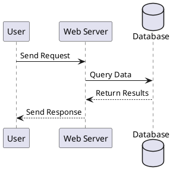

## Participant Types

PlantUML supports specialized participant types beyond standard boxes:

- `participant` - Standard rectangular box
- `actor` - Stick figure for human actors
- `boundary` - System boundary representation
- `control` - Control/logic component
- `entity` - Data entities
- `database` - Database systems
- `collections` - Collection of items
- `queue` - Message queues

**Example:**

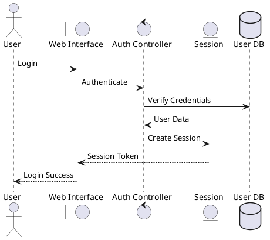

## Participant Customization

### Renaming with Aliases

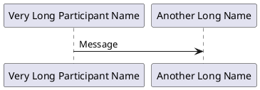

### Controlling Order

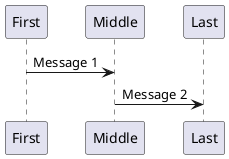

### Multiline Participant Names

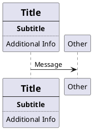

### Colored Participants

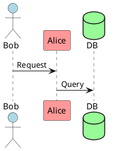

## Activation and Lifelines

Activation (lifelines) shows when a participant is active or processing:

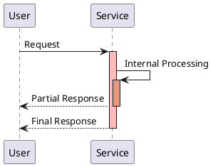

### Shorthand Activation Syntax

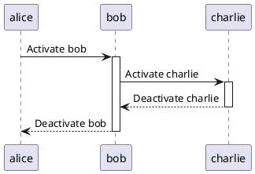

### Creation and Destruction

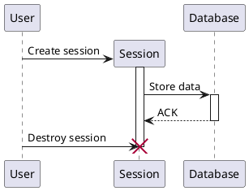

## Message Types and Arrows

PlantUML supports various message arrow styles:

- `->` Solid arrow (synchronous message)
- `-->` Dashed arrow (return/async message)
- `->>` Asynchronous message
- `<-` Reverse solid (for code readability)
- `<--` Reverse dashed
- `-\\` Lost message (message that doesn't reach destination)
- `/-` Found message (message from unknown source)
- `->x` Message with destruction
- `->o` Message to boundary
- `->>o` Async message to boundary

**Example:**

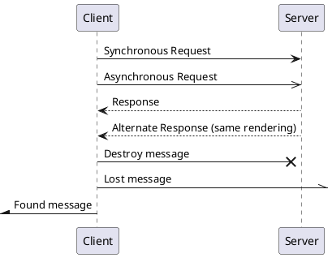

## System Boundary Messages

Messages from/to system boundaries:

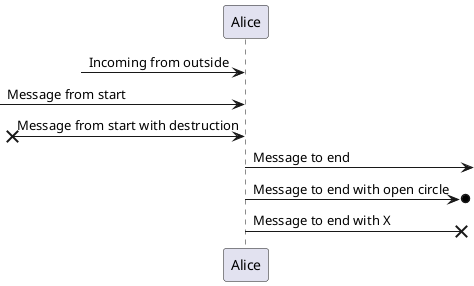

## Messages to Self

Show internal processing:

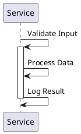

## Grouping and Control Structures

### Alt/Else (Alternative Paths)

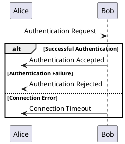

### Opt (Optional)

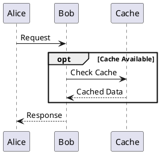

### Loop

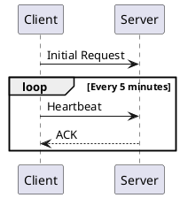

### Par (Parallel)

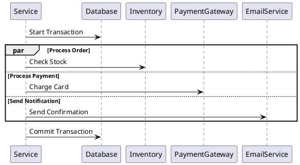

### Group

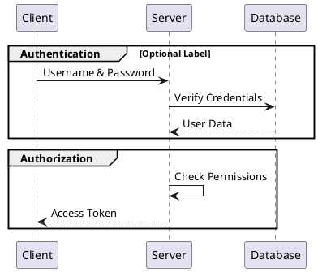

## Notes and Annotations

### Basic Notes

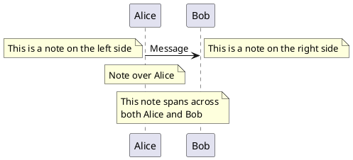

### Note Styles

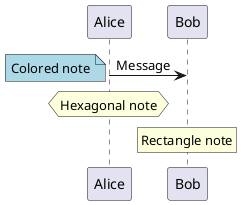

### Notes on Messages

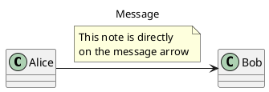

## Spacing and Formatting

### Manual Spacing

```puml
@startuml
Alice -> Bob : Message 1

|||

Alice -> Bob : Message 2 (with automatic spacing)

||50||

Alice -> Bob : Message 3 (with 50 pixels spacing)
@enduml
```

### Dividers

```puml
@startuml
== Initialization ==
Alice -> Bob : Connect

== Authentication ==
Alice -> Bob : Login
Bob --> Alice : Token

== Data Transfer ==
Alice -> Bob : Request Data
Bob --> Alice : Send Data

== Cleanup ==
Alice -> Bob : Disconnect
@enduml
```

### Delay Marker

```puml
@startuml
Alice -> Bob : Request
...5 minutes later...
Bob --> Alice : Response

...
Alice -> Bob : Another Request
@enduml
```

## Advanced Features

### Reference to Other Diagrams

```puml
@startuml
participant Alice
participant Bob

ref over Alice, Bob : Complex Authentication Process\n(see auth_detail.puml)

Alice -> Bob : Continue with main flow
@enduml
```

### Numbered Messages

```puml
@startuml
autonumber
Alice -> Bob : First message
Bob --> Alice : Response
Alice -> Bob : Second message
Bob --> Alice : Response
@enduml
```

**Customized Numbering:**

```puml
@startuml
autonumber 10 10 "<b>[000]"
Alice -> Bob : Message 10
Bob --> Alice : Response 20
autonumber stop
Alice -> Bob : No number
autonumber resume
Alice -> Bob : Message 30
@enduml
```

### Message Delays

```puml
@startuml
Alice -> Bob : Request
... 5 minutes later ...
Bob --> Alice : Response
@enduml
```

## Real-World Example: Authentication Flow

```puml
@startuml
actor User
participant "Web App" as Web
participant "Auth Service" as Auth
database "User DB" as DB
participant "Email Service" as Email

User -> Web : Enter credentials
activate Web

Web -> Auth : Authenticate(username, password)
activate Auth

Auth -> DB : Query user by username
activate DB
DB --> Auth : User record
deactivate DB

alt Password Valid
    Auth -> Auth : Generate JWT token
    Auth -> DB : Update last_login
    activate DB
    DB --> Auth : Success
    deactivate DB

    Auth --> Web : JWT token
    deactivate Auth

    Web --> User : Redirect to dashboard
    deactivate Web

    par Send notification
        Auth -> Email : Send login notification
        activate Email
        Email --> Auth : Email sent
        deactivate Email
    end

else Password Invalid
    Auth --> Web : Authentication failed
    deactivate Auth

    Web --> User : Show error message
    deactivate Web

    alt Too many failures
        Web -> Auth : Lock account
        activate Auth
        Auth -> DB : Set account_locked = true
        activate DB
        DB --> Auth : Success
        deactivate DB
        Auth -> Email : Send security alert
        activate Email
        Email --> Auth : Email sent
        deactivate Email
        deactivate Auth
    end
end
@enduml
```

## Tips and Best Practices

1. **Use meaningful aliases** - `as` keyword for long names
2. **Order participants logically** - Left to right, user to system
3. **Group related interactions** - Use `group`, `alt`, `loop`
4. **Add notes for clarity** - Explain complex business logic
5. **Use dividers** - Separate major phases with `==`
6. **Activate/deactivate consistently** - Show processing time accurately
7. **Choose appropriate arrow types** - Solid for synchronous, dashed for returns
8. **Autonumber for complex flows** - Easier to reference in discussions

## Common Use Cases

- **API interactions** - RESTful, gRPC, SOAP protocols
- **Authentication flows** - OAuth, SAML, JWT
- **Transaction processing** - Payment, order processing
- **Microservice communication** - Service-to-service calls
- **Database transactions** - Query sequences, ACID operations
- **Error handling** - Retry logic, fallback mechanisms

## Conversion to Images

```bash
# PNG
java -jar plantuml.jar sequence.puml

# SVG (recommended for documentation)
java -jar plantuml.jar -tsvg sequence.puml
```

See [plantuml_reference.md](plantuml_reference.md) for comprehensive CLI documentation.
