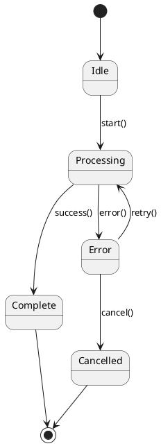
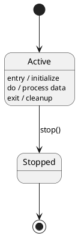
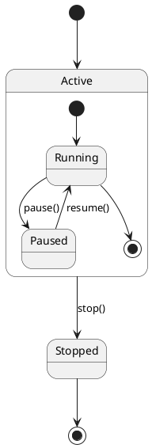
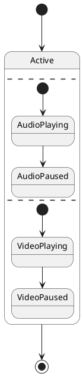
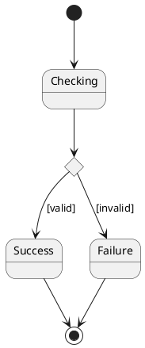

# State Diagrams

State diagrams show how objects transition between states in response to events, useful for modeling stateful systems and protocols.

## Basic Structure



## State Actions



## Composite States



## Concurrent States



## Choice Points



## Conversion

```bash
java -jar plantuml.jar -tsvg state.puml
```

See [toc.md](toc.md) for all diagram types.
