# PlantUML Styling Guide

Comprehensive guide to modern PlantUML styling using the `<style>` tag with CSS-like syntax.

## Table of Contents

1. [Why Modern `<style>` Over Legacy `skinparam`](#why-modern-style-over-legacy-skinparam)
2. [Basic `<style>` Syntax](#basic-style-syntax)
3. [Element Selectors](#element-selectors)
4. [Stereotype Selectors](#stereotype-selectors)
5. [Common Style Properties](#common-style-properties)
6. [Styling by Diagram Type](#styling-by-diagram-type)
7. [Advanced Styling Techniques](#advanced-styling-techniques)
8. [Creole Text Formatting](#creole-text-formatting)
9. [Complete Styling Examples](#complete-styling-examples)

---

## Why Modern `<style>` Over Legacy `skinparam`

### The Dual-Engine System

PlantUML supports two styling approaches:

1. **Legacy `skinparam`** - Imperative commands scattered throughout diagrams
2. **Modern `<style>`** - Declarative CSS-like rules in dedicated style blocks

### Why Choose `<style>`?

✅ **Separation of Concerns**: Style separate from content
✅ **CSS-Familiar Syntax**: Uses standard CSS properties
✅ **Better Organization**: All styles in one place
✅ **Reusability**: Define styles once, apply via stereotypes
✅ **Maintainability**: Easier to update and manage

### Comparison Example

**Legacy `skinparam` approach** (avoid):
```puml
@startuml
skinparam class {
  BackgroundColor PaleGreen
  BorderColor SeaGreen
  ArrowColor SeaGreen
}
skinparam classFontColor Blue
skinparam classFontSize 14

class User {
  +username
  +email
}
@enduml
```

**Modern `<style>` approach** (recommended):
```puml
@startuml
<style>
classDiagram {
  class {
    BackgroundColor PaleGreen
    BorderColor SeaGreen
    FontColor Blue
    FontSize 14
  }
  arrow {
    LineColor SeaGreen
  }
}
</style>

class User {
  +username
  +email
}
@enduml
```

---

## Basic `<style>` Syntax

### Structure

```puml
@startuml
<style>
diagramType {
  element {
    Property Value
    Property Value
  }
}
</style>

' Your diagram content here
@enduml
```

### Simple Example

```puml
@startuml
<style>
classDiagram {
  class {
    BackgroundColor LightBlue
    BorderColor Navy
    FontColor DarkBlue
  }
}
</style>

class Example
@enduml
```

---

## Element Selectors

### Common Elements Across Diagram Types

| Element | Description | Applies To |
|---------|-------------|------------|
| `class` | Class boxes | Class diagrams |
| `component` | Component boxes | Component diagrams |
| `actor` | Actor symbols | Use case, sequence |
| `participant` | Participants | Sequence diagrams |
| `entity` | Entity boxes | ER diagrams |
| `state` | State boxes | State diagrams |
| `activity` | Activity boxes | Activity diagrams |
| `node` | Deployment nodes | Deployment diagrams |
| `arrow` | All arrows/lines | Most diagrams |
| `note` | Note boxes | All diagrams |
| `package` | Package containers | Class, component |
| `frame` | Frame boxes | Sequence diagrams |

### Example: Styling Multiple Elements

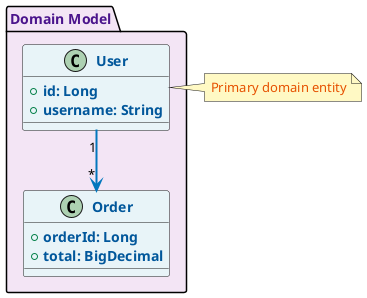

---

## Stereotype Selectors

### What Are Stereotypes?

Stereotypes allow you to define reusable style classes and apply them to specific elements using `<<stereotype_name>>`.

### Defining Stereotype Styles

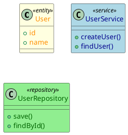

### Multiple Stereotypes

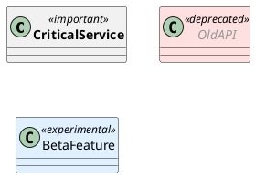

---

## Common Style Properties

### Color Properties

| Property | Description | Example Values |
|----------|-------------|----------------|
| `BackgroundColor` | Fill color | `LightBlue`, `#E8F4F8` |
| `BorderColor` | Border/stroke color | `Navy`, `#0277BD` |
| `FontColor` | Text color | `DarkBlue`, `#01579B` |
| `LineColor` | Line/arrow color | `SeaGreen`, `#2E7D32` |

**Named Colors**: Red, Blue, Green, Yellow, Orange, Purple, Pink, Gray, Black, White, and their variants (Light*, Dark*, Pale*)

**Hex Colors**: `#RRGGBB` format (e.g., `#FF5722`, `#4CAF50`)

### Font Properties

| Property | Description | Values |
|----------|-------------|--------|
| `FontSize` | Text size | `10`, `12`, `14`, `16` |
| `FontStyle` | Text style | `normal`, `bold`, `italic` |
| `FontName` | Font family | `Arial`, `Courier`, `SansSerif` |

### Border Properties

| Property | Description | Values |
|----------|-------------|--------|
| `BorderThickness` | Border width | `1`, `2`, `3`, `4` |
| `BorderStyle` | Line style | `solid`, `dashed`, `dotted` |
| `RoundCorner` | Corner radius | `0`, `5`, `10`, `15` |

### Spacing Properties

| Property | Description | Values |
|----------|-------------|--------|
| `Padding` | Internal spacing | `5`, `10`, `15` |
| `Margin` | External spacing | `5`, `10`, `15` |

---

## Styling by Diagram Type

### Class Diagrams

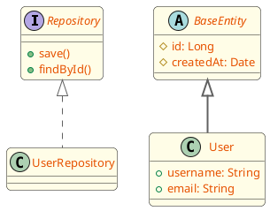

### Sequence Diagrams

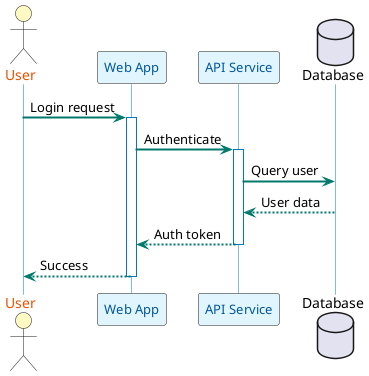

### Activity Diagrams

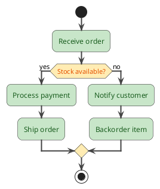

### Component Diagrams

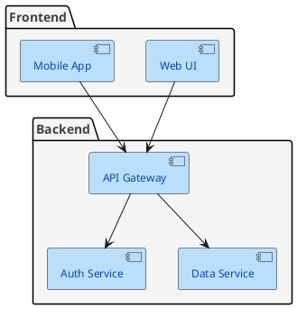

### State Diagrams

```puml
@startuml
<style>
stateDiagram {
  state {
    BackgroundColor #E1BEE7
    BorderColor #8E24AA
    FontColor #4A148C
    RoundCorner 10
  }

  arrow {
    LineColor #6A1B9A
    LineThickness 2
    FontColor #4A148C
  }
}
</style>

[*] --> Draft
Draft --> InReview : Submit
InReview --> Approved : Accept
InReview --> Rejected : Decline
Rejected --> Draft : Revise
Approved --> Published : Publish
Published --> [*]
@enduml
```

### Entity-Relationship Diagrams

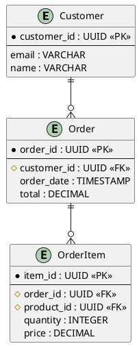

### Use Case Diagrams

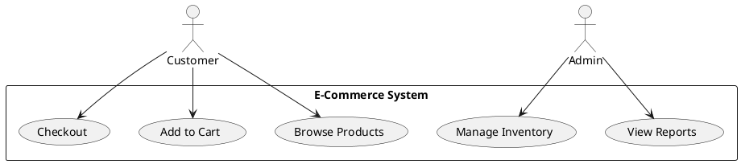

---

## Advanced Styling Techniques

### Conditional Styling with Stereotypes

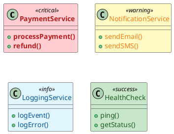

### Layer-Based Styling

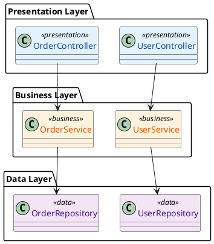

### Technology-Specific Styling

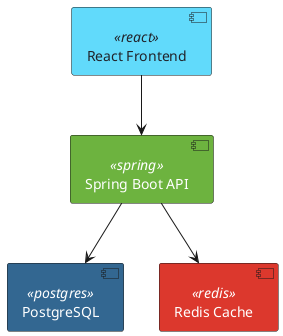

### Gradient Effects (Limited Support)

```puml
@startuml
<style>
classDiagram {
  .gradient {
    BackgroundColor LightBlue-Blue
    FontColor White
    BorderColor DarkBlue
  }
}
</style>

class GradientExample <<gradient>> {
  +method()
}
@enduml
```

---

## Creole Text Formatting

Creole is PlantUML's wiki-style text markup system for inline formatting.

### Basic Text Formatting

| Syntax | Result | Example |
|--------|--------|---------|
| `**text**` | **Bold** | `**Important**` |
| `//text//` | *Italic* | `//Optional//` |
| `--text--` | ~~Strikethrough~~ | `--Deprecated--` |
| `__text__` | Underline | `__Required__` |
| `""text""` | Monospace | `""code()""` |

### Example in Diagram

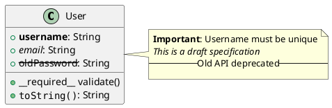

### Colors in Text

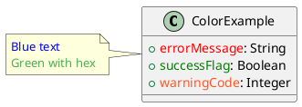

### Text Size

```puml
@startuml
class SizeExample {
  +<size:18>largeProperty</size>: String
  +<size:10>smallProperty</size>: Integer
}

note right
  <size:16>**Large heading**</size>
  <size:12>Normal text</size>
  <size:8>Small footnote</size>
end note
@enduml
```

### Hyperlinks

```puml
@startuml
class Documentation {
  +[[https://example.com See docs]]
  +[[https://api.example.com/user API Reference]]
}

note bottom
  Visit [[https://plantuml.com PlantUML site]]
  for more information
end note
@enduml
```

### Lists in Notes

```puml
@startuml
class TaskManager

note right
  **Features**:
  * Create tasks
  * Assign priorities
  * Set deadlines

  **Requirements**:
  # User authentication
  # Database connection
  # Email service
end note
@enduml
```

### Combining Formatting

```puml
@startuml
class AdvancedFormatting {
  +**<color:red>criticalError</color>**: String
  +//<size:10>optionalField</size>//: Integer
  +--<color:gray>deprecated</color>--: Boolean
}

note right
  **<color:blue>Status</color>**: <color:green>//Active//</color>
  **Version**: ""<size:10>2.1.0</size>""

  See [[https://docs.example.com documentation]]
  for details.
end note
@enduml
```

---

## Complete Styling Examples

### Example 1: Modern Enterprise Application

```puml
@startuml
<style>
classDiagram {
  .controller {
    BackgroundColor #E3F2FD
    BorderColor #1976D2
    FontColor #0D47A1
    FontSize 12
    RoundCorner 8
  }

  .service {
    BackgroundColor #FFF3E0
    BorderColor #F57C00
    FontColor #E65100
    FontSize 12
    RoundCorner 8
  }

  .repository {
    BackgroundColor #F3E5F5
    BorderColor #7B1FA2
    FontColor #4A148C
    FontSize 12
    RoundCorner 8
  }

  .entity {
    BackgroundColor #C8E6C9
    BorderColor #388E3C
    FontColor #1B5E20
    FontSize 12
    RoundCorner 8
  }

  arrow {
    LineColor #616161
    LineThickness 2
  }

  package {
    BackgroundColor #FAFAFA
    BorderColor #BDBDBD
    FontColor #424242
  }
}
</style>

package "Controllers" {
  class UserController <<controller>> {
    -userService: UserService
    +getUser(id: Long): User
    +createUser(dto: UserDTO): User
  }

  class OrderController <<controller>> {
    -orderService: OrderService
    +getOrder(id: Long): Order
    +createOrder(dto: OrderDTO): Order
  }
}

package "Services" {
  class UserService <<service>> {
    -userRepository: UserRepository
    +findById(id: Long): User
    +save(user: User): User
    +delete(id: Long): void
  }

  class OrderService <<service>> {
    -orderRepository: OrderRepository
    -userService: UserService
    +createOrder(order: Order): Order
    +calculateTotal(order: Order): BigDecimal
  }
}

package "Repositories" {
  class UserRepository <<repository>> {
    +findById(id: Long): Optional<User>
    +save(user: User): User
    +deleteById(id: Long): void
  }

  class OrderRepository <<repository>> {
    +findById(id: Long): Optional<Order>
    +save(order: Order): Order
    +findByUserId(userId: Long): List<Order>
  }
}

package "Entities" {
  class User <<entity>> {
    -id: Long
    -username: String
    -email: String
    -orders: List<Order>
  }

  class Order <<entity>> {
    -id: Long
    -userId: Long
    -orderDate: LocalDateTime
    -total: BigDecimal
  }
}

UserController --> UserService
OrderController --> OrderService
UserService --> UserRepository
OrderService --> OrderRepository
OrderService --> UserService
UserRepository ..> User
OrderRepository ..> Order
User "1" --> "*" Order
@enduml
```

### Example 2: Microservices Architecture

```puml
@startuml
<style>
componentDiagram {
  .gateway {
    BackgroundColor #2196F3
    BorderColor #0D47A1
    FontColor White
    FontSize 13
    FontStyle bold
  }

  .service {
    BackgroundColor #4CAF50
    BorderColor #1B5E20
    FontColor White
    FontSize 12
  }

  .database {
    BackgroundColor #9C27B0
    BorderColor #4A148C
    FontColor White
    FontSize 12
  }

  .cache {
    BackgroundColor #FF5722
    BorderColor #BF360C
    FontColor White
    FontSize 12
  }

  .queue {
    BackgroundColor #FF9800
    BorderColor #E65100
    FontColor White
    FontSize 12
  }

  arrow {
    LineColor #424242
    LineThickness 2
  }
}
</style>

component [API Gateway] <<gateway>>

component [User Service] <<service>>
component [Order Service] <<service>>
component [Inventory Service] <<service>>
component [Notification Service] <<service>>

database [User DB] <<database>>
database [Order DB] <<database>>
database [Inventory DB] <<database>>

database [Redis Cache] <<cache>>
queue [Message Queue] <<queue>>

[API Gateway] --> [User Service]
[API Gateway] --> [Order Service]
[API Gateway] --> [Inventory Service]

[User Service] --> [User DB]
[Order Service] --> [Order DB]
[Inventory Service] --> [Inventory DB]

[User Service] --> [Redis Cache]
[Order Service] --> [Redis Cache]

[Order Service] --> [Message Queue]
[Notification Service] <-- [Message Queue]
@enduml
```

### Example 3: Database Schema with Status Colors

```puml
@startuml
<style>
entityRelationshipDiagram {
  .core {
    BackgroundColor #E8F5E9
    BorderColor #2E7D32
    FontColor #1B5E20
    BorderThickness 2
  }

  .transactional {
    BackgroundColor #E3F2FD
    BorderColor #1565C0
    FontColor #0D47A1
    BorderThickness 2
  }

  .audit {
    BackgroundColor #FFF3E0
    BorderColor #EF6C00
    FontColor #E65100
  }

  arrow {
    LineColor #424242
    LineThickness 2
  }
}
</style>

entity User <<core>> {
  *user_id : UUID <<PK>>
  --
  **username** : VARCHAR(50) <<unique>>
  **email** : VARCHAR(255) <<unique>>
  password_hash : VARCHAR(255)
  created_at : TIMESTAMP
  updated_at : TIMESTAMP
}

entity Customer <<core>> {
  *customer_id : UUID <<PK>>
  --
  #user_id : UUID <<FK>>
  first_name : VARCHAR(100)
  last_name : VARCHAR(100)
  phone : VARCHAR(20)
}

entity Order <<transactional>> {
  *order_id : UUID <<PK>>
  --
  #customer_id : UUID <<FK>>
  order_date : TIMESTAMP
  status : VARCHAR(20)
  total_amount : DECIMAL(10,2)
  currency : VARCHAR(3)
}

entity OrderItem <<transactional>> {
  *item_id : UUID <<PK>>
  --
  #order_id : UUID <<FK>>
  #product_id : UUID <<FK>>
  quantity : INTEGER
  unit_price : DECIMAL(10,2)
  subtotal : DECIMAL(10,2)
}

entity Product <<core>> {
  *product_id : UUID <<PK>>
  --
  **sku** : VARCHAR(50) <<unique>>
  name : VARCHAR(200)
  description : TEXT
  price : DECIMAL(10,2)
  stock_quantity : INTEGER
}

entity AuditLog <<audit>> {
  *log_id : UUID <<PK>>
  --
  #user_id : UUID <<FK>>
  action : VARCHAR(50)
  entity_type : VARCHAR(50)
  entity_id : UUID
  timestamp : TIMESTAMP
  details : JSONB
}

User ||--|| Customer
Customer ||--o{ Order
Order ||--o{ OrderItem
Product ||--o{ OrderItem
User ||--o{ AuditLog
@enduml
```

### Example 4: State Machine with Emotion Colors

```puml
@startuml
<style>
stateDiagram {
  .initial {
    BackgroundColor #E0E0E0
    BorderColor #616161
    FontColor #212121
  }

  .active {
    BackgroundColor #C8E6C9
    BorderColor #388E3C
    FontColor #1B5E20
  }

  .warning {
    BackgroundColor #FFF9C4
    BorderColor #FBC02D
    FontColor #F57F17
  }

  .error {
    BackgroundColor #FFCDD2
    BorderColor #D32F2F
    FontColor #B71C1C
  }

  .success {
    BackgroundColor #B2DFDB
    BorderColor #00897B
    FontColor #004D40
  }

  arrow {
    LineColor #424242
    LineThickness 2
    FontSize 11
  }
}
</style>

[*] --> Created <<initial>>

state Created <<initial>> {
  [*] --> Draft
  Draft --> Submitted : submit()
}

state Active <<active>> {
  Submitted --> InReview : assign()
  InReview --> Testing : approve()
  Testing --> Testing : test_failed()
}

state Warning <<warning>> {
  InReview --> Revision : request_changes()
  Revision --> InReview : resubmit()
}

state Error <<error>> {
  Testing --> Failed : critical_bug()
  Failed --> InReview : fix_and_retry()
}

state Success <<success>> {
  Testing --> Approved : all_tests_pass()
  Approved --> Deployed : deploy()
}

Created --> Active
Active --> Warning
Active --> Error
Warning --> Active
Error --> Active
Active --> Success
Deployed --> [*]
@enduml
```

---

## Text Contrast Best Practices

**CRITICAL**: Always ensure sufficient contrast between text and background colors. Light text on light backgrounds is unreadable.

### The Contrast Rule

| Background | Text Color | Example |
|------------|------------|---------|
| Light pastels (#E1F5FE, #FFF3E0, #C8E6C9) | Dark variants (#01579B, #E65100, #1B5E20) | ✅ Good |
| Light backgrounds | White or light colors | ❌ Bad - unreadable |
| Dark backgrounds (#1565C0, #E65100) | White (#FFFFFF) | ✅ Good |

### Material Design Color Pairings

Use these proven background/text combinations:

| Category | Background | FontColor | Use For |
|----------|------------|-----------|---------|
| Blue | #E3F2FD (Light Blue 50) | #0D47A1 (Blue 900) | AWS, Services |
| Orange | #FFF3E0 (Orange 50) | #E65100 (Orange 800) | Warnings, AWS |
| Green | #E8F5E9 (Green 50) | #1B5E20 (Green 900) | Kafka, Success |
| Purple | #F3E5F5 (Purple 50) | #4A148C (Purple 900) | Database |
| Yellow | #FFFDE7 (Yellow 50) | #333333 (Gray 800) | Notes |
| Red | #FFEBEE (Red 50) | #B71C1C (Red 900) | Errors |

### Example: High-Contrast Component Diagram

```puml
@startuml
skinparam backgroundColor #FEFEFE
skinparam defaultTextAlignment center
skinparam component {
    BackgroundColor<<shell>> #E1F5FE
    FontColor<<shell>> #01579B
    BackgroundColor<<aws>> #FFF3E0
    FontColor<<aws>> #E65100
    BackgroundColor<<kafka>> #E8F5E9
    FontColor<<kafka>> #1B5E20
    BackgroundColor<<database>> #F3E5F5
    FontColor<<database>> #4A148C
}
skinparam package {
    FontColor #1A237E
}
skinparam note {
    BackgroundColor #FFFDE7
    FontColor #333333
    BorderColor #FBC02D
}
skinparam legend {
    BackgroundColor #F5F5F5
    FontColor #212121
    BorderColor #9E9E9E
}

component "API Service" <<aws>>
component "Kafka Topic" <<kafka>>
database "PostgreSQL" <<database>>

[API Service] --> [Kafka Topic]
[Kafka Topic] --> [PostgreSQL]

note right of [API Service]
  High contrast note text
  on light yellow background
end note
@enduml
```

### Legacy skinparam FontColor Pattern

When using legacy `skinparam` with stereotypes, **always pair BackgroundColor with FontColor**:

```puml
skinparam component {
    BackgroundColor<<aws>> #FFF3E0
    FontColor<<aws>> #E65100        ' ALWAYS include FontColor!
    BackgroundColor<<kafka>> #C8E6C9
    FontColor<<kafka>> #1B5E20      ' ALWAYS include FontColor!
}
```

### Common Contrast Mistakes

❌ **Bad - Light on Light**:
```puml
skinparam component {
    BackgroundColor #E3F2FD   ' Light blue background
    ' Missing FontColor - defaults to black which is OK
    ' But white or light gray would be unreadable!
}
```

✅ **Good - Dark on Light**:
```puml
skinparam component {
    BackgroundColor #E3F2FD   ' Light blue background
    FontColor #0D47A1         ' Dark blue text
}
```

### Note and Legend Styling

Notes and legends often have readability issues. Always specify:

```puml
skinparam note {
    BackgroundColor #FFFDE7    ' Light yellow
    FontColor #333333          ' Dark gray - NOT default which may be light
    BorderColor #FBC02D        ' Amber border for visual separation
}
skinparam legend {
    BackgroundColor #F5F5F5    ' Light gray
    FontColor #212121          ' Near black
    BorderColor #9E9E9E        ' Medium gray
}
```

---

## Summary

### Modern Styling Best Practices

1. ✅ **Always use `<style>` tags** instead of `skinparam`
2. ✅ **Group styles by diagram type** for organization
3. ✅ **Use stereotypes** for reusable style classes
4. ✅ **Prefer named colors** for readability (or hex for precision)
5. ✅ **Apply consistent theming** across related diagrams
6. ✅ **Use Creole formatting** for rich text in notes and labels
7. ✅ **Keep styles separate** from diagram content
8. ✅ **ALWAYS pair BackgroundColor with FontColor** for readable contrast
9. ✅ **Use dark text on light backgrounds** (Material Design 800-900 shades on 50-100 shades)

### Quick Reference

**Basic Template**:
```puml
@startuml
<style>
diagramType {
  element {
    BackgroundColor <color>
    BorderColor <color>
    FontColor <color>
    FontSize <number>
  }
}
</style>

' Your diagram here
@enduml
```

**With Stereotypes**:
```puml
@startuml
<style>
diagramType {
  .styleName {
    BackgroundColor <color>
    BorderColor <color>
  }
}
</style>

element Name <<styleName>>
@enduml
```

---

See [toc.md](toc.md) for all diagram types and [common_format.md](common_format.md) for universal diagram elements.
