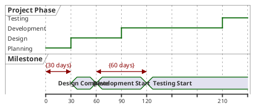

# Timeline Diagrams

Timeline diagrams show chronological events.

## Basic Structure

```puml
@startuml
robust "Project Phase" as PP
concise "Milestone" as M

@PP
0 is Planning
+30 is Design
+60 is Development
+120 is Testing

@M
30 is "Design Complete"
60 is "Development Start"
120 is "Testing Start"

@0 <-> @30 : {30 days}
@60 <-> @120 : {60 days}
@enduml
```

See [toc.md](toc.md) for all diagram types.
