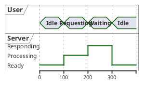
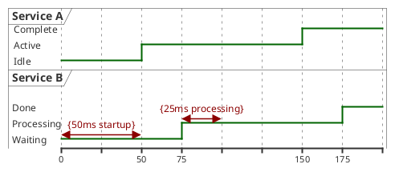

# Timing Diagrams

Timing diagrams show state changes over time.

## Basic Structure

```puml
@startuml
concise "User" as U
robust "Server" as S

@0
U is Idle
S is Ready

@100
U is Requesting
S is Processing

@200
U is Waiting
S is Responding

@300
U is Idle
S is Ready
@enduml
```

## With Constraints

```puml
@startuml
robust "Service A" as A
robust "Service B" as B

@A
0 is Idle
+50 is Active
+100 is Complete

@B
0 is Waiting
+75 is Processing
+100 is Done

@0 <-> @50 : {50ms startup}
@75 <-> @100 : {25ms processing}
@enduml
```

See [toc.md](toc.md) for all diagram types.
