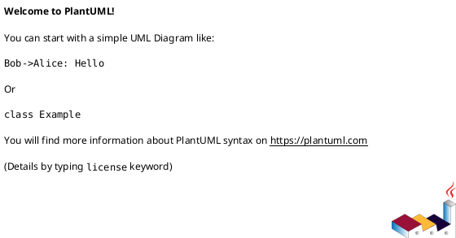

# PlantUML Diagram Types - Complete Reference

This directory contains comprehensive syntax guides for all PlantUML diagram types. Each file includes detailed syntax explanations, examples, and best practices.

## Quick Navigation

### UML Diagrams

1. **[Sequence Diagrams](sequence_diagrams.md)** - Interactions between participants over time
2. **[Use Case Diagrams](use_case_diagrams.md)** - Actors and system functionalities
3. **[Class Diagrams](class_diagrams.md)** - Object-oriented system structure
4. **[Object Diagrams](object_diagrams.md)** - Specific instances of classes
5. **[Activity Diagrams](activity_diagrams.md)** - Workflows and business processes
6. **[Component Diagrams](component_diagrams.md)** - System components and dependencies
7. **[Deployment Diagrams](deployment_diagrams.md)** - Physical architecture and deployment
8. **[State Diagrams](state_diagrams.md)** - State machines and transitions
9. **[Timing Diagrams](timing_diagrams.md)** - State changes over time

### Non-UML Diagrams

10. **[Entity-Relationship Diagrams](er_diagrams.md)** - Database schemas and relationships
11. **[Network Diagrams](network_diagrams.md)** - Network topology (nwdiag)
12. **[Wireframes/UI Mockups](wireframes_salt.md)** - Interface mockups (Salt)
13. **[Ditaa Diagrams](ditaa_diagrams.md)** - ASCII art diagrams
14. **[Work Breakdown Structure](wbs_diagrams.md)** - Hierarchical project tasks
15. **[MindMap Diagrams](mindmap_diagrams.md)** - Hierarchical information organization
16. **[Gantt Charts](gantt_diagrams.md)** - Project timelines and dependencies
17. **[JSON/YAML Visualization](json_yaml_diagrams.md)** - Data structure visualization
18. **[Archimate Diagrams](archimate_diagrams.md)** - Enterprise architecture
19. **[Timeline Diagrams](timeline_diagrams.md)** - Chronological events

## Additional Resources

- **[PlantUML Reference](plantuml_reference.md)** - Installation, CLI commands, troubleshooting
- **[Common Format Elements](common_format.md)** - Universal syntax shared across diagram types
- **[Styling Guide](styling_guide.md)** - Modern `<style>` syntax and visual customization
- **[Advanced Features](advanced_features.md)** - Skinparam, preprocessing, themes
- **[Common Syntax Errors](common_syntax_errors.md)** - Diagram-specific syntax errors and fixes
- **[Troubleshooting Guides](troubleshooting/toc.md)** - Comprehensive error solutions (200+ common issues)

## Usage Guide

1. **Find your diagram type** in the list above
2. **Open the corresponding file** for detailed syntax and examples
3. **Copy and adapt examples** for your use case
4. **Convert to images** using commands from [plantuml_reference.md](plantuml_reference.md)

## Quick Example Template

All diagrams follow this basic structure:



For non-UML diagrams, use specific start/end tags:
- `@startmindmap` / `@endmindmap`
- `@startgantt` / `@endgantt`
- `@startsalt` / `@endsalt`
- `@startditaa` / `@endditaa`
- etc.

## Conversion Commands

### Basic Conversion

```bash
# PNG (default)
java -jar plantuml.jar diagram.puml

# SVG (recommended)
java -jar plantuml.jar -tsvg diagram.puml

# Batch processing
java -jar plantuml.jar "**/*.puml" -tsvg --output-dir images/
```

See [plantuml_reference.md](plantuml_reference.md) for comprehensive CLI documentation.

## Common Patterns

### Arrow Syntax (Universal)
- `->` Solid arrow
- `-->` Dashed arrow
- `..>` Dotted arrow
- `<-` Reverse solid (readability)

### Comments
- `' Single line comment`
- `/' Multi-line comment '/`

### Styling

**Modern `<style>` approach (recommended)**:
```puml
<style>
classDiagram {
  class {
    BackgroundColor LightBlue
    FontSize 14
  }
}
</style>
```

See **[styling_guide.md](styling_guide.md)** for comprehensive modern styling with CSS-like syntax.

## Diagram Selection Guide

**Choose your diagram based on what you're modeling:**

### Process & Behavior
- **Activity** - Business workflows, algorithms
- **Sequence** - Message exchanges, protocols
- **State** - Object state changes
- **Timing** - Temporal behavior

### Structure & Organization
- **Class** - OOP design, static structure
- **Component** - System modules, dependencies
- **Deployment** - Infrastructure, physical architecture
- **Object** - Runtime instances

### Requirements & Planning
- **Use Case** - User interactions, features
- **MindMap** - Brainstorming, ideas
- **WBS** - Project breakdown
- **Gantt** - Project schedules

### Data & Systems
- **ER Diagram** - Database schemas
- **Network** - Network topology
- **Archimate** - Enterprise architecture
- **JSON/YAML** - Data visualization

### UI & Mockups
- **Salt** - Interface wireframes
- **Ditaa** - ASCII art diagrams

## Tips for Success

1. **Start simple** - Begin with basic examples, add complexity incrementally
2. **Use comments** - Document complex logic with `'` comments
3. **Modern styling** - Use `<style>` tags (see [styling_guide.md](styling_guide.md)) instead of legacy `skinparam`
4. **Common elements** - Learn universal syntax from [common_format.md](common_format.md)
5. **Batch process** - Convert multiple diagrams with wildcards
6. **Version control** - Commit `.puml` source files to Git
7. **Choose SVG** - Use SVG format for scalability and quality

## Getting Help

- **Having errors?** Start with the [Troubleshooting Guides](troubleshooting/toc.md) - 200+ common errors with solutions
- Check the specific diagram reference file for detailed syntax
- Review [plantuml_reference.md](plantuml_reference.md) for installation and CLI commands
- Official PlantUML site: https://plantuml.com/
- Language Reference Guide: https://pdf.plantuml.net/PlantUML_Language_Reference_Guide_en.pdf
