# PlantUML Activity Diagrams Troubleshooting Guide

Common errors in activity diagrams: flow control, partitions, forks/joins, loops, and conditional syntax.

## Error #1: Missing Activity Delimiters

**Error Message:**
```
Syntax Error: Activity not recognized
```

**Cause:**
- Not wrapping activity labels with colons

**Solution:**

**Before (Error):**
```plantuml
@startuml
Start
Process Data
End
@enduml
```

**After (Correct):**
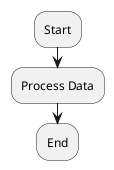

**Rule:** Activities must be wrapped with `:` and end with `;`

---

## Error #2: Missing if/endif

**Error Message:**
```
Syntax Error: Expected 'endif'
Unclosed if block
```

**Cause:**
- Starting `if` without closing `endif`

**Solution:**

**Before (Error):**
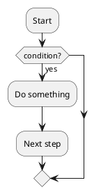

**After (Correct):**
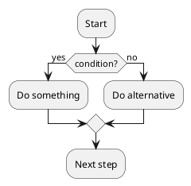

---

## Error #3: if Statement Without then

**Error Message:**
```
Syntax Error: Expected 'then'
```

**Cause:**
- Missing `then` keyword in if statement

**Solution:**

**Before (Error):**
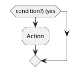

**After (Correct):**
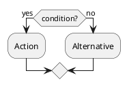

---

## Error #4: while Loop Syntax Errors

**Error Message:**
```
Syntax Error in while loop
Missing endwhile
```

**Cause:**
- Wrong while loop syntax or missing `endwhile`

**Solution:**

**Before (Error):**
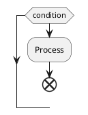

**After (Correct):**
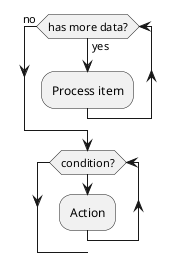

---

## Error #5: repeat/repeat while Errors

**Error Message:**
```
Syntax Error in repeat loop
```

**Cause:**
- Wrong repeat loop syntax

**Solution:**

**Before (Error):**
```plantuml
@startuml
repeat
  :Action;
until (condition)
@enduml
```

**After (Correct):**
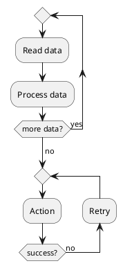

---

## Error #6: fork/fork again/end fork Errors

**Error Message:**
```
Syntax Error in fork
Parallel activities not working
```

**Cause:**
- Missing `fork again` or `end fork`

**Solution:**

**Before (Error):**
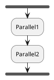

**After (Correct):**
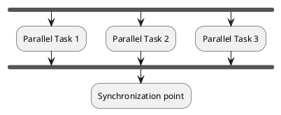

---

## Error #7: Partition Syntax Errors

**Error Message:**
```
Syntax Error in partition
Partition not recognized
```

**Cause:**
- Wrong partition syntax

**Solution:**

**Before (Error):**
```plantuml
@startuml
swimlane Manager {
  :Approve;
}
@enduml
```

**After (Correct):**
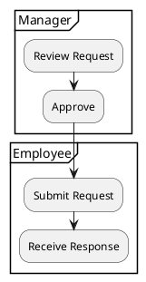

---

## Error #8: Nested Partitions

**Error Message:**
```
Partition nesting error
```

**Cause:**
- Wrong syntax for nested partitions

**Solution:**

**Before (Error):**
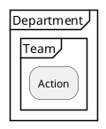

**After (Correct):**
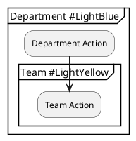

**Note:** Colors can be added with `#` in partition name.

---

## Error #9: Arrow Label Syntax

**Error Message:**
```
Arrow label not appearing
```

**Cause:**
- Wrong syntax for arrow labels

**Solution:**

**Before (Wrong):**
```plantuml
@startuml
:Start;
-> Next: Label on arrow
:Process;
@enduml
```

**After (Correct):**
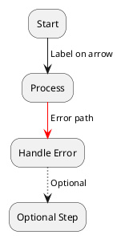

---

## Error #10: Detach Syntax (End Node)

**Error Message:**
```
End node not working
Multiple end points issue
```

**Cause:**
- Not using `detach` properly for multiple endpoints

**Solution:**

**Before (Unclear):**
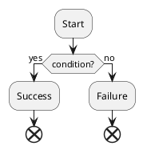

**After (Clear):**
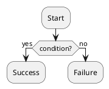

**Note:** Use `detach` to create multiple end points, `end` for activity diagram end, `stop` for final node.

---

## Error #11: Switch/case Syntax Errors

**Error Message:**
```
Syntax Error in switch
Case statement wrong
```

**Cause:**
- Wrong switch/case syntax

**Solution:**

**Before (Error):**
```plantuml
@startuml
switch (value)
case 1:
  :Action1;
case 2:
  :Action2;
endswitch
@enduml
```

**After (Correct):**
```plantuml
@startuml
switch (status?)
case ( new )
  :Process new;
case ( pending )
  :Wait;
case ( complete )
  :Archive;
endswitch

:Continue;
@enduml
```

---

## Error #12: Backward Arrow Syntax

**Error Message:**
```
Backward arrow not working
```

**Cause:**
- Wrong syntax for backward arrows (loops back)

**Solution:**

**Before (Wrong):**
```plantuml
@startuml
:Start;
:Process;
<- :Loop back;
:Start;
@enduml
```

**After (Correct):**
```plantuml
@startuml
:Start;
:Process;
backward:Retry;
:Start;

' Or with label
:Action;
if (success?) then (no)
  backward:Retry;
else (yes)
  :Continue;
endif
@enduml
```

---

## Error #13: Split/Split again/end split Errors

**Error Message:**
```
Syntax Error in split
```

**Cause:**
- Wrong split syntax for parallel flows that don't synchronize

**Solution:**

**Before (Error):**
```plantuml
@startuml
split
  :Path1;
  :Path2;
end split
@enduml
```

**After (Correct):**
```plantuml
@startuml
split
  :Path 1;
split again
  :Path 2;
split again
  :Path 3;
end split

:After split;
@enduml
```

**Difference:**
- `fork`: Parallel execution that synchronizes
- `split`: Parallel execution that may not synchronize

---

## Error #14: Note Placement Errors

**Error Message:**
```
Note not attached correctly
```

**Cause:**
- Wrong note syntax in activity diagrams

**Solution:**

**Before (Limited):**
```plantuml
@startuml
:Action;
note: This is a note
@enduml
```

**After (Flexible):**
```plantuml
@startuml
:Action;
note right
  This is a note
  on the right
end note

note left: Short note on left

floating note right: Floating note
@enduml
```

---

## Error #15: Activity Color Syntax

**Error Message:**
```
Color not applied to activity
```

**Cause:**
- Wrong color syntax

**Solution:**

**Before (Wrong):**
```plantuml
@startuml
:Action; color(red)
:Next; #FF0000
@enduml
```

**After (Correct):**
```plantuml
@startuml
:Normal Action;
#LightBlue:Important Action;
#Red:Error Action;
#00FF00:Success Action;
@enduml
```

---

## Error #16: Grouping Activities

**Error Message:**
```
Group syntax error
```

**Cause:**
- Wrong syntax for grouping activities

**Solution:**

**Before (Wrong):**
```plantuml
@startuml
group "Phase 1"
  :Action1;
  :Action2;
endgroup
@enduml
```

**After (Correct):**
```plantuml
@startuml
group Initialization
  :Load Config;
  :Connect DB;
end group

group Processing
  :Read Data;
  :Transform;
end group
@enduml
```

---

## Error #17: Goto/Label Errors

**Error Message:**
```
Label not found
Goto syntax error
```

**Cause:**
- Wrong label/goto syntax or missing label

**Solution:**

**Before (Error):**
```plantuml
@startuml
:Start;
goto restart
label restart
:Process;
@enduml
```

**After (Correct):**
```plantuml
@startuml
:Start;

label check
:Validate;

if (valid?) then (no)
  goto check
else (yes)
  :Continue;
endif
@enduml
```

---

## Error #18: Diamond Decision vs if

**Error Message:**
```
Decision diamond not showing
```

**Cause:**
- Not understanding when PlantUML shows diamonds

**Solution:**

**Automatic diamond (with if):**
```plantuml
@startuml
if (condition?) then (yes)
  :Action;
else (no)
  :Other;
endif
@enduml
```

**Manual diamond:**
```plantuml
@startuml
:Start;
-> [label];

if (condition?) then (yes)
  :True path;
else (no)
  :False path;
endif
@enduml
```

---

## Error #19: Start/Stop/End Confusion

**Error Message:**
```
Multiple start/end nodes
```

**Cause:**
- Confusing different end node types

**Solution:**

**Understanding differences:**
```plantuml
@startuml
start
:Initial Action;

if (error?) then (yes)
  :Handle Error;
  stop
else (no)
  :Continue;
endif

:Final Action;
end
@enduml
```

**Node types:**
- `start` : Start node (filled circle)
- `stop` : Stop node (filled circle with ring)
- `end` : End node (filled circle)
- `detach` : Detach from flow (arrow ends)

---

## Error #20: Vertical/Horizontal Layout Issues

**Error Message:**
```
Diagram layout wrong direction
```

**Cause:**
- Not setting layout direction

**Solution:**

**Before (Default vertical):**
```plantuml
@startuml
:A;
:B;
:C;
@enduml
```

**After (Horizontal):**
```plantuml
@startuml
left to right direction

:A;
:B;
:C;
@enduml
```

**Or control individual flows:**
```plantuml
@startuml
:Start;
-right-> Next;
:Action;
-down-> Continue;
:End;
@enduml
```

---

## Quick Reference: Activity Diagram Syntax

### Basic Activities
```plantuml
@startuml
start
:Activity;
#Color:Colored Activity;
stop
@enduml
```

### Conditional
```plantuml
@startuml
if (condition?) then (yes)
  :Action;
else (no)
  :Alternative;
endif
@enduml
```

### Loops
```plantuml
@startuml
' While loop
while (condition?)
  :Action;
endwhile

' Repeat loop
repeat
  :Action;
repeat while (condition?)
@enduml
```

### Parallel
```plantuml
@startuml
fork
  :Task 1;
fork again
  :Task 2;
end fork
@enduml
```

### Partitions
```plantuml
@startuml
partition User {
  :Submit;
}
partition System {
  :Process;
}
@enduml
```

---

## Common Activity Diagram Mistakes Summary

| Mistake | Problem | Solution |
|---------|---------|----------|
| Missing delimiters | `Start` | `:Start;` |
| Missing endif | `if` without `endif` | Add `endif` |
| Missing then | `if (x?) (yes)` | `if (x?) then (yes)` |
| Wrong while | `while condition` | `while (condition?)` |
| Wrong fork | Missing `fork again` | Add `fork again` between paths |
| Wrong partition | `swimlane` keyword | Use `partition` |
| Color syntax | `:Action; color(red)` | `#Red:Action;` |
| Multiple ends | Unclear end points | Use `detach` for multiple ends |
| Wrong switch | `case 1:` | `case ( 1 )` |

---

## Testing Activity Diagrams

Minimal test:

```plantuml
@startuml
start

partition User {
  :Submit Request;
}

partition System {
  if (valid?) then (yes)
    fork
      :Process;
    fork again
      :Log;
    end fork
  else (no)
    :Reject;
    stop
  endif
}

:Complete;
stop
@enduml
```

## Additional Resources

- [PlantUML Activity Diagram Documentation](https://plantuml.com/activity-diagram-beta)
- [Activity Diagram Reference](https://pdf.plantuml.net/PlantUML_Language_Reference_Guide_en.pdf)
