# PlantUML Class Diagrams Troubleshooting Guide

Common errors in class diagrams: relationships, visibility, generics, abstract classes, interfaces, and cardinality.

## Error #1: Wrong Inheritance Arrow

**Error Message:**
```
Incorrect relationship type
```

**Cause:**
- Using association arrow for inheritance

**Solution:**

**Before (Wrong):**
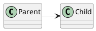

**After (Correct):**
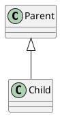

**Rule:** Use `<|--` for inheritance (solid line with hollow triangle).

---

## Error #2: Interface Implementation Wrong Arrow

**Error Message:**
```
Wrong relationship for interface
```

**Cause:**
- Using inheritance arrow instead of realization

**Solution:**

**Before (Wrong):**


**After (Correct):**
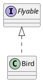

**Rule:** Use `<|..` (dotted line) for interface realization/implementation.

---

## Error #3: Visibility Modifier Errors

**Error Message:**
```
Invalid visibility symbol
```

**Cause:**
- Wrong visibility symbols or missing symbols

**Solution:**

**Before (Wrong):**
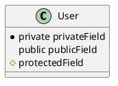

**After (Correct):**
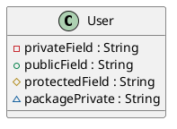

**Visibility symbols:**
- `-` : private
- `+` : public
- `#` : protected
- `~` : package/internal

---

## Error #4: Generic Syntax Errors

**Error Message:**
```
Syntax Error with generics
Invalid angle brackets
```

**Cause:**
- Using `<>` instead of `~` for generics

**Solution:**

**Before (Error):**
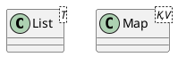

**After (Working):**
```plantuml
@startuml
class List~T~
class Map~K,V~
class Repository~T extends Entity~
@enduml
```

**Rule:** Use `~` (tilde) instead of `<>` for generics.

---

## Error #5: Composition vs Aggregation Mix-up

**Error Message:**
```
Wrong ownership relationship
```

**Cause:**
- Using composition when aggregation is appropriate or vice versa

**Solution:**

**Composition (strong, child can't exist without parent):**
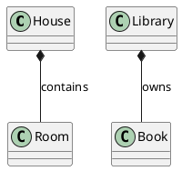

**Aggregation (weak, child can exist independently):**
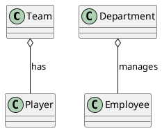

**Rule:**
- Composition (`*--`): Deleting parent deletes child
- Aggregation (`o--`): Child can exist independently

---

## Error #6: Cardinality Syntax Errors

**Error Message:**
```
Invalid cardinality
Multiplicity format wrong
```

**Cause:**
- Missing quotes around cardinality
- Wrong format

**Solution:**

**Before (Error):**
```plantuml
@startuml
Customer 1 --> 0..* Order
Order many --> 1 Product
@enduml
```

**After (Correct):**
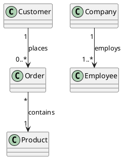

**Common cardinalities:**
- `"1"` : exactly one
- `"0..1"` : zero or one
- `"0..*"` or `"*"` : zero or many
- `"1..*"` : one or many
- `"n"` : exactly n

---

## Error #7: Abstract Class/Method Syntax

**Error Message:**
```
Abstract not recognized
```

**Cause:**
- Wrong syntax for abstract classes or methods

**Solution:**

**Before (Unclear):**
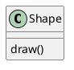

**After (Clear):**
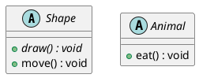

**Methods:** Use `{abstract}` modifier.

---

## Error #8: Static Members Syntax

**Error Message:**
```
Static notation not working
```

**Cause:**
- Wrong syntax for static members

**Solution:**

**Before (Plain):**
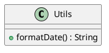

**After (Static):**
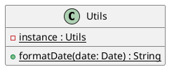

---

## Error #9: Method Parameter Syntax

**Error Message:**
```
Syntax Error in method signature
```

**Cause:**
- Wrong format for method parameters

**Solution:**

**Before (Various issues):**
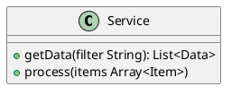

**After (Correct):**
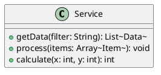

---

## Error #10: Enum Syntax Errors

**Error Message:**
```
Enum not recognized
Invalid enum syntax
```

**Cause:**
- Wrong enum definition

**Solution:**

**Before (Wrong):**
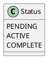

**After (Correct):**
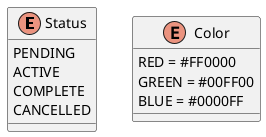

---

## Error #11: Namespace/Package Syntax

**Error Message:**
```
Package syntax error
Unclosed package
```

**Cause:**
- Missing closing brace
- Wrong package syntax

**Solution:**

**Before (Error):**
```plantuml
@startuml
package com.example {
  class User

package model {
  class Data
}
@enduml
```

**After (Correct):**
```plantuml
@startuml
package com.example {
  class User
}

package com.example.model {
  class Data
}

' Or nested
package com.example {
  package model {
    class User
  }
}
@enduml
```

---

## Error #12: Association Name Syntax

**Error Message:**
```
Label syntax error
```

**Cause:**
- Wrong format for relationship labels

**Solution:**

**Before (Limited):**
```plantuml
@startuml
Customer --> Order
@enduml
```

**After (Descriptive):**
```plantuml
@startuml
Customer --> Order : places
Customer "1" --> "*" Order : places >
Order "1" --> "*" LineItem : < contains
@enduml
```

**Arrow labels:**
- `:` followed by label
- `>` : label near target
- `<` : label near source

---

## Error #13: Bidirectional Association Errors

**Error Message:**
```
Wrong bidirectional syntax
```

**Cause:**
- Using wrong arrows for bidirectional

**Solution:**

**Before (Wrong):**
```plantuml
@startuml
Student -> Course
Course -> Student
@enduml
```

**After (Correct):**
```plantuml
@startuml
' Bidirectional association
Student "0..*" <--> "0..*" Course : enrolls in

' Or two separate unidirectional
Student "0..*" --> "0..*" Course : takes
Course "0..*" --> "0..*" Student : has
@enduml
```

---

## Error #14: Dependency Arrow Errors

**Error Message:**
```
Wrong dependency syntax
```

**Cause:**
- Using association instead of dependency

**Solution:**

**Before (Too strong):**
```plantuml
@startuml
Controller --> Request
Controller --> Response
@enduml
```

**After (Correct - dependency):**
```plantuml
@startuml
' Controller uses Request/Response but doesn't own them
Controller ..> Request : uses
Controller ..> Response : creates

' Controller has Service (association)
Controller --> Service : owns
@enduml
```

**Rule:** Use `..>` for dependencies (temporary usage).

---

## Error #15: Attribute Type Syntax

**Error Message:**
```
Invalid attribute definition
```

**Cause:**
- Wrong format for attributes

**Solution:**

**Before (Inconsistent):**
```plantuml
@startuml
class User {
  name
  String email
  age int
}
@enduml
```

**After (Consistent):**
```plantuml
@startuml
class User {
  -name : String
  -email : String
  -age : int
  -roles : List~Role~
}
@enduml
```

**Format:** `visibility name : type`

---

## Error #16: Inner Class Syntax

**Error Message:**
```
Syntax Error with nested class
```

**Cause:**
- Wrong syntax for inner classes

**Solution:**

**Before (Not nested):**
```plantuml
@startuml
class Outer
class Inner
@enduml
```

**After (Properly nested):**
```plantuml
@startuml
class Outer {
}
class Outer$Inner {
}

Outer +-- Outer$Inner

' Or with +-- notation
@enduml
```

---

## Error #17: Interface vs Abstract Class Confusion

**Error Message:**
```
Wrong element type
```

**Cause:**
- Using class when interface is needed

**Solution:**

**Before (Wrong):**
```plantuml
@startuml
class Runnable {
  +run() : void
}
@enduml
```

**After (Correct):**
```plantuml
@startuml
interface Runnable {
  +run() : void
}

class MyTask implements Runnable {
  +run() : void
}

' Connection
Runnable <|.. MyTask
@enduml
```

---

## Error #18: Spot/Circle Notation Errors

**Error Message:**
```
Spot syntax error
```

**Cause:**
- Wrong syntax for adding spots/circles to classes

**Solution:**

**Before (Wrong):**
```plantuml
@startuml
class Entity (E)
class Controller [C]
@enduml
```

**After (Correct):**
```plantuml
@startuml
class Entity <<E,#FF0000>>
class Controller <<C,#00FF00>>
class Service <<S,#0000FF>>

' Or with stereotype
class User <<Entity>>
@enduml
```

---

## Error #19: Class Separator Syntax

**Error Message:**
```
Separator not working
```

**Cause:**
- Wrong separator syntax within class

**Solution:**

**Before (Plain):**
```plantuml
@startuml
class User {
  -name : String
  +getName() : String
}
@enduml
```

**After (With separators):**
```plantuml
@startuml
class User {
  ' Fields
  -name : String
  -email : String
  __
  ' Constructors
  +User(name: String)
  ==
  ' Methods
  +getName() : String
  +setName(name: String) : void
  --
  ' Static
  {static} +getInstance() : User
}
@enduml
```

**Separators:**
- `--` : simple line
- `==` : double line
- `__` : dotted line
- `..` : thin line

---

## Error #20: Layout Direction Issues

**Error Message:**
```
Diagram layout confusing
Arrows crossing
```

**Cause:**
- Not using layout hints
- Auto-layout producing poor results

**Solution:**

**Before (Messy):**
```plantuml
@startuml
A <|-- B
A <|-- C
B --> D
C --> D
@enduml
```

**After (Organized):**
```plantuml
@startuml
' Use layout hints
A <|-- B
A <|-- C
B -down-> D
C -down-> D

' Or explicit direction
left to right direction

' Or hide connections for spacing
A -[hidden]right- C
@enduml
```

---

## Quick Reference: Class Diagram Syntax

### Basic Class
```plantuml
@startuml
class ClassName {
  -privateField : Type
  #protectedField : Type
  +publicField : Type
  ~packageField : Type
  __
  +method(param: Type) : ReturnType
  {static} +staticMethod() : void
  {abstract} +abstractMethod() : void
}
@enduml
```

### Relationships
```plantuml
@startuml
Parent <|-- Child : Inheritance
Interface <|.. Implementation : Realization
Whole *-- Part : Composition
Container o-- Element : Aggregation
ClassA --> ClassB : Association
ClassA ..> ClassB : Dependency
@enduml
```

### Special Classes
```plantuml
@startuml
abstract class AbstractClass
interface InterfaceName
enum EnumName {
  VALUE1
  VALUE2
}
annotation AnnotationName
@enduml
```

---

## Common Class Diagram Mistakes Summary

| Mistake | Problem | Solution |
|---------|---------|----------|
| Wrong inheritance | `Parent -> Child` | `Parent <\|-- Child` |
| Interface implementation | `IFoo <\|-- Foo` | `IFoo <\|.. Foo` |
| Generic syntax | `List<T>` | `List~T~` |
| Missing visibility | `field : String` | `+field : String` |
| Wrong composition | `Team *-- Player` | `Team o-- Player` |
| No cardinality quotes | `1 --> * Order` | `"1" --> "*" Order` |
| Enum as class | `class Status` | `enum Status` |
| Association vs dependency | `Controller --> Request` | `Controller ..> Request` |

---

## Testing Class Diagrams

Minimal test:

```plantuml
@startuml
abstract class Animal {
  -name : String
  {abstract} +makeSound() : void
}

class Dog extends Animal {
  +makeSound() : void
  +fetch() : void
}

interface Pet {
  +play() : void
}

Dog ..|> Pet

class Owner {
  -pets : List~Pet~
}

Owner "1" o-- "*" Pet : owns
@enduml
```

## Additional Resources

- [PlantUML Class Diagram Documentation](https://plantuml.com/class-diagram)
- [UML Class Diagram Tutorial](https://plantuml-documentation.readthedocs.io/en/latest/diagrams/class.html)
