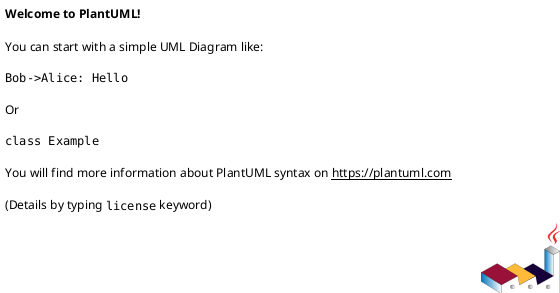
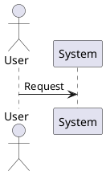
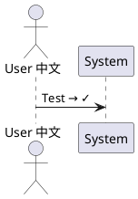
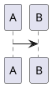

# PlantUML Image Generation Troubleshooting Guide

Common errors related to rendering, output formats, file generation, and image quality issues.

## Error #1: "Failed to generate image"

**Error Message:**
```
Failed to generate image
Error during image generation
```

**Cause:**
- Syntax error in diagram
- Graphviz crash
- File permission issues
- Output directory doesn't exist

**Solution:**

1. **Check syntax first:**
```bash
java -jar plantuml.jar -syntax diagram.puml
```

2. **Use verbose mode:**
```bash
java -jar plantuml.jar -verbose diagram.puml
```

3. **Check output directory exists:**
```bash
mkdir -p output
java -jar plantuml.jar -o output diagram.puml
```

4. **Verify Graphviz working:**
```bash
java -jar plantuml.jar -testdot
```

---

## Error #2: "Negative or zero image size"

**Error Message:**
```
negative or zero image size
java.lang.IllegalArgumentException: negative or zero image size
```

**Cause:**
- Empty diagram
- All elements hidden
- ImageMagick rendering issue

**Solution:**

**Before (Empty):**


**After (With content):**


**Or if using advanced features:**
```bash
# Use headless mode
java -Djava.awt.headless=true -jar plantuml.jar diagram.puml
```

---

## Error #3: Output Format Not Working

**Error Message:**
```
Unknown output format
Format not supported
```

**Cause:**
- Wrong format flag
- Format not available

**Solution:**

**Supported formats:**
```bash
# PNG (default)
java -jar plantuml.jar diagram.puml

# SVG
java -jar plantuml.jar -tsvg diagram.puml

# EPS
java -jar plantuml.jar -teps diagram.puml

# PDF (requires additional setup)
java -jar plantuml.jar -tpdf diagram.puml

# LaTeX
java -jar plantuml.jar -tlatex diagram.puml

# ASCII Art (limited diagrams)
java -jar plantuml.jar -ttxt diagram.puml

# Unicode text
java -jar plantuml.jar -tutxt diagram.puml
```

---

## Error #4: SVG Text Not Rendering

**Error Message:**
```
SVG shows boxes instead of text
Missing glyphs in SVG
```

**Cause:**
- Missing fonts on viewing system
- Font not embedded in SVG

**Solution:**

**Before (System fonts):**
```plantuml
@startuml
skinparam defaultFontName "MyCustomFont"
@enduml
```

**After (Common fonts):**
```plantuml
@startuml
skinparam defaultFontName "Arial"
' Or use default
@enduml
```

**Or embed fonts in SVG (not always possible in PlantUML)**

---

## Error #5: Image Too Large/Small

**Error Message:**
```
Image dimensions wrong
Can't read tiny text
```

**Cause:**
- Wrong scale setting
- DPI issues

**Solution:**

**Control image size:**
```plantuml
@startuml
scale 2
' or
scale 0.5

' Fixed width
scale 800 width

' Fixed height
scale 600 height

' Max dimensions
scale max 1024 width
scale max 768 height

@enduml
```

**Or use command line:**
```bash
# Adjust DPI (default 96)
java -jar plantuml.jar -SdefaultDPI=300 diagram.puml
```

---

## Error #6: Batch Processing Failures

**Error Message:**
```
Some files failed to process
Batch generation incomplete
```

**Cause:**
- Errors in some diagrams
- File path issues

**Solution:**

**Process all files:**
```bash
# Process all .puml files in directory
java -jar plantuml.jar "**/*.puml"

# Process specific directory
java -jar plantuml.jar ./diagrams/*.puml

# Continue on errors
java -jar plantuml.jar -failfast2 *.puml

# Output to specific directory
java -jar plantuml.jar -o ./images *.puml
```

**Check which files failed:**
```bash
# Use verbose mode
java -jar plantuml.jar -verbose *.puml 2>&1 | grep -i error
```

---

## Error #7: Unicode/Special Characters Not Displaying

**Error Message:**
```
Special characters show as boxes
Unicode characters missing
```

**Cause:**
- Missing font support
- Wrong encoding

**Solution:**

1. **Use UTF-8 encoding:**
```bash
java -Dfile.encoding=UTF-8 -jar plantuml.jar diagram.puml
```

2. **Ensure file saved as UTF-8:**
```bash
file -I diagram.puml
# Should show: charset=utf-8
```

3. **Install Unicode fonts:**
```bash
# Ubuntu/Debian
sudo apt-get install fonts-dejavu fonts-liberation

# macOS already has good Unicode support
```

4. **Test with simple Unicode:**


---

## Error #8: Transparent Background Not Working

**Error Message:**
```
Background not transparent
White background in PNG
```

**Cause:**
- PNG doesn't have transparency by default
- Need to specify transparent

**Solution:**

**For PNG:**


**Generate PNG:**
```bash
java -jar plantuml.jar -tpng diagram.puml
```

**For SVG (naturally supports transparency):**
```bash
java -jar plantuml.jar -tsvg diagram.puml
```

---

## Error #9: File Overwrite Issues

**Error Message:**
```
Cannot overwrite existing file
Permission denied when writing
```

**Cause:**
- File locked by another program
- No write permissions
- File read-only

**Solution:**

1. **Check file permissions:**
```bash
ls -l diagram.png
chmod 644 diagram.png
```

2. **Close files in viewers:**
Close any image viewers that have the file open.

3. **Use different output directory:**
```bash
java -jar plantuml.jar -o ./new-output diagram.puml
```

4. **Force overwrite:**
```bash
# PlantUML overwrites by default, but check no processes have file open
lsof | grep diagram.png
```

---

## Error #10: Metadata/Diagram Info Missing

**Error Message:**
```
Cannot extract diagram source from PNG
Metadata not embedded
```

**Cause:**
- Default PNG doesn't embed source
- Need special flag

**Solution:**

**Embed metadata in PNG:**
```bash
# Include diagram source in PNG metadata
java -jar plantuml.jar -metadata diagram.puml
```

**Extract source from PNG:**
```bash
# Extract .puml from PNG with embedded metadata
java -jar plantuml.jar -metadata diagram.png
```

**This creates `diagram.puml` from the PNG.**

---

## Error #11: PDF Generation Failing

**Error Message:**
```
PDF generation not supported
Cannot create PDF
```

**Cause:**
- PDF support requires additional dependencies
- Not all PlantUML versions support direct PDF

**Solution:**

**Method 1: Generate EPS first, then convert:**
```bash
java -jar plantuml.jar -teps diagram.puml
epstopdf diagram.eps
```

**Method 2: Generate SVG, then convert:**
```bash
java -jar plantuml.jar -tsvg diagram.puml
# Use tools like Inkscape or rsvg-convert
rsvg-convert -f pdf -o diagram.pdf diagram.svg
```

**Method 3: Use -tpdf (if available):**
```bash
# Some PlantUML versions support direct PDF
java -jar plantuml.jar -tpdf diagram.puml
```

---

## Error #12: Color Rendering Differences

**Error Message:**
```
Colors look different in PNG vs SVG
Colors not matching
```

**Cause:**
- Different rendering engines
- Color profile differences

**Solution:**

**Use consistent color format:**
```plantuml
@startuml
' Use hex colors for consistency
actor User #FF6600
class System #0099CC

' Avoid named colors that might render differently
@enduml
```

**Test in both formats:**
```bash
java -jar plantuml.jar -tpng diagram.puml
java -jar plantuml.jar -tsvg diagram.puml
```

---

## Error #13: Memory Errors with Large Diagrams

**Error Message:**
```
java.lang.OutOfMemoryError: Java heap space
Cannot allocate memory
```

**Cause:**
- Diagram too complex
- Not enough Java heap memory

**Solution:**

**Increase Java heap size:**
```bash
java -Xmx2048m -jar plantuml.jar diagram.puml

# Or for very large diagrams
java -Xmx4096m -jar plantuml.jar diagram.puml
```

**Simplify diagram:**


---

## Error #14: Diagram Not Updating

**Error Message:**
```
Old version of diagram still showing
Changes not reflected
```

**Cause:**
- Browser/viewer caching
- File not regenerated
- Looking at wrong file

**Solution:**

1. **Force regeneration:**
```bash
# Delete old image
rm diagram.png

# Regenerate
java -jar plantuml.jar diagram.puml
```

2. **Clear browser cache:**
- Hard reload: Ctrl+F5 (Windows/Linux) or Cmd+Shift+R (Mac)

3. **Check file modification time:**
```bash
ls -la diagram.png diagram.puml
# PNG should be newer than puml
```

4. **Use version numbers:**
```html
<!-- Add timestamp to force reload -->

```

---

## Error #15: Line Quality Poor (Jagged/Aliased)

**Error Message:**
```
Lines look jagged
Poor image quality
```

**Cause:**
- Low DPI
- PNG vs SVG quality difference

**Solution:**

**Increase DPI for PNG:**
```bash
java -jar plantuml.jar -SdefaultDPI=300 diagram.puml
```

**Use SVG for better quality:**
```bash
# SVG is vector format - scales perfectly
java -jar plantuml.jar -tsvg diagram.puml
```

**Or increase scale:**
```plantuml
@startuml
scale 2
' Diagram content
@enduml
```

---

## Error #16: Diagram Cut Off (Truncated)

**Error Message:**
```
Part of diagram missing
Diagram truncated at edges
```

**Cause:**
- PlantUML size limits
- Need to adjust maxImageWidth/Height

**Solution:**

**Increase size limits:**
```bash
# Increase max dimensions (default 4096)
java -DPLANTUML_LIMIT_SIZE=8192 -jar plantuml.jar diagram.puml
```

**Or set in environment:**
```bash
export PLANTUML_LIMIT_SIZE=8192
java -jar plantuml.jar diagram.puml
```

**Or simplify diagram** to fit within limits.

---

## Error #17: Font Rendering Issues

**Error Message:**
```
Fonts look wrong
Text not rendering correctly
```

**Cause:**
- Missing fonts
- Font rendering differences across platforms

**Solution:**

**Use common, cross-platform fonts:**


**Install missing fonts:**
```bash
# Ubuntu/Debian
sudo apt-get install fonts-dejavu-core ttf-dejavu

# macOS - usually has all needed fonts
```

**Test with default fonts:**


---

## Error #18: Slow Rendering/Generation

**Error Message:**
```
Generation takes too long
Timeout errors
```

**Cause:**
- Complex diagram
- Graphviz layout algorithms slow
- Not enough resources

**Solution:**

1. **Use alternative layout engine:**
```plantuml
@startuml
!pragma layout smetana
' Your diagram
@enduml
```

2. **Increase timeout:**
```bash
# Set longer timeout (milliseconds)
java -DPLANTUML_TIMEOUT=300000 -jar plantuml.jar diagram.puml
```

3. **Simplify diagram:**
- Reduce number of elements
- Split into multiple diagrams
- Use references

4. **Use more memory:**
```bash
java -Xmx4096m -jar plantuml.jar diagram.puml
```

---

## Error #19: Web Server/API Generation Issues

**Error Message:**
```
PlantUML server not generating images
API call failing
```

**Cause:**
- Server configuration
- Network issues
- Diagram too large for server

**Solution:**

**Use local generation instead:**
```bash
# More reliable than server
java -jar plantuml.jar diagram.puml
```

**Or check server limits:**
```
# Many public servers have size/complexity limits
# Consider self-hosting PlantUML server
docker run -d -p 8080:8080 plantuml/plantuml-server:jetty
```

**Test with minimal diagram:**


---

## Error #20: Diagram Source Not Readable from Generated Image

**Error Message:**
```
Cannot extract source from image
No metadata in image
```

**Cause:**
- Image generated without metadata
- Metadata stripped

**Solution:**

**Generate with metadata:**
```bash
# Embed source in PNG
java -jar plantuml.jar -metadata diagram.puml
```

**Verify metadata exists:**
```bash
# Extract source from PNG
java -jar plantuml.jar -metadata diagram.png
# Should create diagram.puml
```

**Best practice:** Keep `.puml` source files in version control, don't rely on extracting from images.

---

## Quick Reference: Common Rendering Commands

### Basic Generation
```bash
# PNG (default)
java -jar plantuml.jar diagram.puml

# SVG
java -jar plantuml.jar -tsvg diagram.puml

# Batch process
java -jar plantuml.jar *.puml

# Output to directory
java -jar plantuml.jar -o ./images *.puml
```

### Quality/Size Control
```bash
# High DPI
java -jar plantuml.jar -SdefaultDPI=300 diagram.puml

# Increase size limits
java -DPLANTUML_LIMIT_SIZE=8192 -jar plantuml.jar diagram.puml

# More memory
java -Xmx4096m -jar plantuml.jar diagram.puml
```

### Debugging
```bash
# Verbose output
java -jar plantuml.jar -verbose diagram.puml

# Check syntax only
java -jar plantuml.jar -syntax diagram.puml

# Test Graphviz
java -jar plantuml.jar -testdot
```

---

## Common Image Generation Mistakes Summary

| Mistake | Problem | Solution |
|---------|---------|----------|
| Syntax error | Generation fails | Use `-syntax` to check |
| Empty diagram | Zero size error | Add content |
| Wrong format | `-tpng` typo | Use correct flag |
| Low quality | Jagged lines | Increase DPI or use SVG |
| Too large | OutOfMemoryError | Increase heap: `-Xmx4096m` |
| Truncated | Diagram cut off | Increase `PLANTUML_LIMIT_SIZE` |
| Slow rendering | Timeout | Use `smetana` layout or simplify |
| No metadata | Can't extract source | Use `-metadata` flag |

---

## Testing Image Generation

Minimal test:

```bash
# Create test diagram
echo '@startuml
actor User
User -> System : Test
@enduml' > test.puml

# Generate PNG
java -jar plantuml.jar test.puml

# Generate SVG
java -jar plantuml.jar -tsvg test.puml

# Verify files created
ls -l test.png test.svg
```

## Additional Resources

- [PlantUML Command Line Options](https://plantuml.com/command-line)
- [PlantUML FAQ - Generation Issues](https://plantuml.com/faq)
