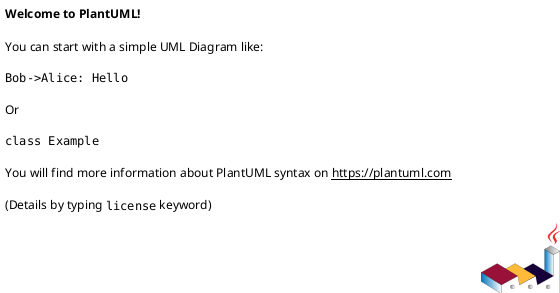
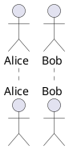

# PlantUML Preprocessor & Includes Troubleshooting Guide

Common errors related to !include, !define, !procedure, file paths, and circular dependencies.

## Error #1: File Not Found - !include

**Error Message:**
```
Cannot include file
Preprocessing error: file not found
```

**Cause:**
- Wrong file path
- File doesn't exist
- Relative path issues

**Solution:**

**Before (Error):**
```plantuml
@startuml
!include wrong-path/common.puml
!include /non/existent/file.puml
@enduml
```

**After (Working):**
```plantuml
@startuml
' Use correct relative path
!include ./common/definitions.puml

' Or absolute path
!include /Users/username/plantuml/common.puml

' Verify file exists first
@enduml
```

---

## Error #2: URL Include Failure

**Error Message:**
```
Cannot open URL
Failed to fetch remote file
Access denied
```

**Cause:**
- Network unavailable
- URL incorrect
- Security restrictions blocking remote includes

**Solution:**

**Before (May fail):**
```plantuml
@startuml
!includeurl http://wrong-url.com/file.puml
@enduml
```

**After (Working):**
```plantuml
@startuml
' Use correct URL
!includeurl https://raw.githubusercontent.com/plantuml-stdlib/C4-PlantUML/master/C4_Context.puml

' Or download file locally and use !include
!include ./local-copy/C4_Context.puml
@enduml
```

**Note:** Some environments (Kroki, cloud renderers) block remote includes for security.

---

## Error #3: Multiple Include with !include_once

**Error Message:**
```
File already included
Duplicate include error
```

**Cause:**
- Using `!include_once` on same file multiple times
- File included both directly and indirectly

**Solution:**

**Before (Error):**
```plantuml
@startuml
!include_once common.puml
!include_once common.puml
@enduml
```

**After (Working):**
```plantuml
@startuml
' Use !include_once only once
!include_once common.puml

' Or use !include if you need multiple includes
!include common.puml
!include common.puml
@enduml
```

**Use `!include_once`** when you want to prevent duplicate includes.

---

## Error #4: Syntax Error in Included File

**Error Message:**
```
Preprocessing failed
Syntax error in included file
```

**Cause:**
- Included file has PlantUML syntax errors
- Error message points to wrong location

**Solution:**

1. Test included file independently:
```bash
java -jar plantuml.jar common.puml
```

2. Fix syntax in included file

3. Then include it:
```plantuml
@startuml
!include common.puml
@enduml
```

**Debugging tip:** Use `-verbose` flag to see include processing

---

## Error #5: Undefined Macro/Variable

**Error Message:**
```
Unknown macro
Undefined variable
```

**Cause:**
- Using `!define` variable before defining it
- Variable defined in different scope

**Solution:**

**Before (Error):**


**After (Working):**


---

## Error #6: !procedure Syntax Error

**Error Message:**
```
Expected !endprocedure
Unexpected symbol in procedure
```

**Cause:**
- Missing `!endprocedure`
- Wrong procedure syntax

**Solution:**

**Before (Error):**
```plantuml
@startuml
!procedure my_proc()
  actor User
' Missing !endprocedure
@enduml
```

**After (Working):**


---

## Error #7: Variable Scoping Issues

**Error Message:**
```
Variable not defined in this scope
```

**Cause:**
- Variables defined in included file not visible
- Scope limitations

**Solution:**

**Before (May not work):**
```plantuml
' In included.puml
!procedure define_vars()
  !$my_var = "value"
!endprocedure

' In main.puml
@startuml
!include included.puml
title $my_var
@enduml
```

**After (Working):**
```plantuml
' In included.puml
!$GLOBAL_VAR = "value"

' In main.puml
@startuml
!include included.puml
title $GLOBAL_VAR
@enduml
```

**Use `$GLOBAL_VAR`** for variables that need to be accessible everywhere.

---

## Error #8: Circular Dependencies

**Error Message:**
```
Stack overflow
Infinite loop in includes
Recursion detected
```

**Cause:**
- File A includes file B, file B includes file A
- Indirect circular references

**Solution:**

**Before (Error):**
```plantuml
' fileA.puml
!include fileB.puml

' fileB.puml
!include fileA.puml
```

**After (Using guards):**
```plantuml
' common.puml
!ifndef COMMON_INCLUDED
!define COMMON_INCLUDED

' Your definitions here
!define MY_VAR "value"

!endif
```

**Best practice:** Always use include guards

---

## Error #9: Path Resolution Differences

**Error Message:**
```
Cannot find included file
Path not resolved correctly
```

**Cause:**
- Different tools resolve paths differently
- Working directory assumptions

**Solution:**

**Before (Tool-dependent):**
```plantuml
@startuml
!include ../common/defs.puml
@enduml
```

**After (Explicit):**
```plantuml
@startuml
' Use absolute paths when possible
!include /full/path/to/common/defs.puml

' Or set !RELATIVE_INCLUDE
!RELATIVE_INCLUDE="./common"
!include %RELATIVE_INCLUDE%/defs.puml
@enduml
```

---

## Error #10: !define vs !function Confusion

**Error Message:**
```
Syntax error in function
Expected different syntax
```

**Cause:**
- Using `!define` when `!function` is needed
- Mixing deprecated and modern syntax

**Solution:**

**Before (Old style):**


**After (Modern):**


---

## Error #11: !includeurl Version Mismatch

**Error Message:**
```
Syntax error in included library
Feature not supported
```

**Cause:**
- Remote library uses newer PlantUML features
- Your PlantUML version too old

**Solution:**

1. Update PlantUML:
```bash
wget https://github.com/plantuml/plantuml/releases/download/v1.2025.0/plantuml.jar
```

2. Or download library locally and modify for compatibility:
```plantuml
@startuml
' Instead of:
' !includeurl https://...new-library.puml

' Download and modify for your version:
!include ./local-copy/compatible-library.puml
@enduml
```

---

## Error #12: Security Restrictions on Includes

**Error Message:**
```
Access denied
Include not allowed
Security policy violation
```

**Cause:**
- Tool/environment blocks file or URL includes
- Asciidoctor, Kroki, or other integrations with restrictions

**Solution:**

**Before (Blocked):**
```plantuml
@startuml
!includeurl https://external.com/lib.puml
!include /etc/passwd
@enduml
```

**After (Allowed):**
```plantuml
@startuml
' Embed definitions directly instead of including
!define PRIMARY_COLOR #LightBlue
!define SECONDARY_COLOR #Navy

' No external includes needed
class User
@enduml
```

---

## Error #13: Comment in Included File Breaking Syntax

**Error Message:**
```
Unexpected comment
Preprocessing error
```

**Cause:**
- Some PlantUML versions don't support comments in certain preprocessor contexts
- Old PlantUML version issue

**Solution:**

**Before (May fail):**
```plantuml
' included.puml
!define MY_VAR "value" ' This is a comment
```

**After (Safe):**
```plantuml
' included.puml
' This is a comment
!define MY_VAR "value"
```

**Or update PlantUML to latest version.**

---

## Error #14: !include with Whitespace in Path

**Error Message:**
```
File not found
Path contains invalid characters
```

**Cause:**
- File path contains spaces
- Not properly quoted

**Solution:**

**Before (Error):**
```plantuml
@startuml
!include /path/with spaces/file.puml
@enduml
```

**After (Working):**
```plantuml
@startuml
' Quote the path
!include "/path/with spaces/file.puml"

' Or use path without spaces
!include /path/without_spaces/file.puml
@enduml
```

---

## Error #15: Missing Include Guards

**Error Message:**
```
Duplicate definition
Symbol already defined
```

**Cause:**
- Including same file multiple times without guards
- Definitions conflict

**Solution:**

**Before (No guards):**
```plantuml
' common.puml
!define PRIMARY_COLOR #Blue
!define BORDER_WIDTH 2
```

**After (With guards):**
```plantuml
' common.puml
!ifndef COMMON_PUML
!define COMMON_PUML

!define PRIMARY_COLOR #Blue
!define BORDER_WIDTH 2

!endif
```

**Pattern:**
```plantuml
!ifndef UNIQUE_NAME
!define UNIQUE_NAME

' Your definitions here

!endif
```

---

## Error #16: Conditional Compilation Errors

**Error Message:**
```
Syntax error in !ifdef
Unexpected !endif
```

**Cause:**
- Unbalanced !ifdef/!endif
- Wrong conditional syntax

**Solution:**

**Before (Error):**
```plantuml
@startuml
!ifdef MY_VAR
  class User
' Missing !endif

!ifdef ANOTHER
  class System
!else
  class Backup
' Multiple !endif
!endif
!endif
@enduml
```

**After (Balanced):**
```plantuml
@startuml
!ifdef MY_VAR
  class User
!endif

!ifdef ANOTHER
  class System
!else
  class Backup
!endif
@enduml
```

---

## Error #17: !include Order Matters

**Error Message:**
```
Symbol not defined
Dependency not found
```

**Cause:**
- Including files in wrong order
- Dependencies not loaded first

**Solution:**

**Before (Wrong order):**
```plantuml
@startuml
!include specific.puml
!include base.puml
' specific.puml needs definitions from base.puml
@enduml
```

**After (Correct order):**
```plantuml
@startuml
' Include base definitions first
!include base.puml
' Then specific implementations
!include specific.puml
@enduml
```

---

## Error #18: Macro Parameter Errors

**Error Message:**
```
Wrong number of arguments
Parameter mismatch
```

**Cause:**
- Calling macro with wrong number of parameters
- Missing required parameters

**Solution:**

**Before (Error):**
```plantuml
@startuml
!procedure CREATE_CLASS($name, $color)
  class "$name" $color
!endprocedure

' Wrong: missing parameter
CREATE_CLASS("User")
@enduml
```

**After (Correct):**
```plantuml
@startuml
!procedure CREATE_CLASS($name, $color)
  class "$name" $color
!endprocedure

' Correct: all parameters
CREATE_CLASS("User", "#LightBlue")

' Or use default parameters
!procedure CREATE_CLASS($name, $color="#LightBlue")
  class "$name" $color
!endprocedure

CREATE_CLASS("User")
@enduml
```

---

## Error #19: !return in !procedure

**Error Message:**
```
!return not allowed in procedure
Unexpected !return
```

**Cause:**
- Using `!return` in `!procedure` (only for `!function`)

**Solution:**

**Before (Error):**
```plantuml
@startuml
!procedure GET_COLOR($type)
  !if ($type == "error")
    !return "#Red"
  !endif
!endprocedure
@enduml
```

**After (Using function):**
```plantuml
@startuml
!function GET_COLOR($type)
  !if ($type == "error")
    !return "#Red"
  !else
    !return "#LightBlue"
  !endif
!endfunction

class User GET_COLOR("normal")
class Error GET_COLOR("error")
@enduml
```

---

## Error #20: Standard Library Include Errors

**Error Message:**
```
Cannot find stdlib
Standard library not available
```

**Cause:**
- Wrong stdlib path
- Old PlantUML version without requested stdlib

**Solution:**

**Before (Error):**
```plantuml
@startuml
!include <cloudinsight/kafka>
!include <wrong/library>
@enduml
```

**After (Working):**
```plantuml
@startuml
' Use correct stdlib syntax
!include <awslib/AWSCommon>
!include <awslib/Compute/all>

' Or check available libraries
!include <tupadr3/common>

' Update PlantUML if library not found
@enduml
```

**List available stdlib:** https://plantuml.com/stdlib

---

## Quick Reference: Preprocessor Directives

### Include Files
```plantuml
@startuml
!include filename.puml
!include_once filename.puml
!include_many filename.puml
!includeurl https://url/file.puml
@enduml
```

### Define Variables
```plantuml
!define MY_VAR "value"
!$VARIABLE = "value"
!$NUMBER = 42
```

### Conditional Compilation
```plantuml
!ifdef MY_VAR
  ' Code if defined
!endif

!ifndef MY_VAR
  ' Code if not defined
!endif

!if %variable()=="value"
  ' Code if condition true
!else
  ' Code otherwise
!endif
```

### Procedures and Functions
```plantuml
!procedure MY_PROC($param)
  actor "$param"
!endprocedure

!function MY_FUNC($param)
  !return $param + "_suffix"
!endfunction
```

### Include Guards Pattern
```plantuml
!ifndef MY_FILE_INCLUDED
!define MY_FILE_INCLUDED

' Your definitions here

!endif
```

---

## Common Preprocessor Mistakes Summary

| Mistake | Problem | Solution |
|---------|---------|----------|
| Wrong path | `!include wrong/path.puml` | Use correct relative/absolute path |
| No guards | Multiple includes clash | Use `!ifndef`/`!endif` guards |
| Circular deps | A includes B, B includes A | Use include guards |
| Missing !end | `!procedure` without `!endprocedure` | Add closing statement |
| Wrong params | Calling with wrong arg count | Match parameter count |
| Scope issues | Variable not visible | Use global variables (`$VAR`) |
| Wrong order | Dependencies not loaded | Include base files first |
| !return in !procedure | Can't return from procedure | Use `!function` instead |

---

## Testing Includes

Minimal test structure:

**common.puml:**
```plantuml
!ifndef COMMON_INCLUDED
!define COMMON_INCLUDED

!define PRIMARY_COLOR #LightBlue
!define SECONDARY_COLOR #Navy

!procedure CREATE_ACTOR($name)
  actor "$name" as $name
!endprocedure

!endif
```

**main.puml:**
```plantuml
@startuml
!include common.puml

CREATE_ACTOR("User")
class System PRIMARY_COLOR
@enduml
```

## Additional Resources

- [PlantUML Preprocessing](https://plantuml.com/preprocessing)
- [PlantUML Standard Library](https://plantuml.com/stdlib)
- [C4-PlantUML Library](https://github.com/plantuml-stdlib/C4-PlantUML)
