# PlantUML Sequence Diagrams Troubleshooting Guide

Common errors in sequence diagrams: participants, arrows, activations, fragments (alt/loop/opt), and message formatting.

## Error #1: Undefined Participant

**Error Message:**
```
Participant not declared
Undefined reference
```

**Cause:**
- Sending message to undeclared participant
- Typo in participant name

**Solution:**

**Before (Error):**
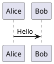

**After (Working):**


**Note:** PlantUML auto-creates participants, but explicit declaration gives better control.

---

## Error #2: Duplicate Participant Declaration

**Error Message:**
```
ERROR Duplicate participant: Bob
Participant already defined
```

**Cause:**
- Declaring same participant twice
- Case-sensitive name match

**Solution:**

**Before (Error):**
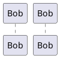

**After (Working):**
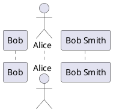

---

## Error #3: Participant Name with Special Characters

**Error Message:**
```
Syntax Error in participant name
```

**Cause:**
- Spaces or special characters without quotes

**Solution:**

**Before (Error):**
```plantuml
@startuml
participant User Service
participant Request/Handler
@enduml
```

**After (Working):**
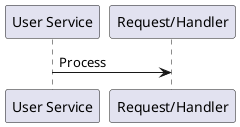

---

## Error #4: Missing Colon in Message

**Error Message:**
```
Syntax Error: Expected ':'
Message format error
```

**Cause:**
- Forgetting colon between arrow and message

**Solution:**

**Before (Error):**
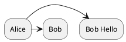

**After (Working):**
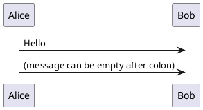

---

## Error #5: Wrong Arrow Type

**Error Message:**
```
Invalid arrow syntax
```

**Cause:**
- Using wrong arrow type for sequence diagrams

**Solution:**

**Sequence Diagram Arrow Types:**
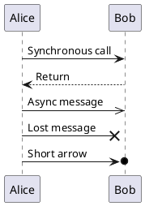

**Before (Wrong):**
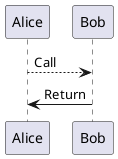

**After (Better):**
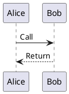

---

## Error #6: Activation Without Message

**Error Message:**
```
Syntax Error: Unexpected activate
```

**Cause:**
- Using `activate` before message
- Wrong activation syntax

**Solution:**

**Before (Error):**
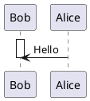

**After (Working):**
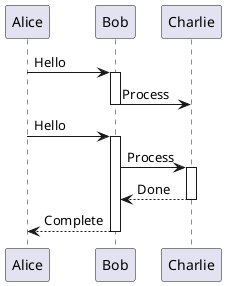

---

## Error #7: Unbalanced Activate/Deactivate

**Error Message:**
```
Activation not closed
Lifeline extends indefinitely
```

**Cause:**
- Missing `deactivate` for `activate`

**Solution:**

**Before (Unbalanced):**
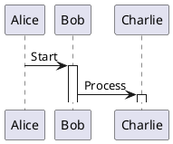

**After (Balanced):**
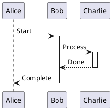

---

## Error #8: Return Arrow Without Prior Message

**Error Message:**
```
Unclear message flow
```

**Cause:**
- Using return arrow without matching call

**Solution:**

**Before (Unclear):**
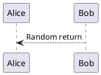

**After (Clear):**
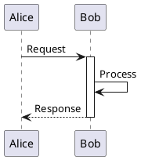

---

## Error #9: Self-Message Syntax

**Error Message:**
```
Syntax Error in self-reference
```

**Cause:**
- Wrong syntax for self-calling messages

**Solution:**

**Before (May not render well):**
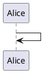

**After (Better):**
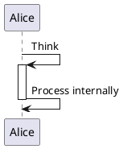

---

## Error #10: Empty alt/opt Fragment

**Error Message:**
```
ERROR empty alt group
Syntax Error in fragment
```

**Cause:**
- Fragment block with no content

**Solution:**

**Before (Error):**
```plantuml
@startuml
alt condition
end
@enduml
```

**After (Working):**
```plantuml
@startuml
alt condition is true
  Alice -> Bob : Do something
else condition is false
  Alice -> Charlie : Do something else
end
@enduml
```

---

## Error #11: Missing end for Fragment

**Error Message:**
```
Syntax Error: Expected 'end'
Unclosed fragment
```

**Cause:**
- Starting alt/opt/loop without closing `end`

**Solution:**

**Before (Error):**
```plantuml
@startuml
alt success
  Alice -> Bob : Process
' Missing end
Alice -> Charlie : Next step
@enduml
```

**After (Working):**
```plantuml
@startuml
alt success
  Alice -> Bob : Process
end

Alice -> Charlie : Next step
@enduml
```

---

## Error #12: Nested Fragments Syntax

**Error Message:**
```
Syntax Error in nested fragment
Fragment structure invalid
```

**Cause:**
- Wrong nesting of fragments
- Missing end statements

**Solution:**

**Before (Error):**
```plantuml
@startuml
alt condition1
  Alice -> Bob : Step1
  loop 5 times
    Bob -> Charlie : Repeat
end
' Missing end for alt
@enduml
```

**After (Working):**
```plantuml
@startuml
alt condition1
  Alice -> Bob : Step1
  loop 5 times
    Bob -> Charlie : Repeat
  end
end
@enduml
```

---

## Error #13: Wrong Fragment Keywords

**Error Message:**
```
Unknown fragment type
Invalid group keyword
```

**Cause:**
- Using non-existent fragment type

**Solution:**

**Valid fragment types:**
```plantuml
@startuml
' Alternative (if/else)
alt condition
  Alice -> Bob : If true
else
  Alice -> Charlie : If false
end

' Optional
opt optional condition
  Alice -> Bob : Only if condition
end

' Loop
loop 5 times
  Alice -> Bob : Repeat
end

' Parallel
par
  Alice -> Bob : Parallel 1
else
  Alice -> Charlie : Parallel 2
end

' Break
break condition
  Alice -> Bob : Break out
end

' Critical region
critical
  Alice -> Bob : Critical section
end

' Group (labeled box)
group My Group
  Alice -> Bob : Grouped messages
end
@enduml
```

---

## Error #14: Participant Ordering Issues

**Error Message:**
```
Participants in wrong order
Layout issues
```

**Cause:**
- PlantUML auto-orders participants by first appearance

**Solution:**

**Before (Auto-ordered):**
```plantuml
@startuml
Alice -> Bob : Hello
Charlie -> Alice : Hi
Bob -> Charlie : Hey
' Order: Alice, Bob, Charlie (by first mention)
@enduml
```

**After (Explicit order):**
```plantuml
@startuml
participant Charlie
participant Alice
participant Bob

Alice -> Bob : Hello
Charlie -> Alice : Hi
Bob -> Charlie : Hey
@enduml
```

---

## Error #15: Divider Syntax Errors

**Error Message:**
```
Syntax Error in divider
```

**Cause:**
- Wrong divider syntax

**Solution:**

**Before (Wrong):**
```plantuml
@startuml
Alice -> Bob : Step 1
divider "Section 2"
Bob -> Charlie : Step 2
@enduml
```

**After (Correct):**
```plantuml
@startuml
Alice -> Bob : Step 1

== Initialization Complete ==

Bob -> Charlie : Step 2

== Processing ==

Charlie -> Alice : Step 3
@enduml
```

---

## Error #16: Note Position Errors

**Error Message:**
```
Invalid note position
Note syntax error
```

**Cause:**
- Wrong note position keyword
- Invalid note attachment

**Solution:**

**Before (Error):**
```plantuml
@startuml
Alice -> Bob : Hello
note above : Wrong position
@enduml
```

**After (Working):**
```plantuml
@startuml
Alice -> Bob : Hello

note left : Note to left of Alice
note right : Note to right of Bob
note over Alice : Note over Alice
note over Alice, Bob : Note spanning both

note left of Alice
  Multi-line note
  on left of Alice
end note

' Note on arrow
Alice -> Bob : Message
note right
  This note refers
  to the message above
end note
@enduml
```

---

## Error #17: Delay Notation Errors

**Error Message:**
```
Syntax Error with delay
```

**Cause:**
- Wrong delay syntax

**Solution:**

**Before (Wrong):**
```plantuml
@startuml
Alice -> Bob : Message1
delay 5 seconds
Bob -> Alice : Message2
@enduml
```

**After (Correct):**
```plantuml
@startuml
Alice -> Bob : Message1
...5 seconds later...
Bob -> Alice : Message2

' Or simple delay
...
Bob -> Charlie : Another message
@enduml
```

---

## Error #18: Lifeline Create/Destroy Errors

**Error Message:**
```
Syntax Error in create/destroy
```

**Cause:**
- Wrong syntax for creating/destroying participants dynamically

**Solution:**

**Before (Wrong):**
```plantuml
@startuml
Alice -> Bob : Create new object
create Charlie
Charlie -> Alice : Response
@enduml
```

**After (Correct):**
```plantuml
@startuml
Alice -> Bob : Create new object
create participant Charlie
Charlie -> Alice : Hello

Alice -> Charlie : Destroy
destroy Charlie
@enduml
```

---

## Error #19: Autonumber Issues

**Error Message:**
```
Autonumber not working
Numbers not showing
```

**Cause:**
- Wrong autonumber syntax
- Placement issues

**Solution:**

**Before (May not work):**
```plantuml
@startuml
Alice -> Bob : Message
autonumber
Bob -> Charlie : Message
@enduml
```

**After (Working):**
```plantuml
@startuml
' Place autonumber BEFORE first message
autonumber
Alice -> Bob : First message
Bob -> Charlie : Second message

' Or with custom format
autonumber 1 1 "<b>[0]"
Alice -> Bob : Custom numbered

' Stop/resume numbering
autonumber stop
Alice -> Bob : Not numbered
autonumber resume
Bob -> Charlie : Numbered again
@enduml
```

---

## Error #20: Box Grouping Errors

**Error Message:**
```
Syntax Error in box
Box not closed
```

**Cause:**
- Missing `end box`
- Wrong box syntax

**Solution:**

**Before (Error):**
```plantuml
@startuml
box "Internal System"
  participant Alice
  participant Bob
' Missing end box

participant Charlie
@enduml
```

**After (Working):**
```plantuml
@startuml
box "Internal System" #LightBlue
  participant Alice
  participant Bob
end box

box "External System" #LightGreen
  participant Charlie
end box

Alice -> Bob : Internal call
Bob -> Charlie : External call
@enduml
```

---

## Quick Reference: Sequence Diagram Syntax

### Participants
```plantuml
@startuml
participant Participant
actor Actor
boundary Boundary
control Control
entity Entity
database Database
collections Collections
queue Queue
@enduml
```

### Arrows
```plantuml
@startuml
A -> B : Sync message
A <-- B : Return
A ->> B : Async
A ->x B : Lost
A ->o B : Short arrow
@enduml
```

### Fragments
```plantuml
@startuml
alt condition
  A -> B
else
  A -> C
end

opt optional
  A -> B
end

loop 5 times
  A -> B
end
@enduml
```

### Activation
```plantuml
@startuml
A -> B ++: Message
B -> C ++: Forward
C --> B --: Response
B --> A --: Complete
@enduml
```

---

## Common Sequence Diagram Mistakes Summary

| Mistake | Problem | Solution |
|---------|---------|----------|
| Missing participant | `Alice -> Bob` (Bob not declared) | Declare Bob first or let auto-create |
| Duplicate participant | `participant Bob` twice | Use unique names |
| Missing colon | `Alice -> Bob Hello` | `Alice -> Bob : Hello` |
| Wrong arrow | `Alice --> Bob` for call | Use `Alice -> Bob` |
| Unbalanced activate | Missing deactivate | Match every activate/deactivate |
| Empty fragment | `alt\nend` | Add content or remove fragment |
| Missing end | `alt` without `end` | Add `end` statement |
| Wrong note position | `note above` | Use `note left/right/over` |
| Wrong delay | `delay 5` | Use `...5 seconds...` |
| Box not closed | Missing `end box` | Add `end box` |

---

## Testing Sequence Diagrams

Minimal test:

```plantuml
@startuml
participant Alice
participant Bob

Alice -> Bob ++: Request
Bob -> Bob : Process
Bob --> Alice --: Response

alt Success
  Alice -> Bob : Acknowledge
else Failure
  Alice -> Bob : Retry
end
@enduml
```

## Additional Resources

- [PlantUML Sequence Diagram Documentation](https://plantuml.com/sequence-diagram)
- [Sequence Diagram Reference](https://pdf.plantuml.net/PlantUML_Language_Reference_Guide_en.pdf)
