# PlantUML Text & Labels Troubleshooting Guide

Common errors related to quotes, special characters, text formatting, and label syntax.

## Error #1: Missing Quotes for Special Characters

**Error Message:**
```
Syntax Error: Invalid character
Unexpected character in name
```

**Cause:**
- Names containing spaces, slashes, hyphens without quotes

**Solution:**

**Before (Error):**
```plantuml
@startuml
actor System Admin
class User/Account
participant Message Handler
@enduml
```

**After (Working):**
```plantuml
@startuml
actor "System Admin" as Admin
class "User/Account" as Account
participant "Message Handler" as MH
@enduml
```

**Rule:** Use quotes for names with spaces or special characters.

---

## Error #2: Unmatched Quotes

**Error Message:**
```
Syntax Error: Unclosed string
Missing closing quote
```

**Cause:**
- Opening quote without closing quote
- Using different quote types

**Solution:**

**Before (Error):**
```plantuml
@startuml
actor "User
class "System'
participant "Handler
@enduml
```

**After (Working):**
```plantuml
@startuml
actor "User" as U
class "System" as S
participant "Handler" as H
@enduml
```

---

## Error #3: Special Characters in Messages

**Error Message:**
```
Syntax Error: Invalid escape sequence
Unexpected character
```

**Cause:**
- Not escaping special characters in messages
- Using characters that have special meaning in PlantUML

**Solution:**

**Before (Error):**
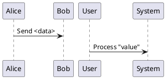

**After (Working):**
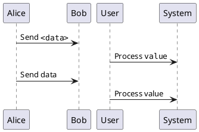

**Problematic characters:** `<`, `>`, `"`, `:`, `{`, `}`

---

## Error #4: Newline in Text

**Error Message:**
```
Syntax Error: Unexpected line break
```

**Cause:**
- Breaking text across multiple lines without proper syntax

**Solution:**

**Before (Error):**
```plantuml
@startuml
Alice -> Bob : This is a
very long message
@enduml
```

**After (Working):**
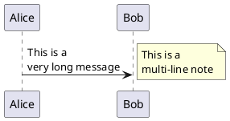

---

## Error #5: Colon in Labels

**Error Message:**
```
Syntax Error near ':'
```

**Cause:**
- Using colon in message labels without protection
- Colon is special character (separator between arrow and message)

**Solution:**

**Before (Error):**
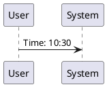

**After (Working):**
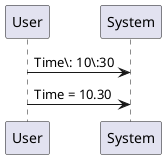

---

## Error #6: Unicode/UTF-8 Characters Not Displaying

**Error Message:**
```
Illegal character
Character encoding error
Missing glyph/box characters displayed
```

**Cause:**
- File not saved as UTF-8
- Missing font support for character

**Solution:**

**Before (Error - ISO-8859-1 encoding):**
```plantuml
@startuml
actor Utilisateur
Utilisateur -> Système : Demande données
@enduml
```

**After (Working - UTF-8):**
```plantuml
@startuml
actor Utilisateur
Utilisateur -> Système : Demande données

' Emojis and symbols work in UTF-8
actor User 😊
note right : ✓ Success
@enduml
```

**Fix:**
1. Save file as UTF-8
2. Run with: `java -Dfile.encoding=UTF-8 -jar plantuml.jar diagram.puml`

---

## Error #7: HTML-like Tags Not Working

**Error Message:**
```
Tags displayed as literal text
<b>, <i>, <u> not rendering
```

**Cause:**
- PlantUML supports limited HTML-like formatting
- Wrong syntax or context

**Solution:**

**Before (Not working in all contexts):**
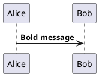

**After (Working):**
```plantuml
@startuml
' HTML works in notes and some labels
note right
  <b>Bold text</b>
  <i>Italic text</i>
  <u>Underlined</u>
  <s>Strikethrough</s>
end note

' Use Creole for messages
Alice -> Bob : **Bold message**
Alice -> Bob : //Italic message//
@enduml
```

---

## Error #8: Creole Syntax Errors

**Error Message:**
```
Formatting not applied
Creole markup showing literally
```

**Cause:**
- Using wrong Creole syntax
- Mixing HTML and Creole incorrectly

**Solution:**

**Creole Formatting Reference:**
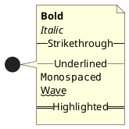

---

## Error #9: Multiline Strings in Attributes

**Error Message:**
```
Syntax Error in class/object definition
```

**Cause:**
- Trying to use multiline text in class attributes

**Solution:**

**Before (Error):**
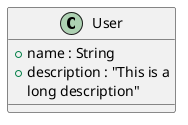

**After (Working):**
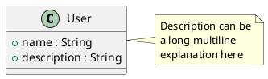

---

## Error #10: Special Formatting in Notes

**Error Message:**
```
Note formatting not working
```

**Cause:**
- Wrong syntax for note formatting
- Missing proper delimiters

**Solution:**

**Before (Limited):**
```plantuml
@startuml
note right : This is a note
@enduml
```

**After (Rich formatting):**
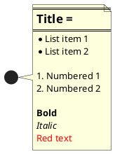

---

## Error #11: Mathematical Symbols

**Error Message:**
```
Symbol not rendering
Math characters display incorrectly
```

**Cause:**
- PlantUML has limited math symbol support
- Wrong syntax for special symbols

**Solution:**

**Before (May not work):**
```plantuml
@startuml
User -> System : Calculate α + β = γ
@enduml
```

**After (Working):**
```plantuml
@startuml
' Use Unicode math symbols (save as UTF-8)
User -> System : Calculate α + β = γ

' Or use <math> tags (limited support)
note right
  <math>x = y + z</math>
end note

' Or use AsciiMath/LaTeX (if available)
@enduml
```

---

## Error #12: Label Too Long

**Error Message:**
```
Rendering issue: Label overflow
Text truncated
```

**Cause:**
- Label exceeds box/arrow width
- Not using line breaks

**Solution:**

**Before (Too long):**
```plantuml
@startuml
User -> System : This is an extremely long message that will overflow
@enduml
```

**After (Better):**
```plantuml
@startuml
' Use \n for line breaks
User -> System : This is an extremely\nlong message that\nwill not overflow

' Or use maxMessageSize
skinparam maxMessageSize 150
User -> System : This is an extremely long message

' Or shorten with note
User -> System : Process request
note right
  Full details:
  This is an extremely long
  explanation that belongs
  in a note
end note
@enduml
```

---

## Error #13: Stereotype Label Issues

**Error Message:**
```
Syntax Error in stereotype
```

**Cause:**
- Wrong syntax for stereotypes
- Missing angle brackets

**Solution:**

**Before (Error):**
```plantuml
@startuml
class User (Entity)
actor Admin <Person>
@enduml
```

**After (Working):**
```plantuml
@startuml
class User <<Entity>>
actor Admin <<Person>>
interface Service <<Interface>>

' Can also use spot/circle
class Controller <<C,#FF0000>>
@enduml
```

---

## Error #14: Method/Attribute Signatures

**Error Message:**
```
Syntax Error in class member
```

**Cause:**
- Wrong format for method signatures
- Special characters not handled

**Solution:**

**Before (Error):**
```plantuml
@startuml
class Service {
  +getData(filter: String): List<Data>
  +process(items: Array<Item>)
}
@enduml
```

**After (Working):**
```plantuml
@startuml
class Service {
  +getData(filter: String): List~Data~
  +process(items: Array~Item~)
  {method} +calculate(): void
}

' Or escape special characters
class Service2 {
  +getData(filter: String): "List<Data>"
}
@enduml
```

**Note:** Use `~` for generics instead of `<>`

---

## Error #15: Note Position Errors

**Error Message:**
```
Invalid note position
Note syntax error
```

**Cause:**
- Using invalid position keyword
- Wrong syntax for note attachment

**Solution:**

**Before (Error):**
```plantuml
@startuml
class User
note above User : Wrong position
note on User : Wrong keyword
@enduml
```

**After (Working):**
```plantuml
@startuml
class User

' Valid positions
note left of User : Left note
note right of User : Right note
note top of User : Top note
note bottom of User : Bottom note

' Floating note
note "Floating\nnote" as N1

' Note on link
User --> System
note on link : Note on this relationship
@enduml
```

---

## Error #16: Color in Text

**Error Message:**
```
Color syntax not working in text
```

**Cause:**
- Wrong syntax for coloring text
- Limited support in some contexts

**Solution:**

**Before (Error):**
```plantuml
@startuml
Alice -> Bob : [red]Error message[/red]
@enduml
```

**After (Working):**
```plantuml
@startuml
' Use <color> tags in notes
note right
  <color:red>Error message</color>
  <color:#FF0000>Also red</color>
  <color:blue>Blue text</color>
end note

' For elements, use styling
Alice -> Bob : Error message
note right : <color:red>This is an error</color>
@enduml
```

---

## Error #17: Link/URL in Text

**Error Message:**
```
URL not clickable
Link syntax error
```

**Cause:**
- Wrong syntax for creating clickable links
- Not all output formats support links

**Solution:**

**Before (Plain text):**
```plantuml
@startuml
note right : See http://example.com
@enduml
```

**After (Working):**
```plantuml
@startuml
' Use [[URL]] syntax
note right
  See [[http://example.com documentation]]
  [[http://wiki.example.com{More info}]]
end note

' For elements
class User [[http://example.com/user]]
@enduml
```

**Note:** Links work in SVG output, not in PNG

---

## Error #18: Monospace/Code Formatting

**Error Message:**
```
Code formatting not applied
```

**Cause:**
- Wrong syntax for monospace text
- Not using proper delimiters

**Solution:**

**Before (Not monospace):**
```plantuml
@startuml
note right : Code: function() { return true; }
@enduml
```

**After (Monospace):**
```plantuml
@startuml
note right
  Use double quotes:
  ""function() { return true; }""

  Or monospace tag:
  <font:monospaced>var x = 10;</font>
end note
@enduml
```

---

## Error #19: Escaping Backslashes

**Error Message:**
```
Invalid escape sequence
Unexpected backslash
```

**Cause:**
- Backslash is escape character
- Not doubling backslashes when needed

**Solution:**

**Before (Error):**
```plantuml
@startuml
note right : Path: C:\Users\Documents
@enduml
```

**After (Working):**
```plantuml
@startuml
' Double backslashes
note right : Path: C:\\Users\\Documents

' Or use forward slashes
note right : Path: C:/Users/Documents
@enduml
```

---

## Error #20: Title Formatting Issues

**Error Message:**
```
Title not displaying correctly
Syntax error in title
```

**Cause:**
- Wrong title syntax
- Not using proper delimiters for multiline

**Solution:**

**Before (Limited):**
```plantuml
@startuml
title My Diagram
@enduml
```

**After (Rich formatting):**
```plantuml
@startuml
' Simple title
title Simple Title

' Or multiline with formatting
title
  <font color=red size=20>System Architecture</font>
  <color:blue>Version 2.0</color>
  --
  //Last updated: 2025-01-14//
end title

' With header and footer
header Company Logo
footer Page %page% of %lastpage%

@enduml
```

---

## Quick Reference: Text Formatting

### Creole Markup
```plantuml
@startuml
note right
  **Bold**
  //Italic//
  __Underlined__
  --Strikethrough--
  ""Monospaced""
  ~~Wave~~
  ==Highlighted==
end note
@enduml
```

### HTML-like Tags (in notes)
```plantuml
@startuml
note right
  <b>Bold</b>
  <i>Italic</i>
  <u>Underlined</u>
  <s>Strikethrough</s>
  <color:red>Colored</color>
  <size:18>Large text</size>
  <font color=blue>Blue font</font>
end note
@enduml
```

### Lists
```plantuml
@startuml
note right
  * Bullet 1
  * Bullet 2
  ** Sub-bullet

  # Numbered 1
  # Numbered 2
  ## Sub-numbered
end note
@enduml
```

### Special Characters
- Line break: `\n`
- Backslash: `\\`
- Quote: `""`
- Generic brackets: `~` instead of `<>`

---

## Common Text Mistakes Summary

| Mistake | Problem | Solution |
|---------|---------|----------|
| Missing quotes | `actor System Admin` | `actor "System Admin"` |
| Unmatched quotes | `class "User` | `class "User"` |
| Colon in text | `Time: 10:30` | `Time\: 10\:30` |
| Wrong newline | Multi-line break | Use `\n` |
| HTML everywhere | `<b>` in messages | Use Creole or notes |
| Generics syntax | `List<Data>` | `List~Data~` |
| Wrong note position | `note above` | `note top of` |
| Backslash | `C:\Users` | `C:\\Users` |

---

## Testing Text Formatting

Minimal test:

```plantuml
@startuml
title Test Diagram

actor "User Name" as U
note right of U
  **Bold text**
  //Italic text//
  <color:red>Red text</color>
end note

U -> System : Message with\nline break
@enduml
```

## Additional Resources

- [PlantUML Creole Documentation](https://plantuml.com/creole)
- [PlantUML Text Formatting](https://plantuml.com/commons)
