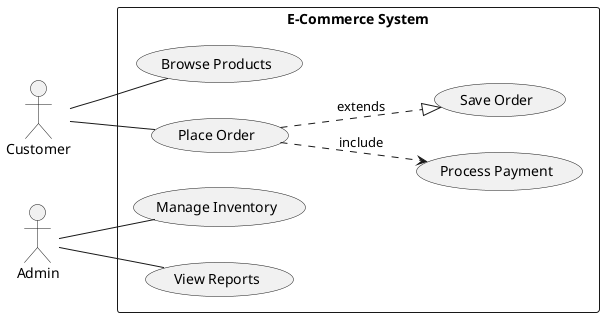
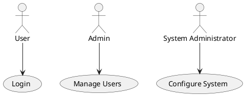
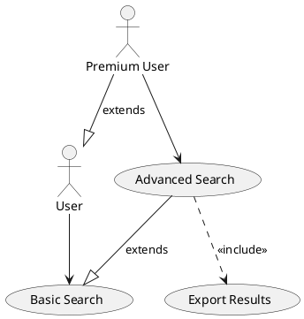
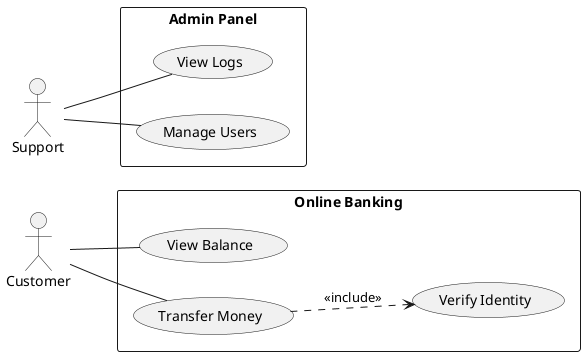

# Use Case Diagrams

Use case diagrams show how actors (users or external systems) interact with a system, illustrating the system's functionality from the user's perspective.

## Basic Elements



## Actor Types



## Relationships

- `--` **Association** - Actor uses use case
- `..>` **Include** - Mandatory inclusion
- `..|>` **Extend** - Optional extension
- `<|--` **Generalization** - Inheritance



## System Boundaries



## Conversion

```bash
java -jar plantuml.jar -tsvg usecase.puml
```

See [toc.md](toc.md) for all diagram types.
