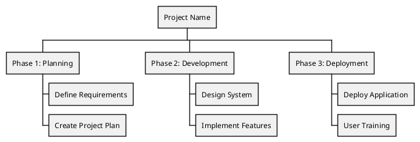
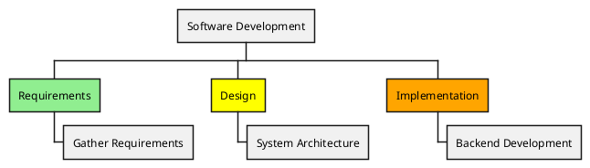

# Work Breakdown Structure (WBS)

WBS diagrams break projects into hierarchical tasks.

## Basic Structure

```puml
@startwbs
* Project Name
** Phase 1: Planning
*** Define Requirements
*** Create Project Plan
** Phase 2: Development
*** Design System
*** Implement Features
** Phase 3: Deployment
*** Deploy Application
*** User Training
@endwbs
```

## With Colors

```puml
@startwbs
skinparam wbsNodeBackgroundColor lightblue

* Software Development
**[#lightgreen] Requirements
*** Gather Requirements
**[#yellow] Design
*** System Architecture
**[#orange] Implementation
*** Backend Development
@endwbs
```

See [toc.md](toc.md) for all diagram types.
