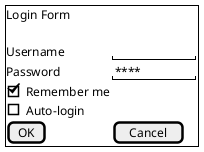
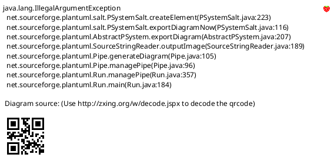

# Wireframes/UI Mockups (Salt)

Salt creates graphical interface mockups.

## Basic Form

```puml
@startsalt
{+
  Login Form
  .
  Username | "          "
  Password | "****      "
  [X] Remember me
  [ ] Auto-login
  [ OK ] | [ Cancel ]
}
@endsalt
```

## With Tables

```puml
@startsalt
{#
  . | Column 1 | Column 2
  Row 1 | Data 1 | Data 2
  Row 2 | Data 3 | Data 4
}
@endsalt
```

## Tree Structure

```puml
@startsalt
{T
  + Root
  ++ Node 1
  +++ Leaf 1.1
  ++ Node 2
}
@endsalt
```

See [toc.md](toc.md) for all diagram types.
