# PlantUML Arrows & Relationships Troubleshooting Guide

Common errors related to arrow syntax, connectors, relationship types, and directionality across all diagram types.

## Error #1: Missing Arrow Operator

**Error Message:**
```
Syntax Error: Expected arrow
Invalid message syntax
```

**Cause:**
- Forgetting the arrow operator between elements
- Using wrong punctuation instead of arrow

**Solution:**

**Before (Error):**
```plantuml
@startuml
Alice Bob : Hello
User System Request
@enduml
```

**After (Working):**
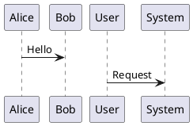

---

## Error #2: Wrong Arrow Direction

**Error Message:**
```
Syntax Error near arrow
Unexpected arrow direction
```

**Cause:**
- Using arrow in wrong direction
- Confusing left-to-right with right-to-left

**Solution:**

**Arrow Directions:**
- `->` : Left to right
- `<-` : Right to left
- `<->` : Bidirectional

**Before (Error):**
```plantuml
@startuml
' Confusing arrow directions
Alice <- Bob : Hello
' Reads as: Alice receives from Bob (Bob sends to Alice)
@enduml
```

**After (Working):**
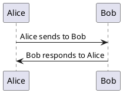

---

## Error #3: Invalid Arrow Syntax for Diagram Type

**Error Message:**
```
Syntax Error: Invalid relationship type
Arrow not valid for this diagram
```

**Cause:**
- Using sequence diagram arrows in class diagrams
- Using class diagram connectors in sequence diagrams

**Solution:**

**Different arrow types for different diagrams:**

**Sequence Diagrams:**
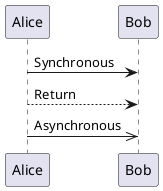

**Class Diagrams:**
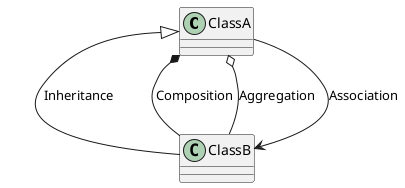

**Activity Diagrams:**
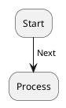

---

## Error #4: Missing Colon Before Message Label

**Error Message:**
```
Syntax Error: Expected ':'
Message format error
```

**Cause:**
- Omitting colon before message text in sequence/communication diagrams
- Using wrong separator

**Solution:**

**Before (Error):**
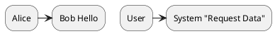

**After (Working):**
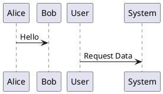

**Rule:** Arrow messages require format: `From -> To : Message`

---

## Error #5: Wrong Relationship Symbol for Class Diagrams

**Error Message:**
```
Syntax Error: Invalid relationship
```

**Cause:**
- Using wrong relationship symbol
- Confusing inheritance, composition, aggregation

**Solution:**

**Class Diagram Relationships:**

**Before (Error):**
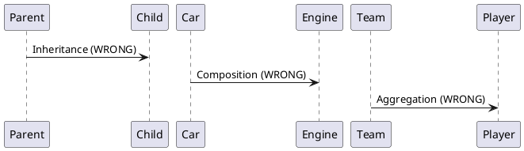

**After (Working):**
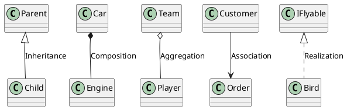

**Relationship Reference:**
- `<|--` : Inheritance (extends)
- `*--` : Composition (strong ownership)
- `o--` : Aggregation (weak ownership)
- `-->` : Association
- `<|..` : Realization/Implementation
- `..>` : Dependency

---

## Error #6: Incorrect Arrowhead Combinations

**Error Message:**
```
Syntax Error: Invalid arrow
Unrecognized arrow type
```

**Cause:**
- Creating invalid arrow combinations
- Mixing incompatible arrow styles

**Solution:**

**Valid Arrow Components:**
- Line style: `-` (solid), `--` (dashed), `..` (dotted)
- Direction: `>`, `<`, `<>` (bidirectional)
- Special heads: `|>` (empty triangle), `*` (composition), `o` (aggregation)

**Before (Error):**
```plantuml
@startuml
ClassA <*-- ClassB
ClassA o|-- ClassB
ClassA -->* ClassB
@enduml
```

**After (Working):**
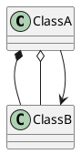

---

## Error #7: Arrow Length Inconsistencies

**Error Message:**
```
Rendering issue: Overlapping arrows
Layout problems
```

**Cause:**
- Not using consistent arrow lengths
- PlantUML layout engine struggles with mixed lengths

**Solution:**

**Before (Messy):**
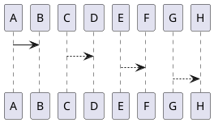

**After (Better):**
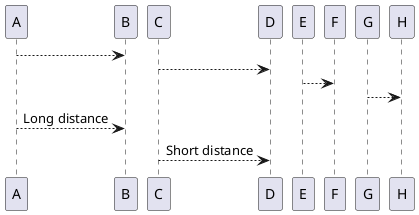

**Rule:** More dashes = longer arrow (forces more spacing)

---

## Error #8: Missing Relationship Label

**Error Message:**
```
Warning: Unlabeled relationship
```

**Cause:**
- Not providing labels for relationships
- Makes diagrams harder to understand

**Solution:**

**Before (Unclear):**
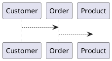

**After (Clear):**
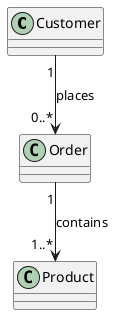

---

## Error #9: Bidirectional Arrow Misuse

**Error Message:**
```
Unclear relationship direction
```

**Cause:**
- Using bidirectional arrows when not appropriate
- Confusing message flow

**Solution:**

**Before (Confusing):**
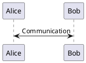

**After (Clear):**
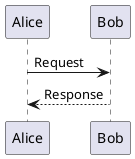

**Note:** Bidirectional arrows (`<->`) are appropriate in class diagrams for associations, but not in sequence diagrams.

---

## Error #10: Hidden/Invisible Arrow Syntax Errors

**Error Message:**
```
Syntax Error near 'hidden'
```

**Cause:**
- Incorrect syntax for hidden arrows
- Used for layout control

**Solution:**

**Before (Error):**
```plantuml
@startuml
A -> B hidden
A [hidden]-> B
@enduml
```

**After (Working):**
```plantuml
@startuml
' Hidden arrows for layout control
A -[hidden]-> B

' Or shorter form
A -[hidden]- B
@enduml
```

**Use case:** Force element positioning without visible connection

---

## Error #11: Cardinality/Multiplicity Notation Errors

**Error Message:**
```
Syntax Error: Invalid cardinality
```

**Cause:**
- Wrong format for cardinality in relationships
- Missing quotes around cardinality

**Solution:**

**Before (Error):**
```plantuml
@startuml
Customer 1 --> 0..* Order
Order many --> 1 Product
@enduml
```

**After (Working):**
```plantuml
@startuml
Customer "1" --> "0..*" Order
Order "*" --> "1" Product
Company "1" --> "1..*" Employee

' Also valid
Customer --> "many" Order : places
@enduml
```

**Common Cardinalities:**
- `"1"` : Exactly one
- `"0..1"` : Zero or one
- `"0..*"` or `"*"` : Zero or many
- `"1..*"` : One or many
- `"n"` : Exactly n

---

## Error #12: ER Diagram Cardinality Syntax

**Error Message:**
```
Syntax Error in ER relationship
```

**Cause:**
- Using class diagram syntax in ER diagrams
- ER diagrams have different notation

**Solution:**

**Before (Error):**
```plantuml
@startuml
entity Customer
entity Order
Customer --> Order
@enduml
```

**After (Working):**
```plantuml
@startuml
entity Customer
entity Order

' ER diagram cardinality notation
Customer ||--o{ Order : places
Customer }o--|| Address : has

' Cardinality symbols:
' ||--|| : One to one
' ||--o{ : One to many
' }o--o{ : Many to many
' }o--|| : Many to one
@enduml
```

**ER Notation:**
- `||` : Exactly one
- `|o` : Zero or one
- `}o` : Zero or many
- `}|` : One or many

---

## Error #13: Dotted vs Dashed Line Confusion

**Error Message:**
```
Unexpected arrow style
```

**Cause:**
- Confusing dotted `..` with dashed `--`
- Using wrong style for relationship type

**Solution:**

**Line Styles:**
```plantuml
@startuml
' Solid line (association, dependency)
ClassA --> ClassB : Solid

' Dashed line (often for returns, replies)
ClassA --> ClassB : Call
ClassA <-- ClassB : Return (dashed)

' Dotted line (realization, implementation)
Interface <|.. Implementation : Dotted

' Double line (composition/aggregation)
ClassA *-- ClassB : Composition
@enduml
```

**Sequence Diagram Convention:**
```plantuml
@startuml
Alice -> Bob : Synchronous call (solid)
Alice <-- Bob : Return (dashed)
Alice ->> Bob : Async message (solid with different head)
@enduml
```

---

## Error #14: Self-Referencing Arrow Errors

**Error Message:**
```
Syntax Error: Invalid self-reference
```

**Cause:**
- Wrong syntax for self-referencing messages
- Missing proper notation

**Solution:**

**Before (Error):**
```plantuml
@startuml
Alice -> Alice
System -> System
@enduml
```

**After (Working):**
```plantuml
@startuml
' Sequence diagram self-call
Alice -> Alice : Think

' Class diagram self-association
class Node {
  +children : Node[]
}
Node --> Node : contains

' Activity diagram loop back
:Process;
-> Loop back;
:Process;
@enduml
```

---

## Error #15: Arrow Color Syntax Errors

**Error Message:**
```
Syntax Error: Invalid color in arrow
```

**Cause:**
- Wrong syntax for coloring arrows
- Invalid color specification

**Solution:**

**Before (Error):**
```plantuml
@startuml
Alice -> Bob color:red : Message
Alice -red> Bob : Message
@enduml
```

**After (Working):**
```plantuml
@startuml
' Correct arrow color syntax
Alice -[#red]-> Bob : Error message
Alice -[#00FF00]-> Bob : Success message
Alice -[#blue,bold]-> Bob : Important

' Class diagram arrow colors
ClassA -[#red]-> ClassB
ClassA -[#00AA00,dashed]-> ClassC
@enduml
```

---

## Error #16: Dependency vs Association Confusion

**Error Message:**
```
Incorrect relationship type
```

**Cause:**
- Using association when dependency is needed
- Not understanding the difference

**Solution:**

**Understanding the difference:**
- **Association** (`-->`): Strong relationship, one class has a field of another
- **Dependency** (`..>`): Weak relationship, one class uses another temporarily

**Before (Unclear):**
```plantuml
@startuml
Controller --> Service
Controller --> Request
@enduml
```

**After (Clear):**
```plantuml
@startuml
' Controller has a Service field (association)
Controller --> Service : uses

' Controller uses Request temporarily (dependency)
Controller ..> Request : depends on
@enduml
```

---

## Error #17: Inheritance vs Realization Confusion

**Error Message:**
```
Wrong relationship for interface
```

**Cause:**
- Using inheritance arrow for interface implementation
- Confusing extends with implements

**Solution:**

**Before (Error):**
```plantuml
@startuml
interface Flyable
class Bird

' Wrong: using inheritance arrow
Flyable <|-- Bird
@enduml
```

**After (Working):**
```plantuml
@startuml
interface Flyable
class Bird
class Penguin

' Correct: realization/implementation uses dotted line
Flyable <|.. Bird

' Inheritance between classes uses solid line
Bird <|-- Penguin
@enduml
```

**Rule:**
- Classes extend classes: `<|--` (solid)
- Classes implement interfaces: `<|..` (dotted)

---

## Error #18: Missing Relationship Direction

**Error Message:**
```
Ambiguous relationship
```

**Cause:**
- Not specifying navigability
- Unclear which direction the relationship flows

**Solution:**

**Before (Ambiguous):**
```plantuml
@startuml
Order -- Customer
Product -- Order
@enduml
```

**After (Clear):**
```plantuml
@startuml
' Unidirectional
Order --> Customer : belongs to
Order --> Product : contains

' Bidirectional (when needed)
Student "0..*" <--> "0..*" Course : enrolls in

' No arrow means unspecified navigability
Order - Customer
@enduml
```

---

## Error #19: Composition vs Aggregation Misuse

**Error Message:**
```
Wrong ownership relationship
```

**Cause:**
- Using composition when aggregation is appropriate
- Not understanding lifecycle ownership

**Solution:**

**Understanding the difference:**
- **Composition** (`*--`): Strong ownership, child cannot exist without parent
- **Aggregation** (`o--`): Weak ownership, child can exist independently

**Before (Wrong):**
```plantuml
@startuml
' Team doesn't own Player (wrong to use composition)
Team *-- Player

' Library should own Books (wrong to use aggregation)
Library o-- Book
@enduml
```

**After (Correct):**
```plantuml
@startuml
' Team has Players, but Players can exist without Team
Team o-- Player : has

' Library owns Books, Books cannot exist without Library
Library *-- Book : owns

' House owns Rooms, Rooms cannot exist without House
House *-- Room : contains

' Department has Employees, Employees can exist independently
Department o-- Employee : manages
@enduml
```

**Rule of thumb:**
- If deleting the parent should delete the child → Composition (`*--`)
- If the child can exist independently → Aggregation (`o--`)

---

## Error #20: Overlapping/Crossing Arrows

**Error Message:**
```
Layout issue: Arrows crossing
Diagram unclear
```

**Cause:**
- Too many connections creating spaghetti diagram
- Poor layout organization

**Solution:**

**Before (Messy):**
```plantuml
@startuml
A --> B
A --> C
A --> D
B --> D
C --> B
D --> A
@enduml
```

**After (Organized):**
```plantuml
@startuml
' Use layout hints
A --> B
A --> C
B --> D
C --> D

' Or use hidden arrows to control layout
A -[hidden]down- C
B -[hidden]right- C

' Or split into multiple diagrams
@enduml
```

**Layout control techniques:**
```plantuml
@startuml
' Explicit direction
A -down-> B
B -right-> C
C -up-> A

' Hidden connections for spacing
A -[hidden]- Spacer
Spacer -[hidden]- B
@enduml
```

---

## Quick Reference: Arrow Types by Diagram

### Sequence Diagrams
```plantuml
@startuml
A -> B : Synchronous message
A --> B : Return message (dashed)
A ->> B : Asynchronous message
A -\ B : Lost message
A -/ B : Message to self
@enduml
```

### Class Diagrams
```plantuml
@startuml
A <|-- B : Inheritance
A *-- B : Composition
A o-- B : Aggregation
A --> B : Association
A <|.. B : Realization
A ..> B : Dependency
@enduml
```

### ER Diagrams
```plantuml
@startuml
A ||--|| B : One to one
A ||--o{ B : One to many
A }o--o{ B : Many to many
A }o--|| B : Many to one
@enduml
```

### Activity Diagrams
```plantuml
@startuml
:Activity;
-> Label on arrow;
:Next Activity;
-[#blue]-> Colored arrow;
:Final Activity;
@enduml
```

---

## Common Arrow Mistakes Summary

| Mistake | Problem | Solution |
|---------|---------|----------|
| Missing arrow | `A B : Message` | `A -> B : Message` |
| Wrong relationship | `Parent -> Child` | `Parent <\|-- Child` |
| Missing colon | `A -> B Message` | `A -> B : Message` |
| Wrong cardinality | `A 1 -> * B` | `A "1" -> "*" B` |
| Interface implementation | `IFoo <\|-- Foo` | `IFoo <\|.. Foo` |
| Composition/Aggregation | `Team *-- Player` | `Team o-- Player` |
| Hidden arrow | `A [hidden]> B` | `A -[hidden]-> B` |
| Arrow color | `A -red> B` | `A -[#red]-> B` |

---

## Testing Arrow Syntax

Minimal test for each diagram type:

**Sequence:**
```plantuml
@startuml
A -> B : Test
@enduml
```

**Class:**
```plantuml
@startuml
A <|-- B
@enduml
```

**ER:**
```plantuml
@startuml
entity A
entity B
A ||--o{ B
@enduml
```

**Activity:**
```plantuml
@startuml
:Start;
->
:End;
@enduml
```

## Additional Resources

- [PlantUML Arrow Types Reference](https://plantuml.com/guide)
- [Class Diagram Relationships](https://plantuml.com/class-diagram)
- [Sequence Diagram Arrows](https://plantuml.com/sequence-diagram)
- [ER Diagram Notation](https://plantuml.com/ie-diagram)
