# PlantUML ER Diagrams Troubleshooting Guide

Common errors in Entity-Relationship diagrams: entity syntax, relationships, cardinality notation, and keys.

## Error #1: Missing entity Keyword

**Error Message:**
```
Syntax Error: Entity not recognized
```

**Cause:**
- Forgetting `entity` keyword

**Solution:**

**Before (Error):**
```plantuml
@startuml
Customer {
  id : int
  name : string
}
@enduml
```

**After (Correct):**
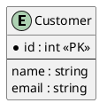

---

## Error #2: Wrong Cardinality Notation

**Error Message:**
```
Invalid relationship syntax
Cardinality format wrong
```

**Cause:**
- Using class diagram notation in ER diagrams

**Solution:**

**Before (Wrong - class diagram style):**
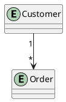

**After (Correct - ER notation):**
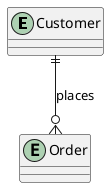

**ER Cardinality Symbols:**
- `||` : Exactly one
- `|o` : Zero or one
- `}|` : One or many
- `}o` : Zero or many

---

## Error #3: Cardinality Combination Errors

**Error Message:**
```
Invalid cardinality combination
```

**Cause:**
- Using non-existent cardinality combinations

**Solution:**

**Valid combinations:**
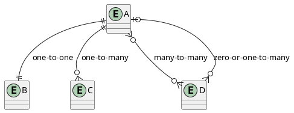

---

## Error #4: Missing Primary Key

**Error Message:**
```
Warning: No primary key defined
```

**Cause:**
- Not marking primary key attributes

**Solution:**

**Before (Unclear):**
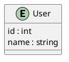

**After (Clear):**
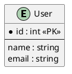

**Key markers:**
- `*` : Primary key (required)
- `+` : Foreign key

---

## Error #5: Foreign Key Syntax Errors

**Error Message:**
```
Foreign key not recognized
```

**Cause:**
- Wrong syntax for foreign keys

**Solution:**

**Before (Not marked):**
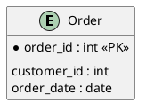

**After (Marked):**
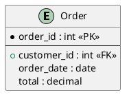

---

## Error #6: Attribute vs Entity Confusion

**Error Message:**
```
Diagram structure unclear
Too many attributes in one entity
```

**Cause:**
- Putting related attributes in wrong entity
- Not extracting repeating groups

**Solution:**

**Before (Denormalized):**
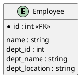

**After (Normalized):**
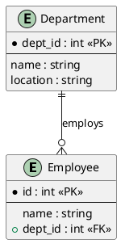

---

## Error #7: Relationship Label Missing

**Error Message:**
```
Unlabeled relationship
```

**Cause:**
- Not providing relationship names

**Solution:**

**Before (Unclear):**
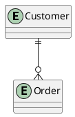

**After (Clear):**


---

## Error #8: Many-to-Many Without Junction Table

**Error Message:**
```
Unclear many-to-many relationship
```

**Cause:**
- Showing M:N relationship without junction/associative entity

**Solution:**

**Before (Incomplete):**
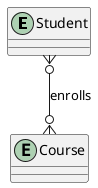

**After (Complete with junction table):**
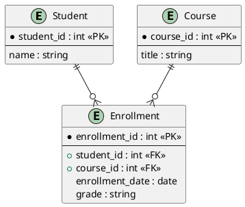

---

## Error #9: Weak Entity Syntax

**Error Message:**
```
Weak entity not shown correctly
```

**Cause:**
- Not indicating weak entities

**Solution:**

**Before (Not clear):**
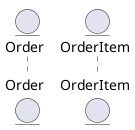

**After (Showing dependency):**
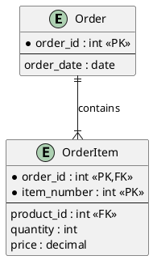

---

## Error #10: Attribute Type Inconsistency

**Error Message:**
```
Type formatting inconsistent
```

**Cause:**
- Inconsistent data type naming

**Solution:**

**Before (Inconsistent):**
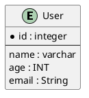

**After (Consistent):**
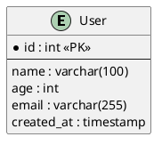

---

## Error #11: Composite Key Syntax

**Error Message:**
```
Composite key not clear
```

**Cause:**
- Not properly indicating composite primary keys

**Solution:**

**Before (Unclear):**
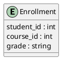

**After (Clear):**
```plantuml
@startuml
entity Enrollment {
  * student_id : int <<PK,FK>>
  * course_id : int <<PK,FK>>
  --
  enrollment_date : date
  grade : string
}
@enduml
```

**Note:** Both fields marked with `*` indicate composite key.

---

## Error #12: Self-Referencing Relationship Errors

**Error Message:**
```
Self-reference not clear
```

**Cause:**
- Not showing recursive relationships clearly

**Solution:**

**Before (Unclear):**
```plantuml
@startuml
entity Employee
Employee }o--o{ Employee
@enduml
```

**After (Clear):**
```plantuml
@startuml
entity Employee {
  * employee_id : int <<PK>>
  --
  name : string
  + manager_id : int <<FK>>
}

Employee }o--|| Employee : manages
@enduml
```

---

## Error #13: Missing Separator Between Keys and Attributes

**Error Message:**
```
Hard to read entity definition
```

**Cause:**
- Not using separators in entity definition

**Solution:**

**Before (Hard to read):**
```plantuml
@startuml
entity Customer {
  * customer_id : int <<PK>>
  name : string
  email : string
  phone : string
}
@enduml
```

**After (Clear):**
```plantuml
@startuml
entity Customer {
  * customer_id : int <<PK>>
  --
  name : string
  email : string
  phone : string
  created_at : timestamp
}
@enduml
```

---

## Error #14: Wrong Relationship Direction

**Error Message:**
```
Relationship direction unclear
```

**Cause:**
- Cardinality symbols on wrong end

**Solution:**

**Before (Wrong direction):**
```plantuml
@startuml
entity Customer
entity Order
' This reads as: Customer is the "many" side
Customer }o--|| Order
@enduml
```

**After (Correct direction):**
```plantuml
@startuml
entity Customer
entity Order
' Customer (one) places many Orders
Customer ||--o{ Order : places
@enduml
```

**Rule:** Cardinality symbol closest to entity shows that entity's participation.

---

## Error #15: Optional vs Required Participation

**Error Message:**
```
Participation constraints unclear
```

**Cause:**
- Not distinguishing between optional and required

**Solution:**

**Understanding symbols:**
- `||` : Required (must exist)
- `|o` : Optional (may not exist)

```plantuml
@startuml
entity Person {
  * person_id : int <<PK>>
  --
  name : string
}

entity Passport {
  * passport_id : int <<PK>>
  --
  + person_id : int <<FK>>
  number : string
}

' Person (optional) has Passport (required)
' Not all persons have passports, but every passport must have a person
Person |o--|| Passport : owns
@enduml
```

---

## Error #16: Identifying vs Non-Identifying Relationships

**Error Message:**
```
Relationship type not clear
```

**Cause:**
- Not distinguishing identifying relationships

**Solution:**

**Identifying relationship (solid line):**
```plantuml
@startuml
entity Order {
  * order_id : int <<PK>>
}

entity OrderLine {
  * order_id : int <<PK,FK>>
  * line_number : int <<PK>>
}

' Solid line = identifying
Order ||--|{ OrderLine
@enduml
```

**Non-identifying relationship (dashed line):**
```plantuml
@startuml
entity Customer {
  * customer_id : int <<PK>>
}

entity Order {
  * order_id : int <<PK>>
  --
  + customer_id : int <<FK>>
}

' Dashed line = non-identifying
Customer ||..o{ Order
@enduml
```

---

## Error #17: Ternary Relationship Issues

**Error Message:**
```
Three-way relationship unclear
```

**Cause:**
- Not properly modeling three-entity relationships

**Solution:**

**Before (Unclear):**
```plantuml
@startuml
entity Doctor
entity Patient
entity Hospital
@enduml
```

**After (Using associative entity):**
```plantuml
@startuml
entity Doctor {
  * doctor_id : int <<PK>>
}

entity Patient {
  * patient_id : int <<PK>>
}

entity Hospital {
  * hospital_id : int <<PK>>
}

entity Treatment {
  * treatment_id : int <<PK>>
  --
  + doctor_id : int <<FK>>
  + patient_id : int <<FK>>
  + hospital_id : int <<FK>>
  date : date
}

Doctor ||--o{ Treatment
Patient ||--o{ Treatment
Hospital ||--o{ Treatment
@enduml
```

---

## Error #18: Derived Attributes Not Marked

**Error Message:**
```
Computed attributes not distinguished
```

**Cause:**
- Not showing which attributes are derived/calculated

**Solution:**

**Before (Not clear):**
```plantuml
@startuml
entity Order {
  * order_id : int <<PK>>
  --
  subtotal : decimal
  tax : decimal
  total : decimal
}
@enduml
```

**After (Showing derived):**
```plantuml
@startuml
entity Order {
  * order_id : int <<PK>>
  --
  subtotal : decimal
  tax_rate : decimal
  total : decimal <<derived>>
}

note right of Order::total
  total = subtotal * (1 + tax_rate)
  Calculated, not stored
end note
@enduml
```

---

## Error #19: Supertype/Subtype Hierarchy Errors

**Error Message:**
```
Inheritance not shown correctly
```

**Cause:**
- Using wrong notation for generalization

**Solution:**

**Before (Class diagram style):**
```plantuml
@startuml
entity Person
entity Customer
entity Employee
Person <|-- Customer
Person <|-- Employee
@enduml
```

**After (ER style):**
```plantuml
@startuml
entity Person {
  * person_id : int <<PK>>
  --
  name : string
  type : string
}

entity Customer {
  * person_id : int <<PK,FK>>
  --
  loyalty_points : int
}

entity Employee {
  * person_id : int <<PK,FK>>
  --
  salary : decimal
}

Person ||--o| Customer
Person ||--o| Employee
@enduml
```

---

## Error #20: Color/Styling in ER Diagrams

**Error Message:**
```
Styling not applied
Colors wrong
```

**Cause:**
- Wrong syntax for entity colors

**Solution:**

**Before (May not work):**
```plantuml
@startuml
entity Customer color(LightBlue)
@enduml
```

**After (Correct):**
```plantuml
@startuml
entity Customer <<entity>> #LightBlue
entity Order <<entity>> #LightYellow
entity Product <<entity>> #LightGreen

Customer ||--o{ Order
Order ||--o{ Product
@enduml
```

---

## Quick Reference: ER Diagram Syntax

### Entity Definition
```plantuml
@startuml
entity EntityName {
  * primary_key : type <<PK>>
  --
  + foreign_key : type <<FK>>
  attribute : type
  computed : type <<derived>>
}
@enduml
```

### Cardinality Symbols
```plantuml
@startuml
entity A
entity B
entity C
entity D

A ||--|| B : One to One (both required)
A ||--o| C : One to Zero-or-One
A ||--o{ D : One to Many
A }o--o{ D : Many to Many
@enduml
```

### Cardinality Symbol Meanings
- `||` : Exactly one (required)
- `|o` : Zero or one (optional)
- `}|` : One or many
- `}o` : Zero or many

---

## Common ER Diagram Mistakes Summary

| Mistake | Problem | Solution |
|---------|---------|----------|
| Missing entity keyword | `Customer { }` | `entity Customer { }` |
| Wrong cardinality | `Customer "1" --> "*" Order` | `Customer \|\|--o{ Order` |
| No PK marker | `id : int` | `* id : int <<PK>>` |
| No FK marker | `customer_id : int` | `+ customer_id : int <<FK>>` |
| M:N without junction | Direct many-to-many | Create junction table |
| No separator | Keys mixed with attributes | Use `--` separator |
| Wrong direction | `}o--\|\|` backwards | Check which side is "many" |
| No relationship label | `A \|\|--o{ B` | `A \|\|--o{ B : label` |

---

## Testing ER Diagrams

Minimal test:

```plantuml
@startuml
entity Customer {
  * customer_id : int <<PK>>
  --
  name : varchar(100)
  email : varchar(255)
}

entity Order {
  * order_id : int <<PK>>
  --
  + customer_id : int <<FK>>
  order_date : date
  total : decimal
}

entity OrderItem {
  * order_id : int <<PK,FK>>
  * item_number : int <<PK>>
  --
  + product_id : int <<FK>>
  quantity : int
  price : decimal
}

Customer ||--o{ Order : places
Order ||--|{ OrderItem : contains
@enduml
```

## Additional Resources

- [PlantUML ER/IE Diagram Documentation](https://plantuml.com/ie-diagram)
- [ER Diagram Best Practices](https://www.red-gate.com/blog/common-er-diagram-mistakes)
