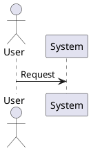
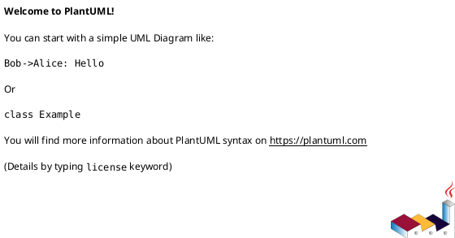
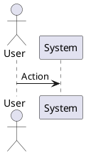
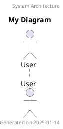
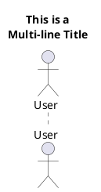
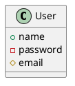
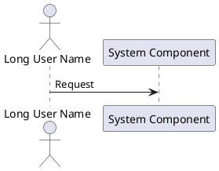

```plantuml
' Separate into two diagrams

@startuml sequence
participant Alice
participant Bob
Alice -> Bob : Hello
@enduml

@startuml class
class User {
  +name
}
@enduml
```

# PlantUML General Syntax Troubleshooting Guide

Common errors related to delimiters, comments, basic structure, and universal PlantUML syntax.

## Error #1: Missing Start/End Delimiters

**Error Message:**
```
Syntax Error
No @startuml/@enduml found
```

**Cause:**
- Diagram is missing `@startuml` or `@enduml` delimiters
- These delimiters are required for all PlantUML diagrams

**Solution:**

Every PlantUML diagram must be wrapped in start/end tags:

**Before (Error):**
```plantuml
actor User
User -> System : Request
```

**After (Working):**


**Note:** Non-UML diagrams use specific tags:
- `@startmindmap` / `@endmindmap`
- `@startgantt` / `@endgantt`
- `@startsalt` / `@endsalt`
- `@startjson` / `@endjson`
- etc.

---

## Error #2: Mixed Diagram Types

**Error Message:**
```
Syntax Error on line X
Some diagram description contains errors
```

**Cause:**
- Mixing syntax from different diagram types in one diagram
- Using sequence diagram syntax with class diagram elements

**Solution:**

Each diagram must use only one diagram type's syntax.

**Before (Error):**
```plantuml
@startuml
' Mixing sequence and class diagram syntax
participant Alice
class User {
  +name
}
Alice -> Bob : Hello
@enduml
```

**After (Working):**


---

## Error #3: Invalid Comment Syntax

**Error Message:**
```
Syntax Error: Unexpected character
```

**Cause:**
- Using wrong comment syntax
- PlantUML supports `'` for single-line and `/' '/` for multi-line

**Solution:**

**Before (Error):**
```plantuml
@startuml
// This is wrong - Java/C++ style comment
# This is also wrong - Shell style comment
/* Multi-line wrong */
actor User
@enduml
```

**After (Working):**


---

## Error #4: Missing Diagram Type Name

**Error Message:**
```
Empty diagram
Nothing to generate
```

**Cause:**
- Empty diagram with only start/end delimiters
- No diagram content between delimiters

**Solution:**

**Before (Error):**


**After (Working):**


---

## Error #5: Incorrect Title/Header Syntax

**Error Message:**
```
Syntax Error near 'title'
```

**Cause:**
- Missing newline after title command
- Using quotes incorrectly

**Solution:**

**Before (Error):**


**After (Working):**


**Multi-line title:**


---

## Error #6: Whitespace/Indentation Issues

**Error Message:**
```
Syntax Error: Unexpected indentation
```

**Cause:**
- Inconsistent or incorrect indentation
- Tabs vs spaces issues in some contexts

**Solution:**

PlantUML is generally forgiving with whitespace, but some structures require consistency:

**Before (Error):**


**After (Working):**


---

## Error #7: Special Characters in Names

**Error Message:**
```
Syntax Error: Invalid character
```

**Cause:**
- Using special characters without quotes
- Spaces in names without quotes

**Solution:**

**Before (Error):**
```plantuml
@startuml
actor User/Admin
class My-Class
participant Request Handler
@enduml
```

**After (Working):**
```plantuml
@startuml
actor "User/Admin" as UA
class "My-Class" as MC
participant "Request Handler" as RH
@enduml
```

**Rule:** If a name contains spaces, slashes, hyphens, or special characters, wrap it in quotes.

---

## Error #8: Malformed `as` Alias

**Error Message:**
```
Syntax Error near 'as'
```

**Cause:**
- Incorrect usage of `as` keyword for aliases
- Missing alias name after `as`

**Solution:**

**Before (Error):**
```plantuml
@startuml
actor "Long User Name" as
participant "System Component"
@enduml
```

**After (Working):**


---

## Error #9: Invalid Color Specification

**Error Message:**
```
Syntax Error: Unknown color
Color not recognized
```

**Cause:**
- Using invalid color name
- Incorrect hex color format

**Solution:**

**Before (Error):**
```plantuml
@startuml
actor User #lightblue1
class System #FF00GG
@enduml
```

**After (Working):**
```plantuml
@startuml
' Use valid color names
actor User #LightBlue
class System #Technology

' Or valid hex codes (#RRGGBB)
actor Admin #FF6600
class Database #0099CC
@enduml
```

**Valid color formats:**
- Named colors: `Red`, `Blue`, `LightGray`, etc.
- Hex colors: `#RRGGBB` (e.g., `#FF0000`)
- Predefined gradients: `#Technology`, `#Business`, etc.

---

## Error #10: Newline/Line Break Errors

**Error Message:**
```
Syntax Error: Unexpected line break
```

**Cause:**
- Breaking a statement across lines incorrectly
- Not using proper line continuation

**Solution:**

**Before (Error):**
```plantuml
@startuml
User ->
System : Request
@enduml
```

**After (Working):**
```plantuml
@startuml
' Use proper multi-line syntax with \n
User -> System : This is a long message\nthat spans multiple\nlines

' Or keep it on one line
User -> System : Request
@enduml
```

---

## Error #11: Unclosed Brackets/Braces

**Error Message:**
```
Syntax Error: Expected '}'
Unclosed bracket
```

**Cause:**
- Missing closing brace for class/object definitions
- Mismatched brackets

**Solution:**

**Before (Error):**
```plantuml
@startuml
class User {
  +name : String
  +email : String

class System
@enduml
```

**After (Working):**
```plantuml
@startuml
class User {
  +name : String
  +email : String
}

class System {
  +process()
}
@enduml
```

---

## Error #12: Invalid Stereotypes

**Error Message:**
```
Syntax Error near '<<>>'
```

**Cause:**
- Incorrect stereotype syntax
- Empty stereotypes

**Solution:**

**Before (Error):**
```plantuml
@startuml
class User << >>
interface System <interface>
@enduml
```

**After (Working):**
```plantuml
@startuml
class User <<Entity>>
interface System <<Interface>>
actor Admin <<Human>>
@enduml
```

**Stereotype syntax:** `<<StereotypeName>>`

---

## Error #13: Skin Parameter Typos

**Error Message:**
```
Ignored: skinparam command
Unknown skinparam
```

**Cause:**
- Misspelled skinparam property name
- Invalid skinparam syntax

**Solution:**

**Before (Error):**
```plantuml
@startuml
skinparam backgroundColor lightblue
skinparam classBackgroudColor yellow
@enduml
```

**After (Working):**
```plantuml
@startuml
' Use correct property names (case-sensitive)
skinparam BackgroundColor LightBlue
skinparam classBackgroundColor Yellow
@enduml
```

**Note:** Modern PlantUML recommends `<style>` blocks instead of `skinparam`.

---

## Error #14: Invalid Note Syntax

**Error Message:**
```
Syntax Error in note
```

**Cause:**
- Missing `end note` for multi-line notes
- Incorrect note attachment syntax

**Solution:**

**Before (Error):**
```plantuml
@startuml
class User
note "This is a note
User
@enduml
```

**After (Working):**
```plantuml
@startuml
class User

' Single-line note
note left of User : This is a note

' Multi-line note
note right of User
  This is a
  multi-line note
end note
@enduml
```

**Note positions:** `left`, `right`, `top`, `bottom`

---

## Error #15: NullPointerException (Internal Error)

**Error Message:**
```
java.lang.NullPointerException
Cannot invoke "Entity.getGroupType()" because "entity" is null
```

**Cause:**
- Internal PlantUML bug (rare)
- Malformed diagram triggering edge case
- Version-specific issue

**Solution:**

1. Update PlantUML to latest version:
```bash
wget https://github.com/plantuml/plantuml/releases/download/v1.2025.0/plantuml.jar
```

2. Simplify diagram to identify problematic element:
```plantuml
@startuml
' Start with minimal diagram
actor User
@enduml
```

3. Add elements one at a time to isolate the issue

4. Report bug to PlantUML with minimal reproduction case:
- https://github.com/plantuml/plantuml/issues

**Workaround:** Rewrite the problematic section using different syntax

---

## Error #16: Package/Namespace Syntax Errors

**Error Message:**
```
Syntax Error in package
```

**Cause:**
- Missing closing brace for package
- Invalid package name

**Solution:**

**Before (Error):**
```plantuml
@startuml
package com.example {
  class User

package model {
  class Data
}
@enduml
```

**After (Working):**
```plantuml
@startuml
package com.example {
  class User
}

package model {
  class Data
}

' Or nested packages
package com.example {
  package model {
    class User
  }
}
@enduml
```

---

## Error #17: Legend Syntax Errors

**Error Message:**
```
Syntax Error in legend
```

**Cause:**
- Missing `end legend`
- Invalid legend position

**Solution:**

**Before (Error):**
```plantuml
@startuml
legend
* Item 1
* Item 2

class User
@enduml
```

**After (Working):**
```plantuml
@startuml
legend left
  * Item 1
  * Item 2
  * Item 3
end legend

' Or legend right/top/bottom
legend right
  Explanation here
end legend

class User
@enduml
```

---

## Error #18: Scale/Zoom Syntax Errors

**Error Message:**
```
Invalid scale value
```

**Cause:**
- Invalid scale parameter
- Scale not numeric

**Solution:**

**Before (Error):**
```plantuml
@startuml
scale large
scale 2x
@enduml
```

**After (Working):**
```plantuml
@startuml
' Use numeric scale
scale 2
' or
scale 0.5

' Predefined scales
scale 2/3
scale 200 width
scale 150 height
@enduml
```

---

## Error #19: Pragma Directive Errors

**Error Message:**
```
Unknown pragma
Invalid pragma syntax
```

**Cause:**
- Misspelled pragma directive
- Using deprecated pragmas

**Solution:**

**Before (Error):**
```plantuml
@startuml
!pragma layout dot
!pragma graphviz_dot jdot
@enduml
```

**After (Working):**
```plantuml
@startuml
' Valid pragmas
!pragma layout smetana
!pragma svek_version 1.0

' Usevertical separator
!pragma useVerticalIf on

class User
@enduml
```

**Common pragmas:**
- `layout smetana` - Alternative layout engine
- `useVerticalIf on` - Vertical if blocks in activity diagrams
- `teoz true` - Advanced sequence diagram features

---

## Error #20: File Encoding Issues

**Error Message:**
```
Illegal character
Encoding error: 0xXX
```

**Cause:**
- File not saved as UTF-8
- Special characters causing encoding issues

**Solution:**

1. Save file as UTF-8:
```bash
# Check current encoding
file -I diagram.puml

# Convert to UTF-8
iconv -f ISO-8859-1 -t UTF-8 diagram.puml > diagram_utf8.puml
```

2. Use Java encoding flag:
```bash
java -Dfile.encoding=UTF-8 -jar plantuml.jar diagram.puml
```

3. In your editor, set file encoding to UTF-8:
- VSCode: Click encoding in status bar → Save with Encoding → UTF-8
- IntelliJ: File → File Encoding → UTF-8
- Sublime: File → Save with Encoding → UTF-8

**Before (Error):**
```plantuml
@startuml
' File saved in ISO-8859-1 with special chars
actor Utilisateur
Utilisateur -> Système : Demande
@enduml
```

**After (Working):**
```plantuml
@startuml
' File saved as UTF-8
actor Utilisateur
Utilisateur -> Système : Demande
@enduml
```

---

## Common Syntax Patterns

### Correct Basic Structure
```plantuml
@startuml
' Comments go here
title Diagram Title

' Diagram content
actor User
participant System

User -> System : Action

@enduml
```

### Correct Naming Conventions
```plantuml
@startuml
' Simple names (no quotes needed)
actor User
class System
participant Database

' Complex names (quotes required)
actor "System Admin" as Admin
class "User/Account" as Account
participant "Message Queue" as MQ

Admin -> Account : Manage
@enduml
```

### Correct Color Usage
```plantuml
@startuml
' Named colors
actor User #LightBlue
class System #Yellow

' Hex colors
participant DB #FF9900
interface API #00CCFF

' Gradient colors
rectangle Box #Red/Yellow
@enduml
```

### Correct Comment Styles
```plantuml
@startuml
' Single line comment

/' Multi-line
   comment block '/

actor User ' inline comment
@enduml
```

---

## Quick Syntax Checklist

Before running PlantUML, verify:

- [ ] File starts with `@startuml` (or appropriate `@start...`)
- [ ] File ends with `@enduml` (or appropriate `@end...`)
- [ ] Only one diagram type used per diagram
- [ ] Comments use `'` or `/' '/` syntax
- [ ] Names with spaces/special chars are quoted
- [ ] All braces `{}` are balanced
- [ ] All multi-line blocks have `end` statements
- [ ] Colors are valid names or hex codes
- [ ] File is saved as UTF-8 encoding
- [ ] No mixing of incompatible diagram syntaxes

---

## Testing Minimal Diagram

When troubleshooting, start with the simplest possible diagram:

```plantuml
@startuml
actor A
A -> B
@enduml
```

If this works, gradually add complexity:
1. Add proper names
2. Add styling
3. Add notes/annotations
4. Add your specific elements

This helps isolate exactly which syntax element is causing the error.

---

## Additional Resources

- [PlantUML Language Reference](https://pdf.plantuml.net/PlantUML_Language_Reference_Guide_en.pdf)
- [PlantUML Common Commands](https://plantuml.com/commons)
- [PlantUML FAQ](https://plantuml.com/faq)
