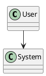
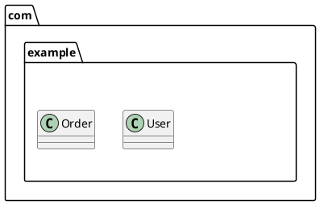
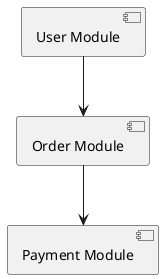
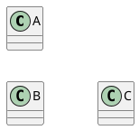
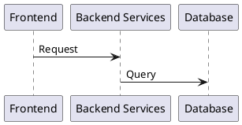
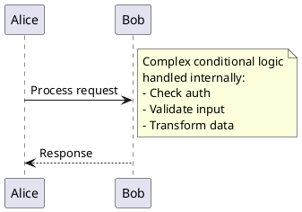
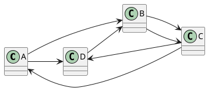
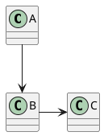
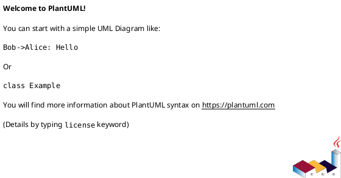
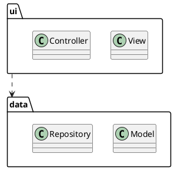

# PlantUML Performance Troubleshooting Guide

Common errors related to timeouts, memory issues, large diagrams, and optimization strategies.

## Error #1: Diagram Generation Timeout

**Error Message:**
```
Timeout during generation
Generation took too long
Process timed out
```

**Cause:**
- Diagram too complex
- Graphviz layout algorithm struggling
- Insufficient timeout setting

**Solution:**

**Increase timeout:**
```bash
# Set timeout to 5 minutes (300000 ms)
java -DPLANTUML_TIMEOUT=300000 -jar plantuml.jar diagram.puml

# Or even longer for very complex diagrams
java -DPLANTUML_TIMEOUT=600000 -jar plantuml.jar diagram.puml
```

**Use faster layout engine:**


**Simplify diagram:**
- Reduce number of elements
- Split into multiple diagrams
- Remove unnecessary details

---

## Error #2: OutOfMemoryError - Java Heap Space

**Error Message:**
```
java.lang.OutOfMemoryError: Java heap space
Exception in thread "main" java.lang.OutOfMemoryError
```

**Cause:**
- Diagram requires more memory than allocated
- Default Java heap size too small (usually 64MB-512MB)

**Solution:**

**Increase heap size:**
```bash
# Allocate 2GB heap
java -Xmx2048m -jar plantuml.jar diagram.puml

# For very large diagrams, 4GB or more
java -Xmx4096m -jar plantuml.jar diagram.puml

# Check current memory usage (verbose)
java -Xmx2048m -verbose:gc -jar plantuml.jar diagram.puml
```

**Monitor memory:**
```bash
# Add memory monitoring flags
java -Xmx2048m -XX:+PrintGCDetails -XX:+PrintGCTimeStamps -jar plantuml.jar diagram.puml
```

---

## Error #3: Too Many Elements in Diagram

**Error Message:**
```
Diagram too complex
Rendering extremely slow
```

**Cause:**
- Hundreds or thousands of elements
- Exponential complexity in layout calculation

**Solution:**

**1. Split diagram into multiple views:**
```plantuml
' Instead of one massive class diagram
' Create multiple focused diagrams:

' diagram-overview.puml - high level
' diagram-auth.puml - authentication module
' diagram-data.puml - data layer
```

**2. Use package hiding:**


**3. Use abstraction:**


---

## Error #4: Graphviz Crashes on Complex Diagrams

**Error Message:**
```
For some reason, dot/GraphViz has crashed
Graphviz layout failed
```

**Cause:**
- Too many crossing edges
- Circular dependencies
- Graph too complex for dot algorithm

**Solution:**

**1. Use alternative layout:**
```plantuml
@startuml
!pragma layout smetana
' Smetana handles complex layouts better
@enduml
```

**2. Simplify relationships:**


**3. Use layout hints:**


---

## Error #5: Slow Sequence Diagram Generation

**Error Message:**
```
Sequence diagram takes minutes to generate
Very slow rendering
```

**Cause:**
- Too many participants
- Too many messages
- Complex fragments (nested alt/loop)

**Solution:**

**1. Reduce participants:**


**2. Simplify fragments:**


**3. Split into multiple sequence diagrams:**
- One for happy path
- One for error scenarios
- One for edge cases

---

## Error #6: Large Number of Files to Process

**Error Message:**
```
Batch processing very slow
Processing hundreds of files taking forever
```

**Cause:**
- Processing files sequentially
- Starting new JVM for each file

**Solution:**

**1. Batch process efficiently:**
```bash
# Process all at once (single JVM instance)
java -jar plantuml.jar -o ./output **.puml

# Use more memory for batch
java -Xmx4096m -jar plantuml.jar **.puml

# Process in parallel (using GNU parallel or xargs)
find . -name "*.puml" | parallel -j 4 java -jar plantuml.jar {}
```

**2. Skip unchanged files:**
```bash
# Only process files newer than output
find . -name "*.puml" -newer ./output/timestamp.txt | \
  xargs java -jar plantuml.jar -o ./output
```

---

## Error #7: Real-time Preview Lag

**Error Message:**
```
IDE preview very slow
Live preview freezing
```

**Cause:**
- Diagram regenerated on every keystroke
- Complex diagram + slow generation

**Solution:**

**1. Reduce preview frequency:**
- Configure IDE to preview on save, not on every change
- VSCode: Set `plantuml.previewAutoUpdate` to `false`

**2. Use simpler test diagram during editing:**
```plantuml
@startuml
' Work on simplified version first
!ifdef SIMPLE_MODE
  class User
  class System
  User --> System
!else
  ' Full complex diagram here
  !include detailed-diagram.puml
!endif
@enduml
```

**3. Disable real-time preview:**
- Generate manually when needed
- Use `Ctrl+Shift+P` → "PlantUML: Preview Current Diagram"

---

## Error #8: CI/CD Pipeline Timeout

**Error Message:**
```
CI job timeout
Pipeline exceeds time limit
```

**Cause:**
- Generating many diagrams in CI
- Sequential processing
- Limited CI resources

**Solution:**

**1. Optimize CI configuration:**
```yaml
# GitHub Actions example
- name: Generate PlantUML diagrams
  run: |
    # Use more memory
    java -Xmx2048m -jar plantuml.jar -o ./images docs/**/*.puml
  timeout-minutes: 10
```

**2. Cache PlantUML jar:**
```yaml
# Cache PlantUML jar between runs
- uses: actions/cache@v2
  with:
    path: plantuml.jar
    key: plantuml-jar-v1.2025.0
```

**3. Only generate changed diagrams:**
```bash
# Find changed .puml files
git diff --name-only HEAD^ HEAD | grep "\.puml$" | \
  xargs java -jar plantuml.jar
```

---

## Error #9: Diagram Size Exceeds Limits

**Error Message:**
```
Diagram exceeds size limit
Image dimensions too large
```

**Cause:**
- PlantUML has default size limits (4096x4096)
- Diagram naturally very large

**Solution:**

**1. Increase size limits:**
```bash
# Allow larger diagrams (8192x8192)
java -DPLANTUML_LIMIT_SIZE=8192 -jar plantuml.jar diagram.puml

# Very large (16384x16384) - use with caution
java -DPLANTUML_LIMIT_SIZE=16384 -Xmx8192m -jar plantuml.jar diagram.puml
```

**2. Use scaling:**
```plantuml
@startuml
' Reduce scale to fit within limits
scale 0.5

' Your large diagram
@enduml
```

**3. Generate as SVG:**
```bash
# SVG is vector format - no pixel size limits
java -jar plantuml.jar -tsvg diagram.puml
```

---

## Error #10: Excessive Recursion/Stack Overflow

**Error Message:**
```
StackOverflowError
Too many recursive calls
```

**Cause:**
- Circular includes
- Recursive preprocessor macros
- Very deep diagram structure

**Solution:**

**1. Fix circular includes:**
```plantuml
' Use include guards
!ifndef COMMON_INCLUDED
!define COMMON_INCLUDED

' Your definitions

!endif
```

**2. Increase stack size:**
```bash
# Increase thread stack size (in KB)
java -Xss2m -jar plantuml.jar diagram.puml
```

**3. Refactor recursive structures:**
- Flatten hierarchy
- Remove circular dependencies
- Simplify preprocessor logic

---

## Error #11: Network Delay with Remote Includes

**Error Message:**
```
Slow generation with !includeurl
Network timeout
```

**Cause:**
- Fetching files from internet every time
- Slow network connection
- Remote server slow/down

**Solution:**

**1. Download and cache locally:**
```bash
# Download once
curl -o C4_Context.puml https://raw.githubusercontent.com/plantuml-stdlib/C4-PlantUML/master/C4_Context.puml

# Use local include
!include ./lib/C4_Context.puml
```

**2. Use local stdlib:**
```plantuml
@startuml
' PlantUML comes with many stdlib files locally
!include <awslib/AWSCommon>
@enduml
```

---

## Error #12: Font Loading Delays

**Error Message:**
```
Slow first render
Initial generation very slow
```

**Cause:**
- Java loading fonts on first use
- System font cache building

**Solution:**

**1. This is usually one-time cost:**
- Subsequent renders faster
- Font cache persists

**2. Use simpler fonts:**
```plantuml
@startuml
' Stick to basic fonts
skinparam defaultFontName "SansSerif"
@enduml
```

**3. Warm up JVM (for scripts):**
```bash
# Generate small diagram first to warm up
echo '@startuml
A -> B
@enduml' | java -jar plantuml.jar -pipe > /dev/null

# Then generate real diagrams
java -jar plantuml.jar *.puml
```

---

## Error #13: High CPU Usage During Generation

**Error Message:**
```
CPU at 100% during generation
System freezing while generating
```

**Cause:**
- Complex layout calculations
- Graphviz algorithms CPU-intensive
- Multiple diagrams processing simultaneously

**Solution:**

**1. Limit concurrent processing:**
```bash
# Process one at a time
for file in *.puml; do
  java -jar plantuml.jar "$file"
done

# Or limit parallel jobs
find . -name "*.puml" | parallel -j 2 java -jar plantuml.jar {}
```

**2. Use nice/ionice (Linux):**
```bash
# Run with lower priority
nice -n 19 java -jar plantuml.jar diagram.puml

# Also limit I/O priority
ionice -c 3 java -jar plantuml.jar diagram.puml
```

**3. Process during off-hours:**
- Schedule diagram generation for low-usage times
- Use CI/CD for heavy processing

---

## Error #14: Disk I/O Bottleneck

**Error Message:**
```
Slow file writes
Disk activity very high
```

**Cause:**
- Writing many large PNG files
- Slow disk (HDD vs SSD)
- Many temporary files

**Solution:**

**1. Use faster disk:**
- Generate to SSD instead of HDD
- Use RAM disk for temporary files

**2. Generate to smaller format first:**
```bash
# SVG files much smaller than PNG
java -jar plantuml.jar -tsvg *.puml

# Convert to PNG later if needed
```

**3. Compress output (if space is issue):**
```bash
# Generate and compress
java -jar plantuml.jar *.puml
find . -name "*.png" -exec optipng {} \;
```

---

## Error #15: Inefficient Diagram Design

**Error Message:**
```
Simple-looking diagram very slow
Unexpected performance issues
```

**Cause:**
- Inefficient diagram structure
- Unnecessary complexity
- Poor layout hints

**Solution:**

**1. Avoid crossing arrows:**


**2. Use explicit positioning:**


**3. Limit relationship types:**


---

## Error #16: Class Diagram with Many Relationships

**Error Message:**
```
Class diagram extremely slow
Rendering takes forever
```

**Cause:**
- N^2 complexity with many classes and relationships
- Graphviz struggling with layout

**Solution:**

**1. Use package structure:**


**2. Create multiple focused diagrams:**
- One for each layer
- One for each module
- One for overall architecture

**3. Hide implementation details:**
```plantuml
@startuml
class User {
  +login()
  +logout()
}

' Hide private members
hide User private
hide User package
@enduml
```

---

## Error #17: Memory Leak in Long-Running Process

**Error Message:**
```
Memory usage keeps growing
Eventually runs out of memory
```

**Cause:**
- PlantUML server running for long time
- Processing many diagrams without JVM restart

**Solution:**

**1. Restart periodically:**
```bash
# For PlantUML server
# Restart daily via cron/systemd timer
0 2 * * * docker restart plantuml-server
```

**2. Use separate JVM instances:**
```bash
# Don't reuse JVM for many diagrams
for file in *.puml; do
  java -jar plantuml.jar "$file"
done
```

**3. Monitor and restart on threshold:**
```bash
# Monitor memory usage
# Restart if exceeds threshold
```

---

## Error #18: IDE Extension Performance Issues

**Error Message:**
```
VSCode/IntelliJ slow with PlantUML
Editor lagging
```

**Cause:**
- Extension regenerating on every change
- Large diagrams
- Multiple diagram files open

**Solution:**

**1. Adjust extension settings:**
```json
// VSCode settings.json
{
  "plantuml.previewAutoUpdate": false,
  "plantuml.render": "Local",
  "plantuml.jar": "/path/to/plantuml.jar",
  "plantuml.jarArgs": ["-Xmx2048m"]
}
```

**2. Close unused diagram files:**
- Only keep active diagrams open
- Close preview when not needed

**3. Use external preview:**
```bash
# Generate and view in external tool
java -jar plantuml.jar -tsvg diagram.puml
# Open in browser
```

---

## Error #19: Git Performance with Many Binary Images

**Error Message:**
```
Git operations slow
Repository size huge
```

**Cause:**
- Committing generated PNG/SVG files
- Binary files don't compress well
- Git stores every version

**Solution:**

**1. Don't commit generated images:**
```bash
# .gitignore
*.png
*.svg
# generated from .puml files
```

**2. Generate in CI/CD:**
```yaml
# Generate diagrams in pipeline
- name: Generate diagrams
  run: java -jar plantuml.jar docs/**/*.puml
- name: Deploy with diagrams
  run: deploy-script.sh
```

**3. Use Git LFS (if must commit):**
```bash
# Track images with Git LFS
git lfs track "*.png"
git lfs track "*.svg"
```

---

## Error #20: Browser Performance with Many SVG Diagrams

**Error Message:**
```
Web page with many diagrams slow
Browser freezing
```

**Cause:**
- Browser rendering many complex SVG files
- SVG DOM can be large

**Solution:**

**1. Use PNG for web display:**
```bash
# Generate PNG instead of SVG for web
java -jar plantuml.jar -tpng *.puml
```

**2. Lazy load diagrams:**
```html
<!-- Load diagrams on demand -->

```

**3. Use image sprites:**
- Combine multiple diagrams
- Reduce HTTP requests

---

## Performance Optimization Checklist

### Before Generating
- [ ] Simplify diagram structure
- [ ] Remove unnecessary elements
- [ ] Use appropriate diagram type
- [ ] Consider splitting large diagrams

### During Generation
- [ ] Allocate sufficient memory (`-Xmx`)
- [ ] Set appropriate timeout (`-DPLANTUML_TIMEOUT`)
- [ ] Use faster layout (`!pragma layout smetana`)
- [ ] Batch process files efficiently

### After Generation
- [ ] Check file sizes
- [ ] Optimize images if needed (optipng, svgo)
- [ ] Don't commit generated files to git
- [ ] Cache for CI/CD

---

## Quick Reference: Performance Commands

### Memory and Timeout
```bash
# Increase heap
java -Xmx4096m -jar plantuml.jar diagram.puml

# Set timeout
java -DPLANTUML_TIMEOUT=300000 -jar plantuml.jar diagram.puml

# Increase size limit
java -DPLANTUML_LIMIT_SIZE=8192 -jar plantuml.jar diagram.puml
```

### Optimization
```bash
# Use faster layout
# In diagram: !pragma layout smetana

# Generate SVG (faster than PNG)
java -jar plantuml.jar -tsvg diagram.puml

# Verbose for debugging
java -jar plantuml.jar -verbose diagram.puml
```

### Batch Processing
```bash
# Efficient batch
java -Xmx4096m -jar plantuml.jar -o ./output **.puml

# Parallel (with GNU parallel)
find . -name "*.puml" | parallel -j 4 java -Xmx2048m -jar plantuml.jar {}
```

---

## Common Performance Mistakes Summary

| Mistake | Problem | Solution |
|---------|---------|----------|
| Default heap size | OutOfMemoryError | Increase with `-Xmx4096m` |
| No timeout | Hangs on complex diagram | Set `-DPLANTUML_TIMEOUT` |
| Huge single diagram | Very slow | Split into multiple diagrams |
| Default layout | Graphviz crashes | Use `!pragma layout smetana` |
| Sequential processing | Slow batch generation | Use parallel processing |
| Real-time preview | IDE lag | Disable auto-update |
| Committing images | Git slow | Gitignore generated files |
| Remote includes | Network delays | Download and use local includes |

---

## Performance Testing

Benchmark simple vs complex:

```bash
# Simple diagram
time java -jar plantuml.jar simple.puml

# Complex diagram
time java -Xmx4096m -jar plantuml.jar complex.puml

# With verbose
time java -Xmx4096m -verbose:gc -jar plantuml.jar complex.puml
```

## Additional Resources

- [PlantUML Command Line](https://plantuml.com/command-line)
- [PlantUML FAQ - Performance](https://plantuml.com/faq)
