```plantuml
@startuml
<style>
rectangle {
  BackgroundColor Blue
}
</style>

' Using component styled as rectangle
component C1
@enduml
```

```plantuml
@startuml
<style>
component {
  BackgroundColor Blue
  Style rectangle
}
</style>

component C1
@enduml
```

# PlantUML Styling & Themes Troubleshooting Guide

Common errors related to skinparam, style blocks, colors, fonts, and modern vs legacy styling.

## Error #1: Mixing skinparam and style Blocks

**Error Message:**
```
Inconsistent styling
Style not applied
```

**Cause:**
- Mixing legacy `skinparam` with modern `<style>` blocks
- Conflicting style rules

**Solution:**

**Before (Conflicting):**


**After (Consistent):**

```plantuml
@startuml
' Use ONLY modern style blocks (recommended)
<style>
classDiagram {
  class {
    BackgroundColor LightBlue
    BorderColor Navy
  }
}
</style>

class User
@enduml
```


**Rule:** Choose either `skinparam` OR `<style>`, don't mix both.

---

## Error #2: Invalid skinparam Property Names

**Error Message:**
```
Unknown skinparam
Ignored skinparam
```

**Cause:**
- Misspelled property name
- Property doesn't exist for diagram type
- Case sensitivity issues

**Solution:**

**Before (Error):**
```plantuml
@startuml
skinparam classBackgroudColor Yellow
skinparam classBackground Colour Blue
skinparam RectangleStereotypeFontColor #FF00FF
@enduml
```

**After (Working):**
```plantuml
@startuml
' Correct property names (case-sensitive)
skinparam classBackgroundColor Yellow
skinparam classBackgroundColor Blue

' Note: RectangleStereotypeFontColor is ignored on many diagrams
' Use style blocks instead
@enduml
```

---

## Error #3: Invalid Color Names/Values

**Error Message:**
```
Unknown color
Color not recognized
```

**Cause:**
- Using invalid color name
- Wrong hex format

**Solution:**

**Before (Error):**
```plantuml
@startuml
skinparam classBackgroundColor lightblue1
actor User #FF00GG
class System #GGHHII
@enduml
```

**After (Working):**
```plantuml
@startuml
' Valid color names
skinparam classBackgroundColor LightBlue
actor User #LightBlue
class System #Technology

' Valid hex colors (#RRGGBB)
actor Admin #FF6600
class Database #0099CC

' Predefined themes
class Service #Application
@enduml
```

**Valid color formats:**
- Named: `Red`, `Blue`, `LightBlue`, `DarkGray`
- Hex: `#RRGGBB` (e.g., `#FF0000`)
- Gradients: `#Red/Yellow`

---

## Error #4: Style Block Syntax Errors

**Error Message:**
```
Syntax Error in style block
Invalid CSS-like syntax
```

**Cause:**
- Wrong property names
- Missing braces
- Incorrect selectors

**Solution:**

**Before (Error):**
```plantuml
@startuml
<style>
class
  background-color: blue
  border-color: red
@enduml
```

**After (Working):**


```plantuml
@startuml
<style>
classDiagram {
  class {
    BackgroundColor Blue
    BorderColor Red
    FontColor White
  }
}
</style>

class User
@enduml
```

**Style block structure:**
```
<style>
diagramType {
  element {
    Property Value
  }
}
</style>
```

---

## Error #5: Font Not Available

**Error Message:**
```
Font not found
Using default font
```

**Cause:**
- Specified font not installed on system
- Font name misspelled

**Solution:**

**Before (May fail):**
```plantuml
@startuml
skinparam classFontName "MyFancyFont"
skinparam defaultFontName "NonExistentFont"
@enduml
```

**After (Portable):**
```plantuml
@startuml
' Use common, cross-platform fonts
skinparam defaultFontName "Arial"
skinparam classFontName "Courier"

' Or rely on PlantUML defaults
@enduml
```

**Safe fonts:** Arial, Courier, Times, Helvetica, SansSerif, Serif, Monospaced

---

## Error #6: Font Size Issues

**Error Message:**
```
Text too small
Text overflowing
```

**Cause:**
- Font size too small or too large
- Not setting appropriate font sizes

**Solution:**

**Before (Problems):**
```plantuml
@startuml
skinparam defaultFontSize 6
skinparam classFontSize 50
@enduml
```

**After (Reasonable):**
```plantuml
@startuml
' Reasonable font sizes
skinparam defaultFontSize 12
skinparam classFontSize 14
skinparam classAttributeFontSize 11

' Or use style blocks
<style>
classDiagram {
  class {
    FontSize 14
  }
}
</style>
@enduml
```

**Recommended sizes:** 10-16 for normal text, 14-20 for titles

---

## Error #7: Deprecated skinparam Usage

**Error Message:**
```
Warning: Deprecated skinparam
```

**Cause:**
- Using old skinparam that's been deprecated
- PlantUML evolving toward `<style>` blocks

**Solution:**

**Before (Deprecated):**
```plantuml
@startuml
skinparam monochrome true
skinparam component {
  Style rectangle
}
@enduml
```

**After (Modern):**
```plantuml
@startuml
<style>
root {
  BackgroundColor White
  FontColor Black
}
component {
  BackgroundColor LightGray
}
</style>
@enduml
```

---

## Error #8: Theme Loading Errors

**Error Message:**
```
Cannot load theme
Theme not found
```

**Cause:**
- Theme file doesn't exist
- Wrong path to theme
- Theme syntax errors

**Solution:**

**Before (Error):**
```plantuml
@startuml
!theme nonexistent
!theme /wrong/path/to/theme
@enduml
```

**After (Working):**


**Built-in themes:** `plain`, `bluegray`, `black-knight`, `mars`, `cerulean`, `sketchy`

---

## Error #9: Gradient Color Syntax

**Error Message:**
```
Invalid gradient
Color syntax error
```

**Cause:**
- Wrong gradient syntax
- Using unsupported gradient format

**Solution:**

**Before (Error):**
```plantuml
@startuml
rectangle Box #Red-Yellow
class User #FF0000 to #FFFF00
@enduml
```

**After (Working):**
```plantuml
@startuml
' Use forward slash for gradients
rectangle Box #Red/Yellow
class User #FF0000/FFFF00

' Or with style blocks
<style>
rectangle {
  BackgroundColor gradient
  BackGroundColor  #Red/Yellow
}
</style>
@enduml
```

---

## Error #10: Style Not Applied to Specific Elements

**Error Message:**
```
Style ignored
Element not styled
```

**Cause:**
- Wrong selector in style block
- Element type mismatch
- Specificity issues

**Solution:**

**Before (Not working):**


**After (Working):**


---

## Error #11: Stereotype Styling Issues

**Error Message:**
```
Stereotype style not applied
```

**Cause:**
- Wrong syntax for styling stereotypes
- Mixing skinparam and style for stereotypes

**Solution:**

**Before (Legacy, limited):**
```plantuml
@startuml
skinparam RectangleStereotypeFontColor Red
@enduml
```

**After (Modern, working):**
```plantuml
@startuml
<style>
.myStereotype {
  BackgroundColor LightYellow
  FontColor Red
  BorderColor Orange
}
</style>

class User <<Entity>>
class User2 <<myStereotype>>
@enduml
```

---

## Error #12: Arrow Styling Errors

**Error Message:**
```
Arrow color not applied
Arrow thickness wrong
```

**Cause:**
- Wrong syntax for arrow styling
- Using skinparam for specific arrow

**Solution:**

**Before (Limited):**
```plantuml
@startuml
skinparam arrowColor Red
A -> B
@enduml
```

**After (Flexible):**
```plantuml
@startuml
' Inline arrow styling
A -[#Red,bold]-> B : Important
A -[#Blue,dashed,thickness=2]-> C : Optional

' Or global with style blocks
<style>
arrow {
  LineColor Red
  LineThickness 2
}
</style>
@enduml
```

---

## Error #13: Background/Border Color Conflicts

**Error Message:**
```
Border not visible
Colors blending
```

**Cause:**
- Border color same as background
- Missing border specification

**Solution:**

**Before (Poor contrast):**
```plantuml
@startuml
<style>
class {
  BackgroundColor Blue
  BorderColor Blue
}
</style>
@enduml
```

**After (Good contrast):**
```plantuml
@startuml
<style>
class {
  BackgroundColor LightBlue
  BorderColor Navy
  BorderThickness 2
}
</style>
@enduml
```

---

## Error #14: Handwritten/Sketch Style Issues

**Error Message:**
```
Handwritten style not working
```

**Cause:**
- Wrong syntax
- Missing theme

**Solution:**

**Before (Wrong):**
```plantuml
@startuml
skinparam handwritten on
@enduml
```

**After (Correct):**
```plantuml
@startuml
skinparam handwritten true

' Or use sketchy theme
!theme sketchy

class User
@enduml
```

---

## Error #15: Shadow Effects Not Working

**Error Message:**
```
Shadow not appearing
```

**Cause:**
- Wrong skinparam name
- Shadows disabled globally

**Solution:**

**Before (Error):**
```plantuml
@startuml
skinparam shadow on
skinparam classShowShadow true
@enduml
```

**After (Working):**
```plantuml
@startuml
skinparam shadowing true
skinparam defaultShadowing true

class User
@enduml
```

---

## Error #16: Rounded Corners Not Applied

**Error Message:**
```
Corners still square
```

**Cause:**
- Wrong syntax for roundCorner
- Limited support on some elements

**Solution:**

**Before (Limited):**
```plantuml
@startuml
skinparam roundcorner 10
@enduml
```

**After (Working):**
```plantuml
@startuml
skinparam roundCorner 15

' Or with style blocks
<style>
class {
  RoundCorner 20
}
</style>

class User
@enduml
```

---

## Error #17: Monochrome Mode Issues

**Error Message:**
```
Colors still showing
Grayscale not applied
```

**Cause:**
- Inline colors override monochrome
- Wrong syntax

**Solution:**

**Before (Colors override):**
```plantuml
@startuml
skinparam monochrome true
class User #Red
@enduml
```

**After (True monochrome):**
```plantuml
@startuml
skinparam monochrome true

' Don't specify colors inline
class User
class System
@enduml
```

---

## Error #18: Package/Namespace Styling

**Error Message:**
```
Package style not applied
```

**Cause:**
- Wrong selector for packages
- Missing package-specific styles

**Solution:**

**Before (Not working):**
```plantuml
@startuml
<style>
class {
  BackgroundColor Blue
}
</style>

package MyPackage {
  class User
}
@enduml
```

**After (Working):**
```plantuml
@startuml
<style>
package {
  BackgroundColor LightYellow
  BorderColor Orange
  FontColor Brown
}
class {
  BackgroundColor LightBlue
}
</style>

package MyPackage {
  class User
}
@enduml
```

---

## Error #19: Sequence Diagram Styling Issues

**Error Message:**
```
Sequence box colors not working
Lifeline colors wrong
```

**Cause:**
- Wrong skinparam names for sequence elements
- Using class styling on sequence elements

**Solution:**

**Before (Wrong):**
```plantuml
@startuml
skinparam classBackgroundColor Yellow
skinparam boxColor Blue
@enduml
```

**After (Correct):**
```plantuml
@startuml
skinparam sequenceParticipantBackgroundColor LightBlue
skinparam sequenceActorBackgroundColor LightGreen
skinparam sequenceLifeLineBackgroundColor White
skinparam sequenceArrowColor Navy

participant User
actor Admin
@enduml
```

---

## Error #20: Style Inheritance Not Working

**Error Message:**
```
Child elements not inheriting style
```

**Cause:**
- Style blocks don't always cascade like CSS
- Need explicit styling for each element type

**Solution:**

**Before (Expecting cascade):**
```plantuml
@startuml
<style>
root {
  FontColor Red
}
</style>

class User
actor Admin
@enduml
```

**After (Explicit):**
```plantuml
@startuml
<style>
root {
  FontColor Red
}
class {
  FontColor Red
}
actor {
  FontColor Red
}
component {
  FontColor Red
}
</style>

class User
actor Admin
component System
@enduml
```

---

## Quick Reference: Styling Methods

### Modern Style Blocks (Recommended)
```plantuml
@startuml
<style>
classDiagram {
  class {
    BackgroundColor LightBlue
    BorderColor Navy
    FontColor Black
    FontSize 14
    RoundCorner 10
  }
  .important {
    BackgroundColor Yellow
    BorderColor Red
  }
}
</style>

class User
class Admin <<important>>
@enduml
```

### Legacy skinparam
```plantuml
@startuml
skinparam classBackgroundColor LightBlue
skinparam classBorderColor Navy
skinparam classFontColor Black
skinparam classFontSize 14
skinparam roundCorner 10

class User
@enduml
```

### Built-in Themes
```plantuml
@startuml
!theme bluegray
class User
@enduml
```

### Common skinparam Properties

**General:**
- `defaultFontName`
- `defaultFontSize`
- `defaultFontColor`
- `backgroundColor`
- `shadowing`
- `handwritten`
- `roundCorner`
- `monochrome`

**Class Diagrams:**
- `classBackgroundColor`
- `classBorderColor`
- `classFontColor`
- `classAttributeFontColor`

**Sequence Diagrams:**
- `sequenceParticipantBackgroundColor`
- `sequenceActorBackgroundColor`
- `sequenceArrowColor`
- `sequenceLifeLineBackgroundColor`

---

## Common Styling Mistakes Summary

| Mistake | Problem | Solution |
|---------|---------|----------|
| Mixing methods | `skinparam` + `<style>` | Use one method only |
| Wrong property | `classBackgroudColor` | `classBackgroundColor` |
| Invalid color | `#FF00GG` | `#FF0000` or `Red` |
| Missing braces | Style block without `{}` | Add proper structure |
| Platform font | `MyCustomFont` | Use common fonts |
| Wrong selector | `rectangle` for `component` | Match element type |
| No contrast | Same background/border | Use contrasting colors |
| Expecting cascade | Assuming inheritance | Style each element type |

---

## Testing Styling

Minimal test:

```plantuml
@startuml
<style>
classDiagram {
  class {
    BackgroundColor LightBlue
    BorderColor Navy
    FontColor Black
  }
}
</style>

class User {
  +name: String
  +email: String
}
@enduml
```

## Additional Resources

- [PlantUML Skinparam Reference](https://plantuml.com/skinparam)
- [PlantUML Style Guide](https://plantuml.com/style)
- [PlantUML Themes](https://plantuml.com/theme)
- [Style Evolution](https://plantuml.com/style-evolution)
